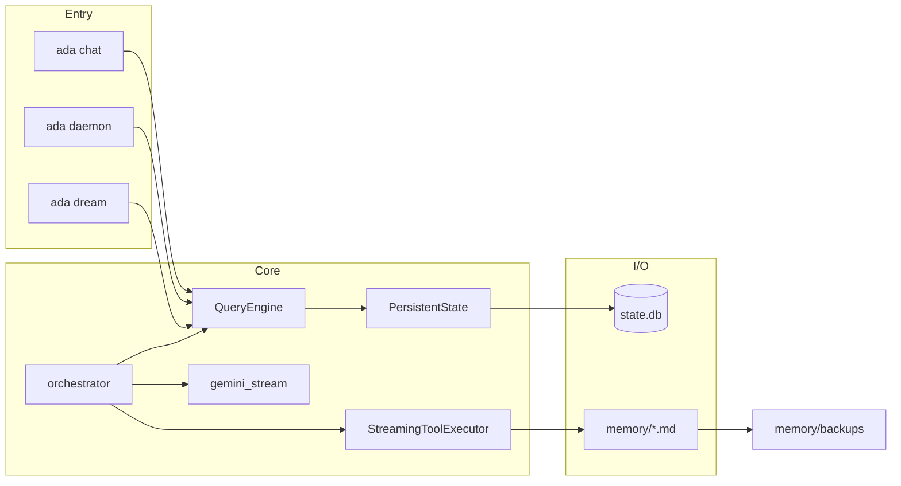

# ADA

**ADA** is a **headless Python 3.11+ asyncio harness** for a local “agent” on edge devices (e.g. Raspberry Pi): **SQLite** for durable transcript and ops metadata, **Google GenAI (`google-genai`)** for streaming chat with **manual function calling**, **allowlisted shell probes**, optional **memory file writes**, and a **manual dream / compression** job. Behavior is aligned with the norms in [`docs/claude_logic.md`](docs/claude_logic.md); high-level shape is described in [`docs/system_architecure.md`](docs/system_architecure.md) (note: that doc is **Phase-1–oriented** and predates several features below—this README is the **current** status).

---

## Table of contents

1. [Where we are vs final goal](#1-where-we-are-vs-final-goal)
2. [Stack and constraints](#2-stack-and-constraints)
3. [Architecture (runtime)](#3-architecture-runtime)
4. [Data model](#4-data-model)
5. [Entry points (CLI)](#5-entry-points-cli)
6. [Agentic turn (how one user message runs)](#6-agentic-turn-how-one-user-message-runs)
7. [Tools and security](#7-tools-and-security)
8. [Dream mode and memory I/O](#8-dream-mode-and-memory-io)
9. [Configuration (environment)](#9-configuration-environment)
10. [Setup and tests](#10-setup-and-tests)
11. [Roadmap / not implemented](#11-roadmap--not-implemented)
12. [Further reading](#12-further-reading)

---

## 1. Where we are vs final goal

| Theme | **Implemented today** | **Not implemented (north-star / your broader plan)** |
|--------|------------------------|------------------------------------------------------|
| **Transcript** | `messages` chain (`user` / `assistant` / `tool`), `parent_uuid`, `sequence`, **tombstone** on failed legs, **rewire** of live children after tombstone (optional) | Full Claude-parity edge cases only in spec; optional dedicated `api_metadata` column; advanced compaction / snip |
| **Operational “clipboard”** | `tasks` row per chat session or daemon job; `status`, `goal`, `current_output`; **`plan_json`** read/write via **`read_task_plan`** / **`write_task_plan`** (session-bound; toggle **`ADA_ENABLE_PLAN_TOOLS`**) | Surfacing **`plan_json`** in the system prompt or daemon steps (model still learns tools from declarations only unless you extend prompts) |
| **Usage / cost** | `usage_ledger` per model leg; `state` keys `session.last_leg_input_tokens`, `session.last_leg_output_tokens`, `session.last_usage_extras_json`; totals **not** naïvely summed across tool legs | Operator-facing “session totals” policy; chat-native answers for “how many tokens?” (needs **tool or allowlisted query**, not automatic) |
| **Static / dynamic memory files** | `memory/soul.md`, `master.md`, `wakeup.md`, `shell_allowlist.txt`; loaded into system prompt; **append** tools + **timestamped backups** | Automated **cron** dream (only **manual** `ada dream` today); richer merge / “dream” policies |
| **Tools** | **Allowlisted shell** (`exec`, exact line match); **append_master_section** / **append_soul_fragment** (bounded writes under `memory/`); **read_task_plan** / **write_task_plan** (SQLite **`tasks.plan_json`**, same session only) | Arbitrary filesystem read, ad-hoc SQL, web/search, plugin DAGs |
| **Persistence layering** | **`PersistentState`** (`ada/persistent/store.py`) owns SQL; **`QueryEngine`** adds debounced assistant streaming | Optional further split to match every line of a separate `ARCHITECTURE.md` if you maintain one |
| **Data lakes / RAG** | — | Structured datalake tables, **Chroma** (or other vector store), skill/pipeline library |
| **Scheduling** | Daemon polls **pending** tasks | Daily dream job, external orchestration left to **cron** + `ada dream` |

**Summary:** ADA is a **working local agent loop** with **Gemini streaming**, **multi-leg tool rounds**, **durable SQLite transcript**, **memory file evolution** (chat tools + manual dream), **task clipboard** (`plan_json` tools), and **hardening** (idle/wall stream timeouts, executor `discard()` on retry). It is **not** yet the full “consciousness + lakes + automated dream” product end-to-end—especially **RAG/datalake** and **scheduled** compression.

---

## 2. Stack and constraints

| Area | Choice |
|------|--------|
| **Language / runtime** | Python **≥ 3.11**, `asyncio` |
| **LLM** | **Google GenAI** SDK (`google-genai`), async streaming `generate_content_stream` |
| **DB** | **SQLite** via `aiosqlite`, **WAL** mode, `PRAGMA foreign_keys=ON` |
| **Package layout** | `src/ada/` (setuptools `where = ["src"]`) |
| **CLI** | `ada` console script → `ada.__main__:main` |

**Non-goals (current design):** no TUI requirement, no MCP transport, no hosted multi-tenant session ingress—**single process**, local disk truth.

---

## 3. Architecture (runtime)

Rough data and control flow:



- **`PersistentState`**: schema apply/migrate, all SQL writes/reads for tasks, messages, state, usage_ledger, action_log, tombstone/rewire.
- **`QueryEngine`**: same public API for app code; owns **debounced** partial assistant text flushes during streaming; delegates persistence to `PersistentState`.
- **`orchestrator`**: one **user** row per turn, then a **loop** of model **legs** (stream → optional tool calls → persist tool rows → next leg) up to `ADA_MAX_TOOL_ROUNDS`.
- **`adapters/gemini_stream`**: normalizes stream chunks (text + function calls), **manual** function calling (`AutomaticFunctionCallingConfig(disable=True)`), optional **chunk idle** and **leg wall-clock** timeouts (`StreamTimeout`).
- **`tool_executor`**: ordered execution; **shell** via allowlist + `asyncio.create_subprocess_exec`; **memory** appends via `memory_io` (locked + backup); **plan** tools via session-bound hooks into **`QueryEngine`** (no extra DB connections).

Normative message shapes and ordering: [`docs/claude_logic.md`](docs/claude_logic.md).

---

## 4. Data model

### 4.1 SQLite (`data/state.db` or `ADA_DATA_DIR/state.db`)

| Table | Role |
|-------|------|
| **`tasks`** | Queue / session anchor: `goal`, `status`, `current_output`, **`plan_json`** (default `'{}'`; **read/write** via **`read_task_plan`** / **`write_task_plan`** when **`ADA_ENABLE_PLAN_TOOLS`** is on), timestamps |
| **`messages`** | Transcript: `uuid`, `session_id` → `tasks.id`, `parent_uuid`, `role` (`user` \| `assistant` \| `tool` \| `system`), `content_json`, `tombstone`, `sequence`, `created_at` |
| **`state`** | String KV cache (e.g. boot flags, last leg tokens, `dream.last_run_at`) |
| **`usage_ledger`** | Append-only-ish log: `session_id`, `model`, `input_tokens`, `output_tokens`, `recorded_at` |
| **`action_log`** | Audit: `kind`, `payload_json`, optional `session_id`, `created_at` (dream start/complete/fail, **`file_access_denied`**, etc.) |

Indexes: messages by `(session_id, sequence)` and `(session_id, tombstone)`; usage and action_log by time/session as in `src/ada/db/schema.sql`.

### 4.2 Files under `memory/`

| File | Role |
|------|------|
| **`soul.md`** | Persona / long-horizon prose; injected as `<user_soul>` (treat as untrusted) |
| **`master.md`** | Operator “worldview” / guardrails; injected as `<master>` |
| **`wakeup.md`** | Boot **user** message text (once per session when `session.<id>.boot_complete` unset) |
| **`shell_allowlist.txt`** | One allowlisted command per line (`#` comments); **exact** match after strip |
| **`backups/`** | Created on append: `*.md.bak` copies before writing `master.md` / `soul.md` |

### 4.3 `content_json` (messages)

JSON with a top-level **`parts`** array; entries include `type: text` \| `function_call` \| `function_response` (see `ada/transcript_format.py` and `docs/claude_logic.md` §3). Assistant rows may include **`meta`** (e.g. `model`, `finish_reason`, `usage` snapshot).

---

## 5. Entry points (CLI)

| Command | Purpose |
|---------|---------|
| **`ada chat`** | REPL: one **`tasks`** row for “Interactive session” (reuse or `--new-session`), boot via `wakeup.md` once, then `you>` turns |
| **`ada chat --new-session`** | New `tasks.id` / transcript chain |
| **`ada daemon`** | Poll `tasks WHERE status='pending'`, run one turn per goal, set `completed` / `failed` |
| **`ada dream`** | **Manual** compression: model summarizes recent transcript + usage → append **master** / optional **soul**; logs **`action_log`**; **`--dry-run`**, **`--session N`**, **`--max-messages`** |

All require **`GEMINI_API_KEY`** for model calls (except pure DB inspection).

---

## 6. Agentic turn (how one user message runs)

1. **`persist_user`** — user row committed before streaming.
2. For each **model leg** (up to cap): load chain → **`chain_rows_to_contents`** → **`stream_one_model_leg`** with merged **Tool** declarations (shell ± memory ± plan clipboard).
3. **Assistant** row updated with final text + optional `function_call` parts + **`meta`** (usage/finish_reason).
4. **`record_usage`** → `usage_ledger` + `state` last-leg keys when token ints exist.
5. If the model returned **tool calls**, **`StreamingToolExecutor.run_ordered`** runs them; **`persist_tool_result`** rows; next leg’s parent is **chain head** (usually last tool row).
6. On failure **before** tools persisted: **retry** (with **`executor.discard()`**) up to `max_retries`. If tools were already persisted for that user turn, **no** full-turn retry.
7. **Tombstone** failed assistant (and rewired children if enabled).

---

## 7. Tools and security

| Tool | Mechanism | Safety |
|------|------------|--------|
| **`run_allowlisted_shell`** | `command` must **exactly** match a line in `shell_allowlist.txt`; `shlex.split` + **`asyncio.create_subprocess_exec`** (no shell) | No arbitrary paths unless you add an exact line; output capped by **`ADA_SHELL_MAX_OUTPUT_BYTES`**, timeout **`ADA_SHELL_TIMEOUT_SEC`** |
| **`append_master_section`** | Append under `memory/master.md` | Path locked to **`memory_dir`**; block/file size caps; **backup** first |
| **`append_soul_fragment`** | Append under `memory/soul.md` | Same as above |
| **`read_task_plan`** | Returns **`plan_json`** text for the **current** `tasks.id` (= transcript session) | No cross-task access; read-only |
| **`write_task_plan`** | Replaces **`plan_json`** after **`json.loads`** validation | Same session only; invalid JSON returns a tool error (no commit) |
| **`list_workspace_directory`** | Non-recursive `scandir` under sandbox roots | Same path rules as read/write; entry cap **`ADA_FILE_MAX_LIST_ENTRIES`** |
| **`read_workspace_file`** / **`write_workspace_file`** | Resolved path must lie under **`ADA_FILE_SANDBOX_ROOTS`** | **Denylist:** always **`ADA_DATA_DIR`** and **`memory/`**; **ADA project root** is denied when the sandbox root strictly contains the repo (e.g. `/home/pi` with ADA in `/home/pi/ADA`). Basenames **`.env`**, **`id_rsa`**, **`*.pem`** blocked; optional **`ADA_FILE_DENY_PREFIXES`**, **`ADA_FILE_DENYLIST_FILE`**, **`ADA_FILE_DENY_BASENAMES`**. Denied attempts can be logged to **`action_log`** as **`file_access_denied`** when **`ADA_FILE_AUDIT_DENIALS=1`**. |
| **Disable memory tools** | `ADA_ENABLE_MEMORY_TOOLS=0` | Shell-only declarations remain if allowlist non-empty |
| **Disable plan tools** | `ADA_ENABLE_PLAN_TOOLS=0` | Clipboard declarations omitted |

The model **cannot** run arbitrary SQL or read arbitrary files unless you **explicitly** add allowlisted commands or new tools. **Symlink following** for read/write uses `Path.resolve()` like before—treat untrusted trees with care.

### 7.1 Filesystem blast radius (summary)

| Asset | Default protection via file tools |
|--------|-----------------------------------|
| SQLite / `data/` | Prefix deny |
| `memory/*.md` | Prefix deny (use **`append_*`** tools) |
| ADA source + `.env` (when using a wider sandbox) | Project root prefix deny if sandbox is an ancestor |
| SSH / extra secrets | Operator adds **`ADA_FILE_DENY_PREFIXES`** or a denylist file |

---

## 8. Dream mode and memory I/O

- **`ada dream`**: builds a text bundle from **`load_messages_for_dream`** (session-scoped or global recent window) + **`load_usage_ledger_lines`**, calls **non-streaming** `generate_content` with **`response_mime_type=application/json`**, expects structured fields for **master** / **soul** fragments, then **`memory_io.append_markdown_block`** (async lock + backup).
- **Logging**: `action_log` kinds `dream_start`, `dream_complete`, `dream_failed`; `state` **`dream.last_run_at`**.
- **Cron**: not built in—schedule **`ada dream`** externally when you want daily/weekly runs.

Details: `src/ada/dream/run.py`, `src/ada/memory_io.py`.

---

## 9. Configuration (environment)

See **`.env.example`** for the full list. Important groups:

- **Model:** `GEMINI_API_KEY`, `GEMINI_MODEL`
- **Paths:** `ADA_DATA_DIR`
- **Agentic loop:** `ADA_MAX_TOOL_ROUNDS`, shell caps/timeouts
- **Stream hardening:** `ADA_STREAM_CHUNK_IDLE_SEC`, `ADA_STREAM_LEG_MAX_SEC`, `ADA_REWIRE_AFTER_TOMBSTONE`
- **Memory / dream:** `ADA_ENABLE_MEMORY_TOOLS`, `ADA_MEMORY_MAX_APPEND_BYTES`, `ADA_MEMORY_MAX_FILE_BYTES`, `ADA_DREAM_MAX_SOUL_BYTES`, `ADA_DREAM_MAX_MESSAGES`
- **Clipboard:** `ADA_ENABLE_PLAN_TOOLS` (default on: **`read_task_plan`** / **`write_task_plan`**)
- **Workspace file tools:** `ADA_ENABLE_FILE_TOOLS`, `ADA_FILE_SANDBOX_ROOTS`, read/write/list caps, **`ADA_FILE_MAX_LIST_ENTRIES`**, **`ADA_FILE_DENY_PREFIXES`**, **`ADA_FILE_DENYLIST_FILE`**, **`ADA_FILE_DENY_BASENAMES`**, **`ADA_FILE_AUDIT_DENIALS`**

`Settings.load()` in `src/ada/config.py` is the single source of parsed values.

---

## 10. Setup and tests

```bash
python3 -m venv .venv
source .venv/bin/activate   # or .venv\Scripts\activate on Windows
pip install -e ".[dev]"
cp .env.example .env        # set GEMINI_API_KEY
```

```bash
ada chat
ada chat --new-session
ada daemon
ada dream --dry-run
ada dream
pytest -q
```

---

## 11. Roadmap / not implemented

Suggested **next planning** items (prioritize as you like):

1. **Operator observability** — read-only **`get_usage_summary`** tool or allowlisted `sqlite3` one-liner so “tokens used” questions are grounded.
2. **Scheduled dream** — `cron` / systemd timer calling `ada dream` (no in-repo scheduler yet).
3. **Datalake / RAG / skills** — new storage and ingestion paths (out of scope for current package).
4. **Docs sync** — refresh [`docs/system_architecure.md`](docs/system_architecure.md) to match this README (tools, tables, dream).

---

## 12. Further reading

- [`docs/claude_logic.md`](docs/claude_logic.md) — normative transcript, roles, tombstones, tool ordering intent  
- [`docs/system_architecure.md`](docs/system_architecure.md) — early phase-1 system view (partially superseded by this README)  
- Google GenAI: [Gemini API docs](https://ai.google.dev/gemini-api/docs)

---

*Version note: README reflects the **repository as of the last update**; grep `plan_json`, `read_task_plan`, and `action_log` in `src/ada` to confirm behavior if you fork or refactor.*
