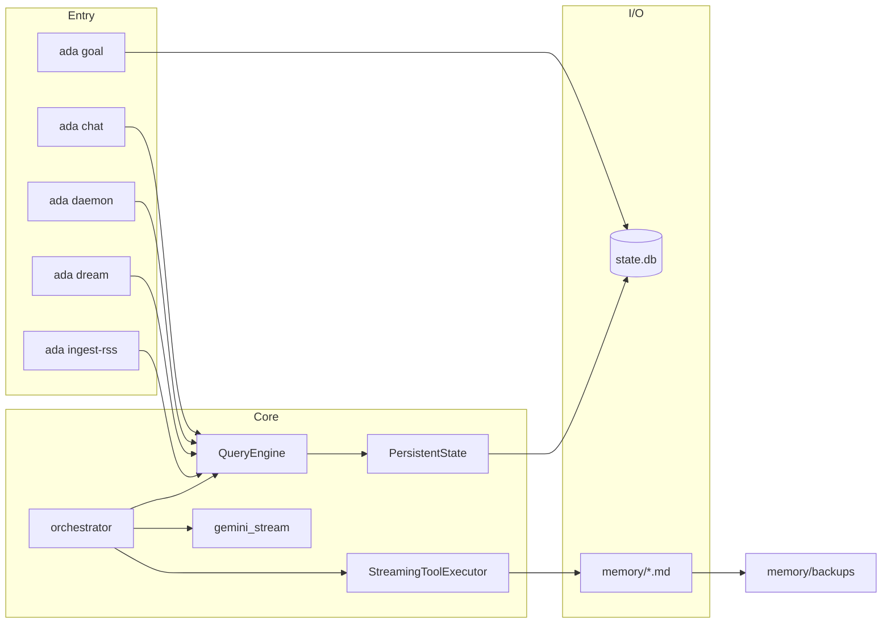

# ADA

**ADA** is a **headless Python 3.11+ asyncio harness** for a local “agent” on edge devices (e.g. Raspberry Pi): **SQLite** for durable transcript and ops metadata, **Google GenAI (`google-genai`)** for streaming chat with **manual function calling**, **allowlisted shell probes**, optional **memory file writes**, a **goal queue** (`ada goal` + `ada daemon` with `task_kind`), optional **web search / URL fetch** tools (Serper + Jina or direct fetch, env-gated), optional **bounded logging** to **`web_sources`**, and a **manual dream / compression** job. Behavior is aligned with the norms in [`docs/claude_logic.md`](docs/claude_logic.md); high-level shape is described in [`docs/system_architecure.md`](docs/system_architecure.md) (note: that doc is **Phase-1–oriented** and predates several features below—this README is the **current** status).

### Recently added (keep reading for full detail)

- **`task_kind`** (`chat` \| `goal`), **`ada goal`** subcommands (`add` / `list` / `show`), and **daemon dequeue** of **pending goals only**; **worker-mode** extra system text for `ada daemon`.
- **Web tools** (when **`ADA_ENABLE_WEB_TOOLS=1`**): **`web_search`** (Serper), **`fetch_url_text`** (Jina Reader or httpx per **`ADA_WEB_FETCH_MODE`**), with caps and optional fetch host allowlist.
- **Phase B persistence**: **`web_sources`** table (bounded excerpts for `search_hit` \| `page_fetch`); optional read-only tool **`list_session_web_sources`** when **`ADA_ENABLE_WEB_SOURCES_TOOL=1`**.
- **Optional** operator file **`memory/schema_digest.md`** — if present, a short digest can be injected into the system prompt (see `src/ada/prompt.py`).
- **Knowledge layer:** SQLite **`knowledge_*`** tables + **FTS5** over **`knowledge_items`**. **`ada ingest-rss`** (no API key) reads **`knowledge_sources`** (`kind=rss`) and fills **`knowledge_items`** (deduped). When **`ADA_ENABLE_KNOWLEDGE_TOOLS=1`**, chat/daemon expose **`search_knowledge`**, **`record_synthesis`**, and **`add_knowledge_source`** to the model (see §7).

---

## Table of contents

1. [Where we are vs final goal](#1-where-we-are-vs-final-goal)
2. [Stack and constraints](#2-stack-and-constraints)
3. [Architecture (runtime)](#3-architecture-runtime)
4. [Data model](#4-data-model)
5. [Entry points (CLI)](#5-entry-points-cli)
6. [Agentic turn (how one user message runs)](#6-agentic-turn-how-one-user-message-runs)
7. [Tools and security](#7-tools-and-security)
8. [Dream mode and memory I/O](#8-dream-mode-and-memory-io)
9. [Configuration (environment)](#9-configuration-environment)
10. [Setup and tests](#10-setup-and-tests)
11. [Roadmap / not implemented](#11-roadmap--not-implemented)
12. [Further reading](#12-further-reading)

---

## 1. Where we are vs final goal

| Theme | **Implemented today** | **Not implemented (north-star / your broader plan)** |
|--------|------------------------|------------------------------------------------------|
| **Transcript** | `messages` chain (`user` / `assistant` / `tool`), `parent_uuid`, `sequence`, **tombstone** on failed legs, **rewire** of live children after tombstone (optional) | Full Claude-parity edge cases only in spec; optional dedicated `api_metadata` column; advanced compaction / snip |
| **Operational “clipboard”** | `tasks` row per chat session (`task_kind=chat`) or queued goal (`task_kind=goal`); `status`, `goal`, `current_output`; **`plan_json`** read/write via **`read_task_plan`** / **`write_task_plan`** (session-bound; toggle **`ADA_ENABLE_PLAN_TOOLS`**); cross-session **goal** recall via **`read_goal_task_view`** (toggle **`ADA_ENABLE_GOAL_RECALL_TOOL`**); **worker-mode** extra harness text for **`ada daemon`** | Auto-injecting full **`plan_json`** into the system prompt on every leg (optional future; model still uses **`read_task_plan`** for explicit reads) |
| **Usage / cost** | `usage_ledger` per model leg; `state` keys `session.last_leg_input_tokens`, `session.last_leg_output_tokens`, `session.last_usage_extras_json`; totals **not** naïvely summed across tool legs | Operator-facing “session totals” policy; chat-native answers for “how many tokens?” (needs **tool or allowlisted query**, not automatic) |
| **Static / dynamic memory files** | `memory/soul.md`, `master.md`, `wakeup.md`, `shell_allowlist.txt`; loaded into system prompt; **append** tools + **timestamped backups** | Automated **cron** dream (only **manual** `ada dream` today); richer merge / “dream” policies |
| **Tools** | **Allowlisted shell**; **`check_token_usage`** (session totals from **`usage_ledger`**); **append_master_section** / **append_soul_fragment**; **read_task_plan** / **write_task_plan**; optional **workspace file** tools; optional **`web_search`** / **`fetch_url_text`** (see §7); optional **`list_session_web_sources`**; optional **knowledge** tools when **`ADA_ENABLE_KNOWLEDGE_TOOLS=1`** | **Plugin DAGs**; **arbitrary** ad-hoc SQL from the model; unconstrained web beyond configured tools |
| **Persistence layering** | **`PersistentState`** (`ada/persistent/store.py`) owns SQL; **`QueryEngine`** adds debounced assistant streaming | Optional further split to match every line of a separate `ARCHITECTURE.md` if you maintain one |
| **Data lakes / RAG** | Bounded **`web_sources`** when web tools persist; **knowledge** store (**`knowledge_items`** + FTS + optional **`knowledge_synthesis`**); **`ada ingest-rss`** for RSS → items; optional Gemini **`search_knowledge`** / **`record_synthesis`** / **`add_knowledge_source`** | **Embeddings** / vector DB over transcript or knowledge; **JSON API ingest** (no dedicated pipeline in-repo); full **datalake** pipelines, skill library as in north-star docs |
| **Scheduling** | Daemon polls **pending** tasks; operator **cron** / **systemd** for **`ada dream`** and **`ada ingest-rss`** | Built-in periodic jobs in-process (today: external **cron** / **systemd** only) |

**Summary:** ADA is a **working local agent loop** with **Gemini streaming**, **multi-leg tool rounds**, **durable SQLite transcript**, **memory file evolution** (chat tools + manual dream), **task clipboard** (`plan_json` tools), **goal queue + worker**, optional **web search/fetch** and **`web_sources`** logging, optional **RSS-backed knowledge** (**`ada ingest-rss`** + env-gated knowledge tools), and **hardening** (idle/wall stream timeouts, executor `discard()` on retry). It is **not** yet the full “consciousness + lakes + automated dream” product end-to-end—especially **semantic RAG / embeddings**, **API-sourced ingest** beyond what you wire yourself, a full **datalake**, and **built-in** scheduled jobs (use **cron** / **systemd**).

---

## 2. Stack and constraints

| Area | Choice |
|------|--------|
| **Language / runtime** | Python **≥ 3.11**, `asyncio` |
| **LLM** | **Google GenAI** SDK (`google-genai`), async streaming `generate_content_stream` |
| **DB** | **SQLite** via `aiosqlite`, **WAL** mode, `PRAGMA foreign_keys=ON` |
| **Package layout** | `src/ada/` (setuptools `where = ["src"]`) |
| **CLI** | `ada` console script → `ada.__main__:main` |

**Non-goals (current design):** no TUI requirement, no MCP transport, no hosted multi-tenant session ingress—**single process**, local disk truth.

---

## 3. Architecture (runtime)

Rough data and control flow:



- **`PersistentState`**: schema apply/migrate, all SQL writes/reads for tasks, messages, state, usage_ledger, action_log, tombstone/rewire.
- **`QueryEngine`**: same public API for app code; owns **debounced** partial assistant text flushes during streaming; delegates persistence to `PersistentState`.
- **`orchestrator`**: one **user** row per turn, then a **loop** of model **legs** (stream → optional tool calls → persist tool rows → next leg) up to `ADA_MAX_TOOL_ROUNDS`.
- **`adapters/gemini_stream`**: normalizes stream chunks (text + function calls), **manual** function calling (`AutomaticFunctionCallingConfig(disable=True)`), optional **chunk idle** and **leg wall-clock** timeouts (`StreamTimeout`).
- **`tool_executor`**: ordered execution; **shell** via allowlist + `asyncio.create_subprocess_exec`; **memory** appends via `memory_io` (locked + backup); **plan** tools via session-bound hooks into **`QueryEngine`** (no extra DB connections); optional **web** HTTP (Serper / fetch) and **bounded inserts** into **`web_sources`** via `web_persistence` when web tools are enabled; optional **knowledge** tools (`search_knowledge`, `record_synthesis`, `add_knowledge_source`) when **`ADA_ENABLE_KNOWLEDGE_TOOLS=1`**.

Normative message shapes and ordering: [`docs/claude_logic.md`](docs/claude_logic.md).

---

## 4. Data model

### 4.1 SQLite (`data/state.db` or `ADA_DATA_DIR/state.db`)

| Table | Role |
|-------|------|
| **`tasks`** | Queue / session anchor: `goal`, `status`, `current_output`, **`plan_json`** (default `'{}'`; **read/write** via **`read_task_plan`** / **`write_task_plan`** when **`ADA_ENABLE_PLAN_TOOLS`** is on), **`task_kind`** (`chat` \| `goal`), timestamps |
| **`messages`** | Transcript: `uuid`, `session_id` → `tasks.id`, `parent_uuid`, `role` (`user` \| `assistant` \| `tool` \| `system`), `content_json`, `tombstone`, `sequence`, `created_at` |
| **`state`** | String KV cache (e.g. boot flags, last leg tokens, `dream.last_run_at`) |
| **`usage_ledger`** | Append-only-ish log: `session_id`, `model`, `input_tokens`, `output_tokens`, `recorded_at` |
| **`action_log`** | Audit: `kind`, `payload_json`, optional `session_id`, `created_at` (dream start/complete/fail, **`file_access_denied`**, etc.) |
| **`web_sources`** | Bounded **Phase B** log per session: `url`, `source_kind` (`search_hit` \| `page_fetch`), optional `query_text`, `content_excerpt`, `content_sha256`, `fetched_at` (written when web tools persist; not a vector index) |
| **`knowledge_sources`** | Registered ingest endpoints: `kind` (`api` \| `rss` \| `web`), optional `label`, `base_url` |
| **`knowledge_items`** | Ingested facts: FK to `knowledge_sources`, optional `external_id`, `published_at`, `ingested_at`, `tags_json`, `content_excerpt`, optional `payload_json`, `content_hash`, optional **`relevance_score`** (0–1), optional **`expires_at`** (ISO), **`tombstoned`** (0/1); legacy rows may have **`relevance_score` NULL** (treat as unknown; queries often use `COALESCE(relevance_score, 1.0)`). Insert **dedupes** by `(source_id, external_id)` or `(source_id, content_hash)` when `external_id` is null |
| **`knowledge_synthesis`** | Optional “opinion” text with `ref_item_ids_json` and optional `task_id` → `tasks` (soft refs to items) |
| **`knowledge_items_fts`** | FTS5 virtual table (`doc`); `rowid` = `knowledge_items.id`; maintained by triggers (not used directly by chat) |

Indexes: messages by `(session_id, sequence)` and `(session_id, tombstone)`; usage and action_log by time/session as in `src/ada/db/schema.sql`.

**Ingestion vs chat:** **`ada chat`** / **`ada daemon`** do not fetch RSS automatically. **`web_search` / `fetch_url_text`** write **`web_sources`** (session-scoped), not **`knowledge_items`**. To populate **`knowledge_items`**, register **`knowledge_sources`** rows (`kind=rss`, `base_url` = feed URL) via SQL, the **`add_knowledge_source`** tool (when enabled), or **`QueryEngine.insert_knowledge_source`**, then run **`ada ingest-rss`** (or schedule it with **cron** / a **systemd timer**). With **`ADA_ENABLE_KNOWLEDGE_TOOLS=1`**, the model can **`search_knowledge`**, **`record_synthesis`**, and **`add_knowledge_source`** during turns.

### 4.2 Files under `memory/`

| File | Role |
|------|------|
| **`soul.md`** | Persona / long-horizon prose; injected as `<user_soul>` (treat as untrusted) |
| **`master.md`** | Operator “worldview” / guardrails; injected as `<master>` |
| **`wakeup.md`** | Boot **user** message text (once per session when `session.<id>.boot_complete` unset) |
| **`shell_allowlist.txt`** | One allowlisted command per line (`#` comments); **exact** match after strip |
| **`backups/`** | Created on append: `*.md.bak` copies before writing `master.md` / `soul.md` |

### 4.3 `content_json` (messages)

JSON with a top-level **`parts`** array; entries include `type: text` \| `function_call` \| `function_response` (see `ada/transcript_format.py` and `docs/claude_logic.md` §3). Assistant rows may include **`meta`** (e.g. `model`, `finish_reason`, `usage` snapshot).

---

## 5. Entry points (CLI)

| Command | Purpose |
|---------|---------|
| **`ada chat`** | REPL: one **`tasks`** row for “Interactive session” (`task_kind=chat`; reuse or `--new-session`), boot via `wakeup.md` once, then `you>` turns |
| **`ada chat --new-session`** | New `tasks.id` / transcript chain |
| **`ada goal add …`** | Enqueue a **`task_kind=goal`** row with `status=pending` (optional **`--plan-json`**). **Does not** call the model; **`GEMINI_API_KEY`** not required. |
| **`ada goal list`** | List recent goal tasks (optional **`--status`**, **`--limit`**). |
| **`ada goal show <id>`** | Print one goal task’s metadata plus **`tasks.current_output`** (the daemon’s final model reply or error text). Long output is **previewed** by default; use **`--full`** for the entire string. |
| **`ada daemon`** | Long-running worker: poll **`tasks` WHERE `status='pending'` AND `task_kind='goal'`**, run **one** `orchestrate_turn` per dequeue, set `completed` / `failed`. Run under **systemd** (or similar), not cron. |
| **`ada dream`** | **Manual** compression: model summarizes recent transcript + usage → append **master** / optional **soul**; logs **`action_log`**; **`--dry-run`**, **`--session N`**, **`--max-messages`** |
| **`ada ingest-rss`** | **Offline** fetch: reads **`knowledge_sources`** where **`kind=rss`** and **`base_url`** is set, downloads each feed, parses Atom/RSS, inserts **`knowledge_items`** (deduped). **`GEMINI_API_KEY`** is optional unless **`ADA_INGEST_GATEKEEPER=1`** or **`ADA_KNOWLEDGE_EMBEDDINGS=1`** (gate scores entries; embeddings write vectors). Schedule with **cron** / **systemd** (often **daily**). |

**`GEMINI_API_KEY`** is required for **`ada chat`**, **`ada daemon`**, and **`ada dream`**. **`ada goal`** does not call the model. **`ada ingest-rss`** uses HTTP only unless gate or embeddings are enabled (then Gemini).

---

## 6. Agentic turn (how one user message runs)

1. **`persist_user`** — user row committed before streaming.
2. For each **model leg** (up to cap): load chain → **`chain_rows_to_contents`** → **`stream_one_model_leg`** with merged **Tool** declarations (shell ± memory ± plan clipboard ± **`read_goal_task_view`** (when enabled) ± file ± web ± `list_session_web_sources` ± knowledge tools as configured).
3. **Assistant** row updated with final text + optional `function_call` parts + **`meta`** (usage/finish_reason).
4. **`record_usage`** → `usage_ledger` + `state` last-leg keys when token ints exist.
5. If the model returned **tool calls**, **`StreamingToolExecutor.run_ordered`** runs them; **`persist_tool_result`** rows; next leg’s parent is **chain head** (usually last tool row).
6. On failure **before** tools persisted: **retry** (with **`executor.discard()`**) up to `max_retries`. If tools were already persisted for that user turn, **no** full-turn retry.
7. **Tombstone** failed assistant (and rewired children if enabled).

---

## 7. Tools and security

| Tool | Mechanism | Safety |
|------|------------|--------|
| **`check_token_usage`** | Reads **`usage_ledger`** for the **current** session and returns summed input/output/total token counts | Always declared with shell tools; read-only |
| **`run_allowlisted_shell`** | `command` must **exactly** match a line in `shell_allowlist.txt`; `shlex.split` + **`asyncio.create_subprocess_exec`** (no shell) | No arbitrary paths unless you add an exact line; output capped by **`ADA_SHELL_MAX_OUTPUT_BYTES`**, timeout **`ADA_SHELL_TIMEOUT_SEC`** |
| **`append_master_section`** | Append under `memory/master.md` | Path locked to **`memory_dir`**; block/file size caps; **backup** first |
| **`append_soul_fragment`** | Append under `memory/soul.md` | Same as above |
| **`read_task_plan`** | Returns **`plan_json`** text for the **current** `tasks.id` (= transcript session) | No cross-task access; read-only |
| **`read_goal_task_view`** | Read **`goal`**, **`status`**, **`current_output`**, **`plan_json`** for another **`tasks.id`** with **`task_kind=goal`** | Read-only; **`ADA_ENABLE_GOAL_RECALL_TOOL`** (default on); invalid or non-goal ids return a tool error |
| **`write_task_plan`** | Replaces **`plan_json`** after **`json.loads`** validation | Same session only; invalid JSON returns a tool error (no commit) |
| **`list_workspace_directory`** | Non-recursive `scandir` under sandbox roots | Same path rules as read/write; entry cap **`ADA_FILE_MAX_LIST_ENTRIES`** |
| **`read_workspace_file`** / **`write_workspace_file`** | Resolved path must lie under **`ADA_FILE_SANDBOX_ROOTS`** | **Denylist:** always **`ADA_DATA_DIR`** and **`memory/`**; **ADA project root** is denied when the sandbox root strictly contains the repo (e.g. `/home/pi` with ADA in `/home/pi/ADA`). Basenames **`.env`**, **`id_rsa`**, **`*.pem`** blocked; optional **`ADA_FILE_DENY_PREFIXES`**, **`ADA_FILE_DENYLIST_FILE`**, **`ADA_FILE_DENY_BASENAMES`**. Denied attempts can be logged to **`action_log`** as **`file_access_denied`** when **`ADA_FILE_AUDIT_DENIALS=1`**. |
| **`web_search`** | Serper Google organic JSON API; returns titles, URLs, snippets | Requires **`ADA_SERPER_API_KEY`** or **`SERPER_API_KEY`**; capped by **`ADA_WEB_SEARCH_MAX_RESULTS`** / timeout envs |
| **`fetch_url_text`** | HTTPS page text (Jina Reader prefix or direct **httpx** per **`ADA_WEB_FETCH_MODE`**) | Caps: max URLs, chars, bytes, timeout; optional **`ADA_WEB_FETCH_HOST_ALLOWLIST`** (SSRF-minded); content may be **truncated** |
| **`list_session_web_sources`** | Read recent **`web_sources`** rows for the **current** `tasks.id` only | **`ADA_ENABLE_WEB_SOURCES_TOOL=1`**; read-only; no HTTP |
| **`search_knowledge`** | **`QueryEngine.search_knowledge_items`** — lexical (**OR** tokens, **BM25** rank), optional **semantic** / **hybrid** when **`ADA_KNOWLEDGE_EMBEDDINGS=1`**; optional **`min_relevance_score`** / **`valid_only`** | **`ADA_ENABLE_KNOWLEDGE_TOOLS=1`**; read-only; returns **title** / **link** / **relevance_score** / **expires_at** when stored |
| **`record_synthesis`** | **`QueryEngine.insert_knowledge_synthesis`**; optional **`task_id`** defaults to current session | **`ADA_ENABLE_KNOWLEDGE_TOOLS=1`** |
| **`add_knowledge_source`** | **`QueryEngine.insert_knowledge_source`** (`rss` \| `web`); **http(s)** URLs only | **`ADA_ENABLE_KNOWLEDGE_TOOLS=1`**; optional **`ADA_KNOWLEDGE_FEED_HOST_ALLOWLIST`** (comma-separated hosts; empty = any allowed host) |
| **Disable memory tools** | `ADA_ENABLE_MEMORY_TOOLS=0` | Shell-only declarations remain if allowlist non-empty |
| **Disable plan tools** | `ADA_ENABLE_PLAN_TOOLS=0` | Clipboard declarations omitted |
| **Disable goal recall** | `ADA_ENABLE_GOAL_RECALL_TOOL=0` | **`read_goal_task_view`** declaration omitted |
| **Disable web tools** | `ADA_ENABLE_WEB_TOOLS=0` (default) | No `web_search` / `fetch_url_text` declarations; no Serper spend |
| **Disable knowledge tools** | `ADA_ENABLE_KNOWLEDGE_TOOLS=0` (default) | No `search_knowledge` / `record_synthesis` / `add_knowledge_source` declarations |

The model **cannot** run arbitrary SQL or read arbitrary files unless you **explicitly** add allowlisted commands or new tools. **Symlink following** for read/write uses `Path.resolve()` like before—treat untrusted trees with care.

### 7.1 Filesystem blast radius (summary)

| Asset | Default protection via file tools |
|--------|-----------------------------------|
| SQLite / `data/` | Prefix deny |
| `memory/*.md` | Prefix deny (use **`append_*`** tools) |
| ADA source + `.env` (when using a wider sandbox) | Project root prefix deny if sandbox is an ancestor |
| SSH / extra secrets | Operator adds **`ADA_FILE_DENY_PREFIXES`** or a denylist file |

---

## 8. Dream mode and memory I/O

- **`ada dream`**: builds a text bundle from **`load_messages_for_dream`** (session-scoped or global recent window) + **`load_usage_ledger_lines`**, calls **non-streaming** `generate_content` with **`response_mime_type=application/json`**, expects structured fields for **master** / **soul** fragments, then **`memory_io.append_markdown_block`** (async lock + backup). It summarizes **transcript (`messages`)**, not the **`knowledge_items`** corpus.
- **Logging**: `action_log` kinds `dream_start`, `dream_complete`, `dream_failed`; `state` **`dream.last_run_at`**.
- **Cadence**: prefer **weekly** or **on-demand** after substantive chats—not daily on empty transcripts. Schedule with **cron** / **systemd** separately from **`ada ingest-rss`** (see §10.1).

Details: `src/ada/dream/run.py`, `src/ada/memory_io.py`.

---

## 9. Configuration (environment)

See **`.env.example`** for the full list. Important groups:

- **Model:** `GEMINI_API_KEY`, `GEMINI_MODEL`
- **Paths:** `ADA_DATA_DIR`
- **Agentic loop:** `ADA_MAX_TOOL_ROUNDS`, shell caps/timeouts
- **Stream hardening:** `ADA_STREAM_CHUNK_IDLE_SEC`, `ADA_STREAM_LEG_MAX_SEC`, `ADA_REWIRE_AFTER_TOMBSTONE`
- **Memory / dream:** `ADA_ENABLE_MEMORY_TOOLS`, `ADA_MEMORY_MAX_APPEND_BYTES`, `ADA_MEMORY_MAX_FILE_BYTES`, `ADA_DREAM_MAX_SOUL_BYTES`, `ADA_DREAM_MAX_MESSAGES`
- **Clipboard:** `ADA_ENABLE_PLAN_TOOLS` (default on: **`read_task_plan`** / **`write_task_plan`**); **`ADA_ENABLE_GOAL_RECALL_TOOL`** (default on: **`read_goal_task_view`**)
- **Workspace file tools:** `ADA_ENABLE_FILE_TOOLS`, `ADA_FILE_SANDBOX_ROOTS`, read/write/list caps, **`ADA_FILE_MAX_LIST_ENTRIES`**, **`ADA_FILE_DENY_PREFIXES`**, **`ADA_FILE_DENYLIST_FILE`**, **`ADA_FILE_DENY_BASENAMES`**, **`ADA_FILE_AUDIT_DENIALS`**
- **Web tools & `web_sources`:** `ADA_ENABLE_WEB_TOOLS`, `ADA_SERPER_API_KEY` / `SERPER_API_KEY`, search/fetch caps and timeouts, **`ADA_WEB_FETCH_MODE`**, **`ADA_JINA_API_KEY`** (if using Jina), **`ADA_ENABLE_WEB_SOURCES_TOOL`** — see **`.env.example`**
- **Knowledge tools & RSS ingest:** `ADA_ENABLE_KNOWLEDGE_TOOLS`, **`ADA_KNOWLEDGE_FEED_HOST_ALLOWLIST`** (optional), **`ADA_INGEST_RSS_MAX_ITEMS`**, **`ADA_INGEST_RSS_MAX_RESPONSE_BYTES`**, **`ADA_INGEST_RSS_TIMEOUT_SEC`**, **`ADA_KNOWLEDGE_DEFAULT_RETENTION_DAYS`**, **`ADA_INGEST_GATEKEEPER`**, **`ADA_INGEST_GATE_MODEL`**, **`ADA_INGEST_GATE_MAX_OUTPUT_TOKENS`** — see **`.env.example`**
- **Knowledge embeddings (optional):** **`ADA_KNOWLEDGE_EMBEDDINGS=1`** enables Gemini vectors for **`search_knowledge`** semantic/hybrid modes and embeds new items during **`ada ingest-rss`** (uses **`GEMINI_API_KEY`**); tune **`ADA_KNOWLEDGE_EMBEDDING_MODEL`**, **`ADA_KNOWLEDGE_EMBEDDING_DIM`**, **`ADA_KNOWLEDGE_EMBEDDING_MIN_COSINE`**

`Settings.load()` in `src/ada/config.py` is the single source of parsed values.

---

## 10. Setup and tests

```bash
python3 -m venv .venv
source .venv/bin/activate   # or .venv\Scripts\activate on Windows
pip install -e ".[dev]"
cp .env.example .env        # set GEMINI_API_KEY
```

```bash
ada chat
ada chat --new-session
ada goal add "background objective"
ada goal list
ada daemon
ada dream --dry-run
ada dream
ada ingest-rss
pytest -q
```

### 10.1 Operator runbook (knowledge, goals, dream)

**End-to-end loop:** Register RSS feeds (`add_knowledge_source` or SQL) → **`ada ingest-rss`** (daily cron) writes **`knowledge_items`** with tags / **`relevance_score`** / optional **`expires_at`** → with **`ADA_ENABLE_KNOWLEDGE_TOOLS=1`**, **`ada chat`** or **`ada daemon`** can **`search_knowledge`** (optionally `min_relevance_score`, e.g. `0.5`) and **`record_synthesis`** into **`knowledge_synthesis`** citing **`ref_item_ids`**. **`ada dream`** is separate: it compresses **chat transcript** into `memory/master.md` / `soul.md`, not the knowledge table.

**`ada daemon`** is a **long-running** process (use **systemd** on a Pi), not a cron one-shot. It dequeues **`task_kind=goal`** rows with **`status=pending`**.

**Example daily brief goal** (daemon consumes when pending):

```bash
ada goal add "Search knowledge for topics X and Y from the last week. Call search_knowledge with min_relevance_score 0.5 if filtering. Then record_synthesis with a short Markdown brief and ref_item_ids from the hits."
```

**Cron (user `pi`, project `/home/pi/ADA`)** — adjust paths:

```cron
# Daily RSS ingest (06:15)
15 6 * * * cd /home/pi/ADA && . .venv/bin/activate && ada ingest-rss >>/home/pi/ADA/data/ingest-rss.log 2>&1

# Weekly dream — Sunday 03:30 (transcript compression; not daily)
30 3 * * 0 cd /home/pi/ADA && . .venv/bin/activate && ada dream >>/home/pi/ADA/data/dream.log 2>&1
```

**systemd** (sketch): `ada daemon` as `Type=simple` `ExecStart=/path/to/.venv/bin/ada daemon`, `Restart=on-failure`; timers for `ingest-rss` / `dream` using `OnCalendar` instead of cron if you prefer.

**Example SQL** (`sqlite3 data/state.db`):

```sql
-- Recent items, relevance at least 0.5 (legacy NULL counts as 1.0 in COALESCE), not expired, not tombstoned
SELECT id, ingested_at, relevance_score, expires_at
FROM knowledge_items
WHERE tombstoned = 0
  AND (expires_at IS NULL OR datetime(expires_at) > datetime('now'))
  AND COALESCE(relevance_score, 1.0) >= 0.5
ORDER BY datetime(ingested_at) DESC
LIMIT 50;
```

Paste-only voice starters for **`memory/master.md`** / **`soul.md`**: see [`docs/operator_voice_templates.md`](docs/operator_voice_templates.md).

---

## 11. Roadmap / not implemented

Suggested **next planning** items (prioritize as you like):

1. **Operator observability** — read-only **`get_usage_summary`** tool or allowlisted `sqlite3` one-liner so “tokens used” questions are grounded.
2. **Scheduled dream** — `cron` / systemd timer calling `ada dream` (no in-repo scheduler yet).
3. **Datalake / RAG / skills** — embeddings / semantic retrieval over stored chunks, graph memory; optional JSON **`api`** sources and richer synthesis beyond today’s RSS + FTS (**`web_sources`** remains session audit excerpts; knowledge store is structured + FTS, not embedding vectors yet).
4. **Docs sync** — refresh [`docs/system_architecure.md`](docs/system_architecure.md) to match this README (tools, tables, dream, goals, web).
5. **Transcript search / RAG** — richer recall over **`messages`** beyond **`read_goal_task_view`** (optional).

---

## 12. Further reading

- [`docs/claude_logic.md`](docs/claude_logic.md) — normative transcript, roles, tombstones, tool ordering intent  
- [`docs/system_architecure.md`](docs/system_architecure.md) — early phase-1 system view (partially superseded by this README)  
- Google GenAI: [Gemini API docs](https://ai.google.dev/gemini-api/docs)

---

*Version note: README reflects the **repository as of the last update**; grep `web_sources`, `web_search`, `task_kind`, `plan_json`, `read_task_plan`, and `action_log` in `src/ada` to confirm behavior if you fork or refactor.*
