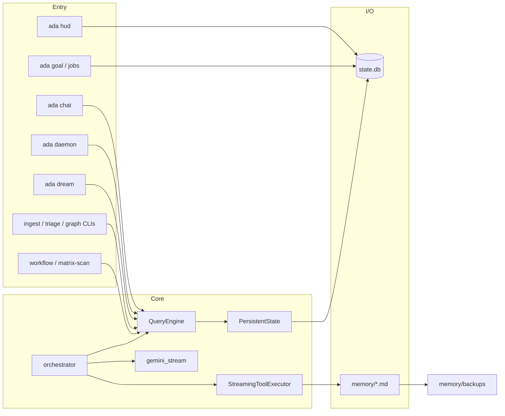

# ADA

**ADA** is a **headless Python 3.11+ asyncio harness** for a local operator agent on edge devices (e.g. Raspberry Pi). One install can run **interactive chat**, a **background worker** (`ada daemon`), **offline ingest CLIs**, and **deterministic publish workflows** (pSEO / ISR), all backed by a single **SQLite** database per profile.

| Layer | What it does |
|-------|----------------|
| **Persistence** | `state.db` — transcript (`messages`), tasks/goals, missions, knowledge, graph, workflows, optional `system_jobs` |
| **Model** | **Google GenAI** (`google-genai`) — streaming `generate_content_stream`, **manual** function calling |
| **Tools** | Allowlisted shell, memory append, plan clipboard, optional web/knowledge/file/GSC/workflow tools (env-gated) |
| **Motor** | Registered **skills** (`skills/*.yaml`) invoked via **`run_skill`** in Agent mode |
| **Operator UI** | Optional Streamlit HUD — `ada hud` (deprecated alias `ada jarvis`) / `scripts/ada_observability_app.py` |

Normative transcript and security rules: [`docs/claude_logic.md`](docs/claude_logic.md). Early phase-1 diagram (partially stale): [`docs/system_architecure.md`](docs/system_architecure.md). **Two-face** Entity vs Work model: [`docs/ADA_CORE.md`](docs/ADA_CORE.md). **This README** is the canonical **current** map of the repo.

### Operator docs (Pi / one profile / pSEO)

- [`docs/ADA_CORE_OPS.md`](docs/ADA_CORE_OPS.md) — **operating ADA on a Pi:** autonomic ops (`ada_ops`), `ada boot` / `ada reload`, cron snippets, tick/daemon
- [`docs/operator-onboarding.md`](docs/operator-onboarding.md) — single path: **profile (optional) → mission init → playbook → cron**, deprecation map, **`ada mission migrate-env`**  
- [`docs/operator-runbook-raspberry-pi.md`](docs/operator-runbook-raspberry-pi.md) — cron + systemd, env matrix, spend caps, dual graph paths, matrix vs keyword tracks, **`ada approval`** for enqueue and publish  
- [`docs/pseo-isr-contract.md`](docs/pseo-isr-contract.md) — stable `page.json` v1 + S3 keys (canonical: `src/ada/publish/page_schema_v1.py`)  
- [`docs/legal-ops-checklist.md`](docs/legal-ops-checklist.md) — ranking / leads / retention / PII (not legal advice)  
- [`ops/schedule.md`](ops/schedule.md) — ingest / triage / dream cadence + `ada daemon` unit (cross-link to runbook for entity/keyword publisher cron)  
- [`scripts/ada_entity_track.sh`](scripts/ada_entity_track.sh), [`scripts/ada_keyword_track.sh`](scripts/ada_keyword_track.sh) — cron-friendly entity vs keyword pipelines  
- [`docs/OPERATOR_SQLITE_BACKUP.md`](docs/OPERATOR_SQLITE_BACKUP.md) — `state.db` backup / restore drill  
- [`docs/OPERATOR_LOGGING.md`](docs/OPERATOR_LOGGING.md) — systemd / file logging for daemon on Pi  
- [`docs/operator-publish-gate.md`](docs/operator-publish-gate.md) — GATE vs ENRICH vs DRAFT (distinct `source_url` facts), diagnosis (`ada workflow status`, `ada gate-failures`, logs)
- [`docs/JOB_QUEUE_SINGLE_OWNER.md`](docs/JOB_QUEUE_SINGLE_OWNER.md) — one job plane per `state.db` (`legacy` vs `system_jobs`)
- [`docs/mission-control-flags.md`](docs/mission-control-flags.md) — deterministic HUD flags from SQLite
- [`docs/mission-control-setup-assist.md`](docs/mission-control-setup-assist.md) — `ada chat --setup` contract

**GATE** (`ADA_PUBLISH_MIN_UNIQUE_FACTS`, distinct `source_url` on graph edges) applies only to **`publish_entity_v1`**, not **`publish_keyword_v1`**. **`ADA_REQUIRE_APPROVAL_FOR_PUBLISH`** gates **`DEPLOY`** for **both** publish kinds when enabled.

### Feature map (details in sections below)

| Area | Entry points / tables |
|------|------------------------|
| **Chat & ingress** | `ada chat` (Entity / Agent / Plan / Setup); [`docs/ADA_CORE.md`](docs/ADA_CORE.md) |
| **Worker** | `ada daemon`, `ada goal`, `ADA_JOB_QUEUE` (`legacy` \| `system_jobs`), `ada jobs` |
| **Missions** | `ada mission`, programme packets, `ada mission tick` |
| **Knowledge** | `ada ingest-rss`, `knowledge_*` + FTS5, optional embeddings |
| **Graph & triage** | `ada extract-graph-lite`, `ada triage`, `entities` / `graph_edges` |
| **Publish** | `publish_entity_v1` / `publish_keyword_v1` workflows, `ada matrix-scan`, S3 ISR — [§12.1](#121-b2b-data-publisher-pseo--isr) |
| **Operator HUD** | `ada hud`, `ada boot`, `ada reload`, `ada doctor`, `ada brief`, `ada gate-failures` |

---

## Table of contents

1. [Where we are vs final goal](#1-where-we-are-vs-final-goal)
2. [Stack and constraints](#2-stack-and-constraints)
3. [Repository layout](#3-repository-layout)
4. [Architecture (runtime)](#4-architecture-runtime)
5. [Data model](#5-data-model)
6. [Entry points (CLI)](#6-entry-points-cli)
7. [Chat surfaces and ingress](#7-chat-surfaces-and-ingress)
8. [Agentic turn (how one user message runs)](#8-agentic-turn-how-one-user-message-runs)
9. [Tools and security](#9-tools-and-security)
10. [Motor, skills, and playbooks](#10-motor-skills-and-playbooks)
11. [Dream mode and memory I/O](#11-dream-mode-and-memory-io)
12. [Configuration (environment)](#12-configuration-environment) — profiles, policy, job queue, B2B publisher
13. [Setup and tests](#13-setup-and-tests)
14. [Roadmap / not implemented](#14-roadmap--not-implemented)
15. [Further reading](#15-further-reading)

---

## 1. Where we are vs final goal

| Theme | **Implemented today** | **Not implemented (north-star / your broader plan)** |
|--------|------------------------|------------------------------------------------------|
| **Transcript** | `messages` chain (`user` / `assistant` / `tool`), `parent_uuid`, `sequence`, **tombstone** on failed legs, **rewire** of live children after tombstone (optional) | Full Claude-parity edge cases only in spec; optional dedicated `api_metadata` column; advanced compaction / snip |
| **Operational “clipboard”** | `tasks` row per chat session (`task_kind=chat`) or queued goal (`task_kind=goal`); `status`, `goal`, `current_output`; **`plan_json`** read/write via **`read_task_plan`** / **`write_task_plan`** (session-bound; toggle **`ADA_ENABLE_PLAN_TOOLS`**); cross-session **goal** recall via **`read_goal_task_view`** (toggle **`ADA_ENABLE_GOAL_RECALL_TOOL`**); **worker-mode** extra harness text for **`ada daemon`** | Auto-injecting full **`plan_json`** into the system prompt on every leg (optional future; model still uses **`read_task_plan`** for explicit reads) |
| **Usage / cost** | `usage_ledger` per model leg; `state` keys `session.last_leg_input_tokens`, `session.last_leg_output_tokens`, `session.last_usage_extras_json`; per-session cap **`ADA_MAX_SESSION_TOKENS`** (fails task when exceeded); **`ada daemon`** optional **global** UTC day/month caps **`ADA_DAILY_TOKEN_BUDGET`** / **`ADA_MONTHLY_TOKEN_BUDGET`** (skips dequeue, leaves goals `pending`); **`ADA_KILL_SWITCH`** pauses daemon dequeue | Operator-facing “session totals” policy; chat-native answers for “how many tokens?” (needs **tool or allowlisted query**, not automatic) |
| **Static / dynamic memory files** | `memory/soul.md`, `master.md`, `wakeup.md`, `shell_allowlist.txt`; loaded into system prompt; **append** tools + **timestamped backups** | Automated **cron** dream (only **manual** `ada dream` today); richer merge / “dream” policies |
| **Tools** | **Allowlisted shell**; **`check_token_usage`** (session totals from **`usage_ledger`**); **append_master_section** / **append_soul_fragment**; **read_task_plan** / **write_task_plan**; optional **workspace file** tools; optional **`web_search`** / **`fetch_url_text`** (see [§9](#9-tools-and-security)); optional **`list_session_web_sources`**; optional **knowledge** + **graph-lite** tools when **`ADA_ENABLE_KNOWLEDGE_TOOLS=1`** | **Plugin DAGs**; **arbitrary** ad-hoc SQL from the model; unconstrained web beyond configured tools |
| **Persistence layering** | **`PersistentState`** (`ada/persistent/store.py`) owns SQL; **`QueryEngine`** adds debounced assistant streaming | Optional further split to match every line of a separate `ARCHITECTURE.md` if you maintain one |
| **Data lakes / RAG** | Bounded **`web_sources`** when web tools persist; **knowledge** store (**`knowledge_items`** + FTS + optional **`knowledge_synthesis`**); **`ada ingest-rss`** for RSS → items; optional Gemini **`search_knowledge`** / **`record_synthesis`** / **`add_knowledge_source`** | **Embeddings** / vector DB over transcript or knowledge; **JSON API ingest** (no dedicated pipeline in-repo); full **datalake** pipelines, skill library as in north-star docs |
| **Scheduling** | Daemon polls **pending** tasks; operator **cron** / **systemd** for **`ada dream`** and **`ada ingest-rss`** | Built-in periodic jobs in-process (today: external **cron** / **systemd** only) |

**Summary:** ADA is a **working local agent loop** with **Gemini streaming**, **multi-leg tool rounds**, **durable SQLite transcript**, **memory file evolution** (chat tools + manual dream), **task clipboard** (`plan_json` tools), **goal queue + worker**, optional **web search/fetch** and **`web_sources`** logging, optional **RSS-backed knowledge** (**`ada ingest-rss`** + env-gated knowledge tools), and **hardening** (idle/wall stream timeouts, executor `discard()` on retry). It is **not** yet the full “consciousness + lakes + automated dream” product end-to-end—especially **semantic RAG / embeddings**, **API-sourced ingest** beyond what you wire yourself, a full **datalake**, and **built-in** scheduled jobs (use **cron** / **systemd**).

---

## 2. Stack and constraints

| Area | Choice |
|------|--------|
| **Language / runtime** | Python **≥ 3.11**, `asyncio` |
| **LLM** | **Google GenAI** SDK (`google-genai`), async streaming `generate_content_stream` |
| **DB** | **SQLite** via `aiosqlite`, **WAL** mode, `PRAGMA foreign_keys=ON` |
| **Package layout** | `src/ada/` (setuptools `where = ["src"]`) |
| **CLI** | `ada` console script → `ada.__main__:main` |

**Non-goals (current design):** no TUI requirement, no MCP transport, no hosted multi-tenant session ingress—**single process**, local disk truth.

---

## 3. Repository layout

Top-level directories (package code lives under **`src/ada/`**):

| Path | Role |
|------|------|
| **`src/ada/`** | Installable package — CLI, orchestrator, persistence, workflows, ingest, publish, observability |
| **`src/ada/db/schema.sql`** | Canonical SQLite DDL (+ migrations applied at connect in `persistent/store.py`) |
| **`memory/`** | Default persona files (`soul.md`, `master.md`, `wakeup.md`, `intent.md`, `shell_allowlist.txt`) when not using profile isolation |
| **`policies/`** | Numeric policy YAML (`default.yaml`); merged with `ADA_POLICY_PACK` and env overrides |
| **`playbooks/registry.yaml`** | Named playbooks → workflow kinds + param allowlists (`ada workflow enqueue --playbook`) |
| **`skills/*.yaml`** | Motor skill specs (`run_skill` in Agent mode) |
| **`templates/missions/`** | Mission programme templates (`ada mission apply-template`) |
| **`profiles/`** | Example env files (e.g. `jarvis.env.example`) for greenfield `system_jobs` profiles |
| **`scripts/`** | Operator scripts — `ada_observability_app.py`, Pi cron helpers (`ada_entity_track.sh`, …) |
| **`ada-control/`** | Thin Streamlit launcher delegating to `src/ada/observability/` (prefer `ada hud`) |
| **`tests/`** | `pytest` suite (publisher tests use **moto** for S3) |
| **`docs/`** | Operator runbooks, contracts, architecture notes (README links the important ones) |

**Core Python modules** (by concern):

| Module / package | Responsibility |
|------------------|----------------|
| [`config.py`](src/ada/config.py), [`profile_runtime.py`](src/ada/profile_runtime.py) | `Settings.load()`, paths, profile isolation |
| [`query_engine.py`](src/ada/query_engine.py), [`persistent/store.py`](src/ada/persistent/store.py) | Public DB API; all SQL |
| [`orchestrator.py`](src/ada/orchestrator.py), [`adapters/gemini_stream.py`](src/ada/adapters/gemini_stream.py) | Multi-leg model loop, streaming |
| [`tool_executor.py`](src/ada/tool_executor.py), [`tools/registry.py`](src/ada/tools/registry.py) | Tool dispatch + Gemini declarations |
| [`chat_session.py`](src/ada/chat_session.py), [`chat_ingress.py`](src/ada/chat_ingress.py) | REPL session; Entity / Work / Setup surfaces |
| [`main.py`](src/ada/main.py), [`daemon_goal.py`](src/ada/daemon_goal.py) | `ada daemon` — legacy goals or `system_jobs` plane |
| [`workflow/`](src/ada/workflow/) | Templates, runner, publish steps (ENRICH → GATE → DRAFT → DEPLOY) |
| [`ingest/`](src/ada/ingest/) | RSS, GSC, keywords, GETS, brand, gatekeeper |
| [`publish/`](src/ada/publish/) | Matrix scan, draft JSON, S3 deploy, WordPress CSV delivery |
| [`extract/graph_lite.py`](src/ada/extract/graph_lite.py), [`triage/`](src/ada/triage/) | Batch graph extraction; impact + category scoring |
| [`motor/`](src/ada/motor/) | Skill registry, argv whitelist, `run_skill` execution |
| [`mission_control/`](src/ada/mission_control/) | HUD snapshots, flags, programme/profile digests |
| [`observability/`](src/ada/observability/) | Streamlit app, read-only queries, operator subprocess guard |
| [`jobs/`](src/ada/jobs/) | `system_jobs` worker loop when `ADA_JOB_QUEUE=system_jobs` |
| [`programme/`](src/ada/programme/) | ProgrammePacket validate/apply (`propose_programme` / `apply_programme`) |

Entry point: **`ada`** → [`__main__.py`](src/ada/__main__.py) (argparse subcommands).

---

## 4. Architecture (runtime)

Rough data and control flow:


```mermaid
flowchart LR
  subgraph entry [Entry]
    Chat[ada chat]
    HUD[ada hud]
    GoalCLI[ada goal / jobs]
    Daemon[ada daemon]
    Dream[ada dream]
    Ingest[ingest / triage / graph CLIs]
    Wf[workflow / matrix-scan]
  end
  subgraph core [Core]
    QE[QueryEngine]
    PS[PersistentState]
    Orch[orchestrator]
    Adp[gemini_stream]
    Ex[StreamingToolExecutor]
  end
  subgraph io [I/O]
    DB[(state.db)]
    Mem[memory/*.md]
  end
  Chat --> QE
  HUD --> DB
  GoalCLI --> DB
  Daemon --> QE
  Dream --> QE
  Ingest --> QE
  Wf --> QE
  QE --> PS
  PS --> DB
  Orch --> QE
  Orch --> Adp
  Orch --> Ex
  Ex --> Mem
  Mem --> backups[memory/backups]
```

- **`PersistentState`**: schema apply/migrate, all SQL writes/reads for tasks, messages, state, usage_ledger, action_log, tombstone/rewire.
- **`QueryEngine`**: same public API for app code; owns **debounced** partial assistant text flushes during streaming; delegates persistence to `PersistentState`.
- **`orchestrator`**: one **user** row per turn, then a **loop** of model **legs** (stream → optional tool calls → persist tool rows → next leg) up to `ADA_MAX_TOOL_ROUNDS`.
- **`adapters/gemini_stream`**: normalizes stream chunks (text + function calls), **manual** function calling (`AutomaticFunctionCallingConfig(disable=True)`), optional **chunk idle** and **leg wall-clock** timeouts (`StreamTimeout`).
- **`tool_executor`**: ordered execution; **shell** via allowlist + `asyncio.create_subprocess_exec`; **memory** appends via `memory_io` (locked + backup); **plan** tools via session-bound hooks into **`QueryEngine`** (no extra DB connections); optional **web** HTTP (Serper / fetch) and **bounded inserts** into **`web_sources`** via `web_persistence` when web tools are enabled; optional **knowledge** tools when **`ADA_ENABLE_KNOWLEDGE_TOOLS=1`**; **ingress-specific** tools (`run_skill`, programme tools, mission snapshot) in Agent / Plan / Setup modes (see [§7](#7-chat-surfaces-and-ingress)).
- **`ada daemon`**: either **legacy** goal polling (`tasks` + optional workflow runner) or **`system_jobs`** plane when **`ADA_JOB_QUEUE=system_jobs`** ([`docs/JOB_QUEUE_SINGLE_OWNER.md`](docs/JOB_QUEUE_SINGLE_OWNER.md)).

**Two faces (Entity vs Work)** — same codebase, different tool sets and mission binding ([`docs/ADA_CORE.md`](docs/ADA_CORE.md)):

| Face | Typical ingress | `tasks.mission_id` | Model tools (high level) |
|------|-----------------|--------------------|---------------------------|
| **Entity** | `ada chat` (no `--mission`) | **NULL** (global concierge) | Web (optional), subset of knowledge, `propose_programme`, `get_mission_control_snapshot`, profile digest |
| **Work** | `ada chat --agent [--mission SLUG]` | Often set on **goals**; chat task may stay unbound while mission context is injected | `run_skill`, full knowledge bundle (when enabled), programme digest, workflow status |

**Job planes** (one per `state.db` — do not mix):

| `ADA_JOB_QUEUE` | Daemon | Enqueue |
|-----------------|--------|---------|
| **`legacy`** (default) | Polls `tasks` where `task_kind=goal` and `status=pending` | `ada goal add`, `ada workflow enqueue` |
| **`system_jobs`** | `jobs/worker.py` claims `system_jobs` rows | `ada mission tick`, handlers; inspect with **`ada jobs`** |

Normative message shapes and ordering: [`docs/claude_logic.md`](docs/claude_logic.md).

---

## 5. Data model

### 5.1 SQLite (`data/state.db` or profile `ADA_PROFILE_DATA_ROOT/<slug>/state.db`)

**Control plane & transcript**

| Table | Role |
|-------|------|
| **`missions`** | Operator programmes: **`slug`**, **`title`**, **`defaults_json`**, **`brief_md`**, **`schedule_hint_json`** (for **`ada mission tick`**) |
| **`tasks`** | Session / queue anchor: **`task_kind`** (`chat` \| `goal`), **`status`**, **`goal`**, **`current_output`**, **`plan_json`**, optional **`mission_id`** |
| **`messages`** | Transcript chain: `content_json` **`parts`**, **`parent_uuid`**, **`tombstone`**, **`sequence`** |
| **`state`** | String KV (boot flags, last-leg tokens, mission tick cursors, `dream.last_run_at`) |
| **`usage_ledger`** | Per-session token legs |
| **`action_log`** | Audit events (dream, blocks, planner failures, operator UI, …) |
| **`approval_records`** | Durable publish/enqueue approvals (**`ada approval`**) |
| **`system_jobs`** | Alternate job plane when **`ADA_JOB_QUEUE=system_jobs`** (leases, retries, idempotency) |

**Knowledge & ingest**

| Table | Role |
|-------|------|
| **`knowledge_sources`** | Endpoints: `kind` (`api` \| `rss` \| `web` \| `brand`), **`base_url`**, optional **`mission_id`** |
| **`knowledge_items`** | Ingested rows + **`impact_score`** / triage categories / **`expires_at`** / **`tombstoned`**; **FTS5** via **`knowledge_items_fts`** |
| **`knowledge_item_embeddings`** | Optional Gemini vectors when **`ADA_KNOWLEDGE_EMBEDDINGS=1`** |
| **`knowledge_synthesis`** | Model- or operator-authored synthesis citing **`ref_item_ids_json`** |
| **`ingest_jobs`**, **`ingest_raw`** | Batch ingest audit (keywords, GETS, …) |
| **`web_sources`** | Per-**chat-session** bounded web tool log (not the knowledge corpus) |
| **`market_metrics`**, **`synthesis_edges`** | Business-kernel triage linkage (optional) |

**Analytics (GSC)**

| Table | Role |
|-------|------|
| **`analytics_providers`**, **`analytics_snapshots`** | Provider config + immutable snapshot per request hash |
| **`gsc_search_analytics_rows`** | Search Console fact rows |
| **`campaign_opportunities`** | Scored opportunities from GSC (planner input) |

**Graph-lite**

| Table | Role |
|-------|------|
| **`entities`** | Subjects (`type`, `name`, **`last_enriched_at`**, optional **`mission_id`**) |
| **`graph_edges`** | Directed edges + **`confidence`**, **`source_url`**, **`status`** |
| **`edge_evidence`** | Links edges to **`knowledge_items`** |

**Workflows**

| Table | Role |
|-------|------|
| **`workflows`** | Template **`kind`**, **`params_json`**, **`parent_task_id`**, idempotency |
| **`workflow_steps`** | **`FETCH`** … **`DEPLOY`** step machine |

Canonical DDL: [`src/ada/db/schema.sql`](src/ada/db/schema.sql). Legacy DBs get **`ALTER`** migrations in [`persistent/store.py`](src/ada/persistent/store.py).

Indexes: messages by `(session_id, sequence)` and `(session_id, tombstone)`; usage and action_log by time/session as in `src/ada/db/schema.sql`.

**Ingestion vs chat:** **`ada chat`** / **`ada daemon`** do not fetch RSS automatically. **`web_search` / `fetch_url_text`** write **`web_sources`** (session-scoped), not **`knowledge_items`**. To populate **`knowledge_items`**, register **`knowledge_sources`** rows (`kind=rss`, `base_url` = feed URL) via SQL, the **`add_knowledge_source`** tool (when enabled), or **`QueryEngine.insert_knowledge_source`**, then run **`ada ingest-rss`** (or schedule it with **cron** / a **systemd timer**). With **`ADA_ENABLE_KNOWLEDGE_TOOLS=1`**, the model can **`search_knowledge`**, **`record_synthesis`**, **`add_knowledge_source`**, **`record_entity`**, **`record_edge`**, and **`link_evidence`** during turns.

### 5.2 Files under `memory/`

| File | Role |
|------|------|
| **`soul.md`** | Persona / long-horizon prose; injected as `<user_soul>` (treat as untrusted) |
| **`master.md`** | Operator “worldview” / guardrails; injected as `<master>` |
| **`wakeup.md`** | Boot **user** message text (once per session when `session.<id>.boot_complete` unset) |
| **`intent.md`** | Plain-English goals for **data-plane** jobs (graph-lite, triage, enrich-graph) — not default chat ([§12.0](#120-policy--intent-files)) |
| **`schema_digest.md`** | Optional; injected into chat system prompt when present |
| **`shell_allowlist.txt`** | One allowlisted command per line (`#` comments); **exact** match after strip |
| **`backups/`** | Created on append: `*.md.bak` copies before writing `master.md` / `soul.md` |

### 5.3 `content_json` (messages)

JSON with a top-level **`parts`** array; entries include `type: text` \| `function_call` \| `function_response` (see `ada/transcript_format.py` and `docs/claude_logic.md` §3). Assistant rows may include **`meta`** (e.g. `model`, `finish_reason`, `usage` snapshot).

---

## 6. Entry points (CLI)

All commands are registered in [`src/ada/__main__.py`](src/ada/__main__.py). Grouped by role:

**Interactive & worker**

| Command | Purpose |
|---------|---------|
| **`ada chat`** | Terminal REPL (`task_kind=chat`). Modes: default **Entity**, **`--agent`** (Work + `run_skill`), **`--plan`** (programme design), **`--setup`** (setup assist). See [§7](#7-chat-surfaces-and-ingress). |
| **`ada chat --new-session`** | New `tasks.id` / transcript |
| **`ada hud`** | Launch Streamlit operator HUD (`scripts/ada_observability_app.py`); prints canonical `ada chat` hint |
| **`ada jarvis`** | Deprecated alias for **`ada hud`** |
| **`ada boot`** | Idempotent **`kernel_boot`** — ensure `base_ops` / `ada_ops` missions and memory source |
| **`ada reload`** | **`kernel_boot`** + restart goal daemon via systemd when configured; no DB wipe; does not restart Streamlit |
| **`ada daemon`** | Background worker — **`legacy`** goal poll (+ workflow runner when parent task matches) or **`system_jobs`** plane per **`ADA_JOB_QUEUE`** |
| **`ada doctor`** | Read-only health report (profile, job queue, stuck `system_jobs`) |

**Goals, jobs, briefs**

| Command | Purpose |
|---------|---------|
| **`ada goal add|list|show`** | **`task_kind=goal`** queue for legacy daemon (optional **`--mission`**, **`--plan-json`**) |
| **`ada jobs list|status|retry|cancel`** | Inspect **`system_jobs`** (requires **`ADA_JOB_QUEUE=system_jobs`**) |
| **`ada brief [--mission SLUG] [--enqueue]`** | SQL-grounded operator brief artifact; optional enqueue as goal |
| **`ada profile brief`** | Profile-scoped brief summary (read-only) |

**Missions & programmes**

| Command | Purpose |
|---------|---------|
| **`ada mission init|list|show`** | CRUD-style mission rows |
| **`ada mission migrate-env <slug>`** | Merge deprecated env into **`defaults_json`** (`--apply` to persist) |
| **`ada mission tick --mission SLUG`** | Run **`schedule_hint_json`** jobs (ingest, matrix, …); often enqueues **`system_jobs`** |
| **`ada mission status|audit-scope <slug>`** | Mission control snapshot + scope audit (JSON) |
| **`ada mission apply-template NAME`** | Build/apply programme from **`templates/missions/<name>.yaml`** |
| **`ada programme apply PATH [--yes]`** | Apply validated **ProgrammePacket** JSON file |

**Workflows & publish**

| Command | Purpose |
|---------|---------|
| **`ada workflow enqueue`** | Pending goal + **`workflows`** / steps — **`--kind`** or **`--playbook`** (from [`playbooks/registry.yaml`](playbooks/registry.yaml)) |
| **`ada workflow status <id>`** | Workflow + steps as JSON |
| **`ada workflow retry <id>`** | Reset failed workflow to pending; **`--duplicate-run`** for full re-enqueue |
| **`ada matrix-scan`** | Enqueue **`publish_entity_v1`** for matrix subjects; **`--dry-run`**, **`--deterministic`**, **`--mission`** |
| **`ada gate-failures`** | Recent failed **GATE** steps + bucket counts |
| **`ada approval request|decide|show`** | **`approval_records`** for publish/enqueue gates |

**Ingest & graph (offline / batch)**

| Command | Purpose |
|---------|---------|
| **`ada ingest-rss`** | RSS/Atom → **`knowledge_items`** (optional **`--mission`**) |
| **`ada add-rss-source URL`** | Register feed in **`knowledge_sources`** |
| **`ada ingest-gsc`** / **`ingest-gsc verify`** | GSC Search Analytics → **`gsc_search_analytics_rows`** |
| **`ada ingest-keywords`** | DataForSEO → **`ingest_raw`** |
| **`ada ingest-gets`** | GETS tender index |
| **`ada ingest-brand`** | Bounded site crawl → brand **`knowledge_items`** |
| **`ada triage`** | Impact + triage categories (optional **`--mission`**, **`--backfill-categories`**) |
| **`ada extract-graph-lite`** | Items → **`entities`** / edges (optional **`--mission`**) |
| **`ada enrich-graph`** | Batch workflow-style **ENRICH** on subject entities |
| **`ada keyword-select`** | Deterministic GSC cluster pick for publish params |

**Memory & maintenance**

| Command | Purpose |
|---------|---------|
| **`ada dream`** | Transcript compression → **`master.md`** / **`soul.md`** (`--dry-run`, `--session`, `--max-messages`) |

**`GEMINI_API_KEY`:** required for **`ada chat`**, **`ada daemon`** (when executing model turns), **`ada dream`**, **`ada triage`**, **`ada extract-graph-lite`**, **`ada enrich-graph`** (live path). Not required for **`ada goal`**, **`ada approval`**, **`ada doctor`**, **`ada jobs`**, **`ada brief`**, **`ada add-rss-source`**, or HTTP-only **`ada ingest-rss`**.

---

## 7. Chat surfaces and ingress

Resolved in [`chat_ingress.py`](src/ada/chat_ingress.py) and [`chat_session.py`](src/ada/chat_session.py):

| CLI flag | Surface | Typical use |
|----------|---------|-------------|
| *(none)* | **Entity (OPEN)** | Concierge: weather/web, mission design, profile digest |
| **`--agent`** | **Work** | Execute **`run_skill`**, mission-scoped knowledge, programme digest |
| **`--plan`** | **Plan** | **`propose_programme`** / validate packets (templates only) |
| **`--setup`** | **Setup** | Tighter tools + **`get_mission_control_snapshot`** ([`docs/mission-control-setup-assist.md`](docs/mission-control-setup-assist.md)) |
| **`--programme`** | *(deprecated)* | Alias for **`--plan`** |

**`--mission SLUG`:** with **`--agent`**, sets default mission context (programme digest, skill defaults). Plain **`ada chat --mission`** without **`--agent`** is deprecated and treated as **`--agent`**.

Env: **`ADA_CHAT_DEFAULT_MISSION`**, **`ADA_REQUIRE_CHAT_MISSION`**, **`ADA_CHAT_SETUP_MODE=1`**, digest inject flags — see **§12** and [`.env.example`](.env.example).

---

## 8. Agentic turn (how one user message runs)

1. **`persist_user`** — user row committed before streaming.
2. For each **model leg** (up to cap): load chain → **`chain_rows_to_contents`** → **`stream_one_model_leg`** with merged **Tool** declarations (shell ± memory ± plan clipboard ± **`read_goal_task_view`** (when enabled) ± file ± web ± `list_session_web_sources` ± knowledge tools as configured).
3. **Assistant** row updated with final text + optional `function_call` parts + **`meta`** (usage/finish_reason).
4. **`record_usage`** → `usage_ledger` + `state` last-leg keys when token ints exist.
5. If the model returned **tool calls**, **`StreamingToolExecutor.run_ordered`** runs them; **`persist_tool_result`** rows; next leg’s parent is **chain head** (usually last tool row).
6. On failure **before** tools persisted: **retry** (with **`executor.discard()`**) up to `max_retries`. If tools were already persisted for that user turn, **no** full-turn retry.
7. **Tombstone** failed assistant (and rewired children if enabled).

---

## 9. Tools and security

| Tool | Mechanism | Safety |
|------|------------|--------|
| **`check_token_usage`** | Reads **`usage_ledger`** for the **current** session and returns summed input/output/total token counts | Always declared with shell tools; read-only |
| **`run_allowlisted_shell`** | `command` must **exactly** match a line in `shell_allowlist.txt`; `shlex.split` + **`asyncio.create_subprocess_exec`** (no shell) | No arbitrary paths unless you add an exact line; output capped by **`ADA_SHELL_MAX_OUTPUT_BYTES`**, timeout **`ADA_SHELL_TIMEOUT_SEC`** |
| **`append_master_section`** | Append under `memory/master.md` | Path locked to **`memory_dir`**; block/file size caps; **backup** first |
| **`append_soul_fragment`** | Append under `memory/soul.md` | Same as above |
| **`read_task_plan`** | Returns **`plan_json`** text for the **current** `tasks.id` (= transcript session) | No cross-task access; read-only |
| **`read_goal_task_view`** | Read **`goal`**, **`status`**, **`current_output`**, **`plan_json`** for another **`tasks.id`** with **`task_kind=goal`** | Read-only; **`ADA_ENABLE_GOAL_RECALL_TOOL`** (default on); invalid or non-goal ids return a tool error |
| **`write_task_plan`** | Replaces **`plan_json`** after **`json.loads`** validation | Same session only; invalid JSON returns a tool error (no commit) |
| **`list_workspace_directory`** | Non-recursive `scandir` under sandbox roots | Same path rules as read/write; entry cap **`ADA_FILE_MAX_LIST_ENTRIES`** |
| **`read_workspace_file`** / **`write_workspace_file`** | Resolved path must lie under **`ADA_FILE_SANDBOX_ROOTS`** | **Denylist:** always **`ADA_DATA_DIR`** and **`memory/`**; **ADA project root** is denied when the sandbox root strictly contains the repo (e.g. `/home/pi` with ADA in `/home/pi/ADA`). Basenames **`.env`**, **`id_rsa`**, **`*.pem`** blocked; optional **`ADA_FILE_DENY_PREFIXES`**, **`ADA_FILE_DENYLIST_FILE`**, **`ADA_FILE_DENY_BASENAMES`**. Denied attempts can be logged to **`action_log`** as **`file_access_denied`** when **`ADA_FILE_AUDIT_DENIALS=1`**. |
| **`web_search`** | Serper Google organic JSON API; returns titles, URLs, snippets | Requires **`ADA_SERPER_API_KEY`** or **`SERPER_API_KEY`**; capped by **`ADA_WEB_SEARCH_MAX_RESULTS`** / timeout envs |
| **`fetch_url_text`** | HTTPS page text (Jina Reader prefix or direct **httpx** per **`ADA_WEB_FETCH_MODE`**) | Caps: max URLs, chars, bytes, timeout; optional **`ADA_WEB_FETCH_HOST_ALLOWLIST`** (SSRF-minded); content may be **truncated** |
| **`list_session_web_sources`** | Read recent **`web_sources`** rows for the **current** `tasks.id` only | **`ADA_ENABLE_WEB_SOURCES_TOOL=1`**; read-only; no HTTP |
| **`search_knowledge`** | **`QueryEngine.search_knowledge_items`** — lexical (**OR** tokens, **BM25** rank), optional **semantic** / **hybrid** when **`ADA_KNOWLEDGE_EMBEDDINGS=1`**; optional **`primary_triage_category`**, **`min_relevance_score`**, **`valid_only`** | **`ADA_ENABLE_KNOWLEDGE_TOOLS=1`**; read-only; returns **title** / **link** / **triage_primary_category** / **relevance_score** / **expires_at** when stored |
| **`record_synthesis`** | **`QueryEngine.insert_knowledge_synthesis`**; optional **`task_id`** defaults to current session | **`ADA_ENABLE_KNOWLEDGE_TOOLS=1`** |
| **`add_knowledge_source`** | **`QueryEngine.insert_knowledge_source`** (`rss` \| `web`); **http(s)** URLs only | **`ADA_ENABLE_KNOWLEDGE_TOOLS=1`**; optional **`ADA_KNOWLEDGE_FEED_HOST_ALLOWLIST`** (comma-separated hosts; empty = any allowed host) |
| **`record_entity`** | Upsert **`entities`** (graph-lite) | **`ADA_ENABLE_KNOWLEDGE_TOOLS=1`** |
| **`record_edge`** | Insert **`graph_edges`** with confidence + evidence item ids | **`ADA_ENABLE_KNOWLEDGE_TOOLS=1`** |
| **`link_evidence`** | Attach **`knowledge_items`** evidence to an edge | **`ADA_ENABLE_KNOWLEDGE_TOOLS=1`** |
| **Disable memory tools** | `ADA_ENABLE_MEMORY_TOOLS=0` | Shell-only declarations remain if allowlist non-empty |
| **Disable plan tools** | `ADA_ENABLE_PLAN_TOOLS=0` | Clipboard declarations omitted |
| **Disable goal recall** | `ADA_ENABLE_GOAL_RECALL_TOOL=0` | **`read_goal_task_view`** declaration omitted |
| **Disable web tools** | `ADA_ENABLE_WEB_TOOLS=0` (default) | No `web_search` / `fetch_url_text` declarations; no Serper spend |
| **Disable knowledge tools** | `ADA_ENABLE_KNOWLEDGE_TOOLS=0` (default) | No `search_knowledge` / `record_synthesis` / `add_knowledge_source` / graph-lite tool declarations |
| **`enqueue_workflow`** | Create pending **`tasks`** row + **`workflows`** + steps from a **code-defined** template kind | **Not a chat tool (H2)** — use **`run_skill`** / `ada workflow enqueue` / internal callers; CLI and `ADA_MAX_TASK_STEPS` unchanged |
| **`get_workflow_status`** | Read-only JSON view of **`workflows`** + **`workflow_steps`** by `workflow_id` | **`ADA_ENABLE_WORKFLOW_TOOLS=1`** |
| **`get_gsc_opportunities`** | Deterministic GSC slices for campaign planning | **`ADA_ENABLE_GSC_READ_TOOLS=1`** |
| **`get_mission_control_snapshot`** | SQLite-derived HUD flags / counts | Setup assist and configured ingress |
| **`run_skill`** | Execute motor skill by id (`skills/*.yaml`) | **Agent** mode; high-risk skills need **`approved=true`** |
| **`propose_programme`** | Validate **ProgrammePacket** JSON (no writes) | Entity / Plan mode |
| **`apply_programme`** | Persist programme after operator confirm | Plan mode; **`approved=true`** required |

The model **cannot** run arbitrary SQL or read arbitrary files unless you **explicitly** add allowlisted commands or new tools. **Symlink following** for read/write uses `Path.resolve()` like before—treat untrusted trees with care.

### 9.1 Filesystem blast radius (summary)

| Asset | Default protection via file tools |
|--------|-----------------------------------|
| SQLite / `data/` | Prefix deny |
| `memory/*.md` | Prefix deny (use **`append_*`** tools) |
| ADA source + `.env` (when using a wider sandbox) | Project root prefix deny if sandbox is an ancestor |
| SSH / extra secrets | Operator adds **`ADA_FILE_DENY_PREFIXES`** or a denylist file |

---

## 10. Motor, skills, and playbooks

**Playbooks** ([`playbooks/registry.yaml`](playbooks/registry.yaml)) name allowed workflow parameters and map to a **`workflow_kind`**. CLI: **`ada workflow enqueue --playbook <id> --goal "…"`** (alternative to **`--kind`**).

**Skills** ([`skills/*.yaml`](skills/)) describe side-effecting operator actions (enqueue workflow, add goal, whitelisted `ada` argv). The model invokes them only via **`run_skill`** in **Agent** mode; execution goes through [`motor/execute.py`](src/ada/motor/execute.py) with argv whitelisting and optional approval gates.

Examples: `ingest_rss_mission.yaml`, `publish_entity_v1.yaml`, `daily_brief.yaml`, `mission_tick_dry_run.yaml`.

**Programme packets** ([`programme/packet.py`](src/ada/programme/packet.py)) bundle mission init, knowledge sources, schedule hints, and enabled skills. Flow: **`propose_programme`** (chat) → operator confirm → **`apply_programme`** (chat) or **`ada programme apply`** (CLI).

---

## 11. Dream mode and memory I/O

- **`ada dream`**: builds a text bundle from **`load_messages_for_dream`** (session-scoped or global recent window) + **`load_usage_ledger_lines`**, calls **non-streaming** `generate_content` with **`response_mime_type=application/json`**, expects structured fields for **master** / **soul** fragments, then **`memory_io.append_markdown_block`** (async lock + backup). It summarizes **transcript (`messages`)**, not the **`knowledge_items`** corpus.
- **Logging**: `action_log` kinds `dream_start`, `dream_complete`, `dream_failed`; `state` **`dream.last_run_at`**.
- **Cadence**: prefer **weekly** or **on-demand** after substantive chats—not daily on empty transcripts. Schedule with **cron** / **systemd** separately from **`ada ingest-rss`** (see [§13.1](#131-operator-runbook-knowledge-goals-dream)).

Details: `src/ada/dream/run.py`, `src/ada/memory_io.py`.

---

## 12. Configuration (environment)

See **`.env.example`** for the full list. Important groups:

- **Model:** `GEMINI_API_KEY`, `GEMINI_MODEL`
- **Paths:** `ADA_DATA_DIR`, **`ADA_PROFILE`** / **`ADA_PROFILE_DATA_ROOT`**, **`ADA_MEMORY_DIR`**, **`ADA_POLICY_ROOT`**, **`ADA_REQUIRE_PROFILE_ISOLATION`** (see **§12.0a**)
- **Agentic loop:** `ADA_MAX_TOOL_ROUNDS`, shell caps/timeouts
- **Stream hardening:** `ADA_STREAM_CHUNK_IDLE_SEC`, `ADA_STREAM_LEG_MAX_SEC`, `ADA_REWIRE_AFTER_TOMBSTONE`
- **Memory / dream:** `ADA_ENABLE_MEMORY_TOOLS`, `ADA_MEMORY_MAX_APPEND_BYTES`, `ADA_MEMORY_MAX_FILE_BYTES`, `ADA_DREAM_MAX_SOUL_BYTES`, `ADA_DREAM_MAX_MESSAGES`
- **Clipboard:** `ADA_ENABLE_PLAN_TOOLS` (default on: **`read_task_plan`** / **`write_task_plan`**); **`ADA_ENABLE_GOAL_RECALL_TOOL`** (default on: **`read_goal_task_view`**)
- **Workspace file tools:** `ADA_ENABLE_FILE_TOOLS`, `ADA_FILE_SANDBOX_ROOTS`, read/write/list caps, **`ADA_FILE_MAX_LIST_ENTRIES`**, **`ADA_FILE_DENY_PREFIXES`**, **`ADA_FILE_DENYLIST_FILE`**, **`ADA_FILE_DENY_BASENAMES`**, **`ADA_FILE_AUDIT_DENIALS`**
- **Web tools & `web_sources`:** `ADA_ENABLE_WEB_TOOLS`, `ADA_SERPER_API_KEY` / `SERPER_API_KEY`, search/fetch caps and timeouts, **`ADA_WEB_FETCH_MODE`**, **`ADA_JINA_API_KEY`** (if using Jina), **`ADA_ENABLE_WEB_SOURCES_TOOL`** — see **`.env.example`**
- **Knowledge tools & RSS ingest:** `ADA_ENABLE_KNOWLEDGE_TOOLS`, **`ADA_KNOWLEDGE_FEED_HOST_ALLOWLIST`** (optional), **`ADA_INGEST_RSS_MAX_ITEMS`**, **`ADA_INGEST_RSS_MAX_RESPONSE_BYTES`**, **`ADA_INGEST_RSS_TIMEOUT_SEC`**, **`ADA_KNOWLEDGE_DEFAULT_RETENTION_DAYS`**, **`ADA_INGEST_GATEKEEPER`**, **`ADA_INGEST_GATE_MODEL`**, **`ADA_INGEST_GATE_MAX_OUTPUT_TOKENS`** — see **`.env.example`**
- **Knowledge embeddings (optional):** **`ADA_KNOWLEDGE_EMBEDDINGS=1`** enables Gemini vectors for **`search_knowledge`** semantic/hybrid modes and embeds new items during **`ada ingest-rss`** (uses **`GEMINI_API_KEY`**); tune **`ADA_KNOWLEDGE_EMBEDDING_MODEL`**, **`ADA_KNOWLEDGE_EMBEDDING_DIM`**, **`ADA_KNOWLEDGE_EMBEDDING_MIN_COSINE`**
- **Job queue:** **`ADA_JOB_QUEUE`** — `legacy` (poll `tasks` goals) or **`system_jobs`** (see [`docs/JOB_QUEUE_SINGLE_OWNER.md`](docs/JOB_QUEUE_SINGLE_OWNER.md)); greenfield profiles often use **`system_jobs`** + **`ada jobs`**
- **Phase 0 control plane (`ada daemon` only):** **`ADA_KILL_SWITCH`** — when `1` / `true` / `yes`, the daemon **does not** dequeue goals (`pending` stays `pending`); **`ada goal add`** still enqueues. **`ADA_DAILY_TOKEN_BUDGET`** / **`ADA_MONTHLY_TOKEN_BUDGET`** — optional caps on **global** summed `usage_ledger` tokens (input+output) for the **current UTC** calendar day / month; when exceeded, the daemon skips execution (same as kill switch: task stays pending). **`ADA_COMMERCIAL_DATA_DIR`** — if set, used as the runtime **`data_dir`** / `state.db` location for that process (overrides **`ADA_DATA_DIR`**; isolated “commercial” profile vs personal `data/`). **`ADA_MAX_TASK_STEPS`** — when set, **workflow enqueue** fails if a template’s expanded step list exceeds this count (see **`src/ada/workflow/templates.py`**); when unset, no cap from this variable. See [`docs/ROADMAP_APEX_OS.md`](docs/ROADMAP_APEX_OS.md) §5 for normative behavior, `action_log` kinds **`kill_switch_skip`** and **`global_budget_block`**, and implementation notes.

`Settings.load()` in `src/ada/config.py` is the single source of parsed values.

### 12.0a Multi-tenant / parallel profiles

Run **N** isolated tenants from one checkout by giving each process a distinct **`ADA_PROFILE`** + **`ADA_PROFILE_DATA_ROOT`** (and distinct **`GEMINI_API_KEY`** / cloud creds via **systemd** `EnvironmentFile=`, not a shared repo **`.env`**).

| Variable | Role |
|----------|------|
| **`ADA_PROFILE`** | Slug (`^[a-z0-9][a-z0-9_-]{1,63}$`); runtime **`data_dir`** = `<ADA_PROFILE_DATA_ROOT>/<ADA_PROFILE>/` (SQLite **`state.db`**, **`artifacts/`**, **`audit/`**). |
| **`ADA_PROFILE_DATA_ROOT`** | Absolute directory containing one subdirectory per profile slug. |
| **`ADA_MEMORY_DIR`** | Optional. If unset in profile mode, defaults to **`ADA_PROFILE_DATA_ROOT/ADA_PROFILE`** (same as **`data_dir`** — soul/master/intent alongside `state.db`). Legacy **`ADA_DATA_DIR`** / default data layout still uses **`<repo>/memory`**. |
| **`ADA_POLICY_ROOT`** | Optional. Directory that contains **`default.yaml`** (same shape as **`<repo>/policies/`**). In profile mode, if **`<data_dir>/policies/default.yaml`** exists, that directory is used; otherwise ADA falls back to **`<repo>/policies`** and prints one stderr line: **`policy_root_fallback profile=…`**. Operators who need **fail-closed** policy isolation should ship a **`default.yaml`** per profile (or set **`ADA_POLICY_ROOT`** to an absolute path outside the repo); a stricter startup mode may be added later. |
| **`ADA_REQUIRE_PROFILE_ISOLATION`** | When **`1`**, requires profile env vars **and** rejects resolved **`ADA_MEMORY_DIR`** / **`ADA_POLICY_ROOT`** (or their defaults) if they lie **under the ADA project root** — use this in prod so tenants cannot accidentally share repo **`<repo>/memory`** or **`<repo>/policies`**. |

**Per-profile layout (recommended):**

```text
<ADA_PROFILE_DATA_ROOT>/
  <profile>/
    state.db
    soul.md, master.md, intent.md, wakeup.md, shell_allowlist.txt, …  # default memory_dir = this folder
    backups/          # created by append tools / memory_io
    policies/
      default.yaml    # optional; omit ⇒ repo policies fallback + stderr hint
    artifacts/
    audit/
```

**`ADA_POLICY_PACK`:** relative paths resolve against the effective **`ADA_POLICY_ROOT`** directory (the folder holding **`default.yaml`**). With legacy **`ADA_DATA_DIR`** only, that directory is **`<repo>/policies`**, so behavior matches older docs. In profile mode, prefer **absolute** pack paths or files under the profile’s **`policies/`** directory.

**Parallel daemons (systemd):** use an **instance** unit so each tenant has its own env file, e.g. **`/etc/systemd/system/ada-daemon@.service`**:

```ini
[Unit]
Description=ADA daemon (%i)

[Service]
Type=simple
User=ada
WorkingDirectory=/opt/ADA
Environment=PYTHONUNBUFFERED=1
EnvironmentFile=-/etc/ada/%i.env
ExecStart=/opt/ADA/.venv/bin/ada daemon
SyslogIdentifier=ada-daemon@%i

[Install]
WantedBy=multi-user.target
```

Enable with **`systemctl enable --now ada-daemon@client_acme`**. Put **`ADA_PROFILE=client_acme`**, **`ADA_PROFILE_DATA_ROOT=/var/lib/ada-profiles`**, keys, and caps in **`/etc/ada/client_acme.env`**. Logs: **`journalctl -u 'ada-daemon@*'`** or **`journalctl -u ada-daemon@client_acme`**.

**Observability:** the Streamlit app resolves **`state.db`** from the same env as the CLI (`ADA_PROFILE` / **`ADA_DATA_DIR`**, etc.); run one dashboard per tenant or pass the same env block as the daemon.

**Secrets:** **`load_dotenv_if_present()`** only fills keys missing from the process environment; a **shared** repo **`.env`** can still inject defaults (e.g. **`ADA_DATA_DIR`**) into the wrong tenant if a unit forgets to set overrides. Prefer **`EnvironmentFile=`** per instance and avoid committing real secrets.

**Upgrade note:** existing profile users who kept persona files in **`<repo>/memory`** should copy them into **`ADA_PROFILE_DATA_ROOT/ADA_PROFILE`** (or set **`ADA_MEMORY_DIR`** explicitly) before switching.

**Missions vs profiles:** **`ADA_PROFILE`** / **`ADA_PROFILE_DATA_ROOT`** (or legacy **`ADA_DATA_DIR`**) determine **which `state.db` file** a process uses. **Missions** are **rows in that same database** (`missions` table); goal tasks may set **`tasks.mission_id`** (CLI: **`ada mission init`**, **`ada goal add --mission <slug>`**). One profile therefore supports **many missions** in one SQLite file. Changing profile (or data dir) switches to a **different** database with its **own** missions and tasks—missions are **not** a substitute for profile isolation.

### 12.0 Policy & intent files

ADA separates **chat persona** (**`memory/soul.md`**, **`memory/master.md`**) from **policy** and **operator intent**:

| Artifact | Purpose |
|---------|---------|
| **[`policies/default.yaml`](policies/default.yaml)** | Numeric limits only: `version`, `intent_max_bytes`, `matrix_planner_top_k`, **`graph_lite_max_items_per_job`**, **`graph_lite_token_cap_per_job`**, **`batch_enrich_max_entities`**, **`batch_enrich_max_tool_rounds`**. **No** prose prompts. Missing file ⇒ built-in defaults. Malformed YAML when the file exists ⇒ **`ValueError`** (fail closed). Unknown top-level keys after merge log one **stderr** line (drift catcher); programme knobs belong in **`missions.defaults_json`** / playbooks — see [`docs/operator-onboarding.md`](docs/operator-onboarding.md). |
| **`ADA_POLICY_PACK`** | Optional absolute path, or path **relative to the effective policy directory** (folder containing **`default.yaml`** — see **`ADA_POLICY_ROOT`** / **§12.0a**), to another **`.yaml` / `.yml`** file, or a **directory** whose `*.yaml` / `*.yml` files are merged in lexical order **after** `default.yaml`. |
| **`ADA_INTENT_MAX_BYTES`**, **`ADA_MATRIX_PLANNER_TOP_K`** | When set, override **`intent_max_bytes`** and **`matrix_planner_top_k`** from YAML. |
| **`ADA_GRAPH_LITE_POLICY_MAX_ITEMS`**, **`ADA_GRAPH_LITE_POLICY_TOKEN_CAP`** | When set, override **`graph_lite_max_items_per_job`** (1–200) and **`graph_lite_token_cap_per_job`** (256–500000) after YAML merge. |
| **`ADA_BATCH_ENRICH_MAX_ENTITIES`**, **`ADA_BATCH_ENRICH_MAX_TOOL_ROUNDS`** | When set, override **`batch_enrich_max_entities`** (1–10000) and **`batch_enrich_max_tool_rounds`** (1–48) after YAML merge. |
| **`memory/intent.md`** | Plain English goals for **data-plane** pipelines (triage, graph-lite extraction, matrix planner, **`ada enrich-graph`**). **Not** injected into default chat (**`build_system_instruction`**). Missing file ⇒ empty string (truncated to the intent byte cap). |

**Merge precedence:** **`default.yaml`** under the effective policy directory (**`<repo>/policies`** or **`ADA_POLICY_ROOT`** / per-profile **`policies/`** — see **§12.0a**) → **`ADA_POLICY_PACK`** overlay(s) → **environment overrides** (`ADA_*` above).

**Programme env deprecation (one release):** several **`ADA_*`** / **`GSC_SITE_URL`** knobs that scope a **programme** (ISR ids, brand/GSC URLs, keyword ingest seeds, matrix caps, publish/triage thresholds) print **stderr** hints on **`Settings.load()`** and may log **`action_log`** `deprecated_env_used` once per process. Prefer **`missions.defaults_json`** and **`ada mission migrate-env <slug>`** — see [`docs/operator-onboarding.md`](docs/operator-onboarding.md). Silence hints with **`ADA_DEPRECATED_ENV_SUPPRESS=1`** only after you accept env-as-global fallback.

**Rollback (policy plane):** remove or restore defaults for `policies/default.yaml`, unset **`ADA_POLICY_PACK`** and overrides, clear **`memory/intent.md`**.

**DAG ENRICH vs batch `enrich-graph`:** the **`publish_entity_v1`** template runs **ENRICH** inside the daemon with the normal worker **`build_system_instruction`** (harness + master + soul). **`ada enrich-graph`** is a **cron-friendly background widen** that reuses the same ENRICH implementation (`run_publish_entity_enrich`) but passes a **data-plane** system instruction built from **`build_llm_context`** + **`memory/intent.md`** + numeric policy only—useful to densify the graph before or between publish runs without coupling to one workflow goal.

### 12.0b Deploy evolved ADA

**Cron / systemd ordering (recommended):** **`ada ingest-rss`** → **`ada extract-graph-lite`** → **`ada triage`** → optional **`ada enrich-graph --limit …`** (background graph widen) → **`ada matrix-scan`** (`--dry-run` optional) → long-running **`ada daemon`** (workflow runner).

### 12.0c Smoke path (intent → graph → batch enrich → one publish)

Minimal operator check that **`memory/intent.md`** and **`policies/default.yaml`** steer data-plane jobs (not chat):

1. Edit **`memory/intent.md`** with plain goals (e.g. sectors or regions to emphasize).
2. Run **`ada extract-graph-lite`** (optional **`--limit`** / **`--token-cap`**; values are clamped by policy ceilings).
3. Run **`ada enrich-graph --limit 1`** (or **`--entity-id <id>`** once or repeated, then **`--limit`** to cap the union). Inspect **`action_log`** for kind **`batch_graph_enrich`**.
4. Enqueue **one** publish workflow, for example: **`ada workflow enqueue --kind publish_entity_v1 --goal "smoke publish" --params-json '{"entity_id":YOUR_ID,"project_id":"default","campaign_id":"main"}'`** (adjust JSON to match your entity and ISR ids), or run **`ada matrix-scan`** with **`ADA_MATRIX_PLANNER=0`** and a small pool so only one workflow is created.
5. Run **`ada daemon`** until the workflow reaches **DRAFT** (watch logs under **`data/logs/`** per [`docs/OPERATOR_LOGGING.md`](docs/OPERATOR_LOGGING.md)). Inspect **`ada workflow status <id>`** for step rows (**ENRICH** / **GATE** / **DRAFT**).

**Matrix modes**

| Mode | Behaviour |
|------|-----------|
| **Legacy matrix-scan** | **`ADA_MATRIX_ENABLE=1`**, **`ADA_MATRIX_PLANNER=0`** (default). Candidates: subject entities with **`classified_as`** / **`under_category`** to a category; **stable order:** `entities.id ASC` (same as PostgreSQL deterministic scan). See [`src/ada/persistent/store.py`](src/ada/persistent/store.py) `list_subjects_with_classified_category`. |
| **Prioritized planner** | **`ADA_MATRIX_PLANNER=1`** (requires **`GEMINI_API_KEY`** for one planning call per **`ada matrix-scan`** unless validation fails early). Bounded pool: **`list_subjects_with_classified_category_recent_for_planner`** — **recent** = **`last_enriched_at DESC`**, **`NULL`** enriched rows ordered **after** dated rows (`(last_enriched_at IS NULL) ASC` then `DESC`), then **`e.id`** / category as tie‑breakers. The model returns **`entity_ids`** only; the server parses JSON → **whitelist** against that pool → **dedupe** → **truncate to `matrix_planner_top_k` from policy** → **`publish_entity_v1`** enqueue via the same idempotent keys as legacy. |
| **Fallback** | **`ADA_MATRIX_PLANNER_LEGACY_FALLBACK=1`**: on invalid/unparseable planner JSON or validation failure, run **legacy deterministic** enqueue ( **`ADA_MATRIX_ENABLE`** still respected). |

**Smoke checks:** **`ada workflow status`**, **`ada gate-failures`**, **`data/` logs** ([`docs/OPERATOR_LOGGING.md`](docs/OPERATOR_LOGGING.md)). Audit / ops: **`action_log`** kinds **`matrix_planner_validation_failed`**, **`matrix_planner_blocked`**.

**Risk / monitoring:** planner adds **LLM tokens** once per scan; watch **`usage_ledger`**, global caps (**`ADA_DAILY_TOKEN_BUDGET`**, **`ADA_MONTHLY_TOKEN_BUDGET`**), and GATE failure rates.

**Staging → prod checklist:** validate **`ada matrix-scan --dry-run`** (`ADA_MATRIX_ENABLE` unset still lists candidates without enqueue); enable **`GEMINI_API_KEY`**; enable **`ADA_MATRIX_PLANNER=1`** only when ready; run **`pytest -q`** on the deployment revision.

### 12.1 B2B Data Publisher (pSEO / ISR)

The **publish** pipeline is **deterministic** where possible: **`ENRICH`** writes **`knowledge_items`**, graph edges (with optional **`source_url`**) and **`entities.last_enriched_at`**; **`GATE`** counts **distinct** non-empty `source_url` on active outgoing edges for `entity_id` and fails the workflow if below **`ADA_PUBLISH_MIN_UNIQUE_FACTS`** (default **3**), so **`DRAFT`** (Gemini JSON) and **`DEPLOY`** (S3) do not run. **Matrix** (**`ada matrix-scan`**) is a separate **cron**-friendly process that enqueues work; the **daemon** executes workflows. **AWS:** set **`S3_BUCKET_NAME`** (or **`ADA_S3_BUCKET`**, same value as the Next app’s bucket), **`AWS_REGION`**, and credentials (or an instance role) with `s3:PutObject` and `s3:GetObject` on `/{project_id}/{campaign_id}/*` for the write identity; the Next **read** role typically needs `s3:ListBucket` + `GetObject`/`HeadObject` (IAM split; see `docs/pseo-isr-contract.md`).

| Kind | Steps (order) | `params_json` (minimum) |
|------|----------------|-------------------------|
| **`rss_fetch_then_graph_then_synth`** | `FETCH` → `EXTRACT` → `SYNTHESIZE` | `topic?`, `recent_item_limit?` |
| **`publish_entity_v1`** | `ENRICH` → `GATE` → `DRAFT` → `DEPLOY` | **`entity_id`**, **`project_id`**, **`campaign_id`**, **`niche`**, optional **`slug`**, optional **`target_keyword_cluster`** (string), optional **`keyword_source`** metadata; workflow-level **`idempotency` via `--idempotency-key` on enqueue** |
| **`publish_keyword_v1`** | `ENRICH` → `DRAFT` → `DEPLOY` | **`target_keyword_cluster`**, **`project_id`**, **`campaign_id`**, **`niche`**; optional **`keyword_source`**, **`slug`**, **`brand_name`**, **`vertical`**. A **`keyword_landing`** subject entity is created/merged on first **ENRICH**; **`workflows.params_json`** is updated with **`entity_id`** (resume-safe). **No** graph fact **GATE**. |

**Publish `delivery` (optional, both publish kinds):** Omit **`delivery`** and **`DEPLOY`** keeps the default **ISR** path (`page.json` + `manifest.json` on **`S3_BUCKET_NAME`** / **`ADA_S3_BUCKET`**). To override, set **`delivery`** in merged **`params_json`** (playbook allowlist + mission **`defaults_json`** + enqueue delta), for example:

- **`{"delivery": {"mode": "isr_s3"}}`** — same as default (explicit).
- **`{"delivery": {"mode": "none"}}`** — **DRAFT** runs as today; **DEPLOY** skips remote S3, completes the workflow, and logs **`publish_delivery_skipped`** (approval rules unchanged when **`ADA_REQUIRE_APPROVAL_FOR_PUBLISH`** is on).
- **`{"delivery": {"mode": "wordpress_csv_s3", "wordpress_csv_s3": {...}}}`** — **DEPLOY** writes a one-row WordPress-style CSV (**`Title`**, **`Content`**, **`Slug`**, **`Meta_Description`**, **`Focus_Keyword`**) to a **separate** bucket via **`PutObject`**. Provide exactly one of **`key`** (full object key) or **`prefix`** (directory prefix; object key = `prefix/{slug}.csv`). Bucket: set **`delivery.wordpress_csv_s3.bucket`**, or omit it and set **`ADA_WORDPRESS_CSV_S3_BUCKET`** as the default. Optional **`idempotency`**: **`overwrite`** / **`overwrite_only`** (default behavior is overwrite). Legacy alias **`delivery_targets`** is merged into **`delivery`** when **`delivery`** is absent (**`delivery`** wins if both are sent).

**Full graph vs keyword-first (operator note):** Use **`publish_entity_v1`** when a **real graph subject** (matrix/ISR entity) is ready: **GATE** enforces **ADA_PUBLISH_MIN_UNIQUE_FACTS** on outgoing edges. Use **`publish_keyword_v1`** to ship a page **tied to a keyword** without selecting a matrix entity—the daemon **ENRICH** step uses the same web/graph rules as **`publish_entity_v1`** (e.g. connector ENRICH when live web is off) but **skips** **GATE**. **Enqueue and deploy** approval env vars (**`ADA_REQUIRE_APPROVAL_FOR_ENQUEUE`**, **`ADA_REQUIRE_APPROVAL_FOR_PUBLISH`**) are unchanged. **`ada matrix-scan`** only enqueues **`publish_entity_v1`**, not the keyword kind.

**Keyword track vs matrix planner:** **`publish_keyword_v1`** remains **deterministic** (GSC / keyword selection + template params in code). The **matrix prioritized planner** only proposes **`entity_id`** values for **`publish_entity_v1`** and must **not** mix in keyword workflows; keyword-led publishes use **`ada workflow enqueue --kind publish_keyword_v1`** (or your keyword automation) separately.

**Publisher env:** all variables are documented in [`.env.example`](.env.example) (S3, AWS credentials, `ADA_PUBLISH_MIN_UNIQUE_FACTS`, `ADA_PUBLISH_DRAFT_MODEL`, `ADA_MATRIX_*`, `ADA_PROJECT_ID`, `ADA_CAMPAIGN_ID`).

**Tests:** `pytest` modules matching **`tests/test_publish_*.py`**.

## 13. Setup and tests

Run the full suite with **`pytest`**; publisher tests use **moto** (no real S3 in CI). Install dev extras with **`pip install -e .[dev]`** (or **`pip install -e ".[dev]"`**). The optional observability dashboard needs **`pip install -e ".[streamlit]"`** (see [§13.4](#134-operator-hud-streamlit)); it is not required for tests.

```bash
python3 -m venv .venv
source .venv/bin/activate   # or .venv\Scripts\activate on Windows
pip install -e ".[dev]"
cp .env.example .env        # set GEMINI_API_KEY
```

```bash
ada chat
ada chat --new-session
ada goal add "background objective"
ada goal list
ada daemon
ada dream --dry-run
ada dream
ada ingest-rss
ada triage --limit 5
ada extract-graph-lite
pytest -q
```

### 13.1 Operator runbook (knowledge, goals, dream)

**End-to-end loop:** Register RSS feeds (`add_knowledge_source` or SQL) → **`ada ingest-rss`** (daily cron) writes **`knowledge_items`** with tags / **`relevance_score`** / optional **`expires_at`** → with **`ADA_ENABLE_KNOWLEDGE_TOOLS=1`**, **`ada chat`** or **`ada daemon`** can **`search_knowledge`** (optionally `min_relevance_score`, e.g. `0.5`) and **`record_synthesis`** into **`knowledge_synthesis`** citing **`ref_item_ids`**. **`ada dream`** is separate: it compresses **chat transcript** into `memory/master.md` / `soul.md`, not the knowledge table.

**`ada daemon`** is a **long-running** process (use **systemd** on a Pi), not a cron one-shot. It dequeues **`task_kind=goal`** rows with **`status=pending`**.

**Example daily brief goal** (daemon consumes when pending):

```bash
ada goal add "Search knowledge for topics X and Y from the last week. Call search_knowledge with min_relevance_score 0.5 if filtering. Then record_synthesis with a short Markdown brief and ref_item_ids from the hits."
```

**Cron (user `pi`, project `/home/pi/ADA`)** — adjust paths:

```cron
# Daily RSS ingest (06:15)
15 6 * * * cd /home/pi/ADA && . .venv/bin/activate && ada ingest-rss >>/home/pi/ADA/data/ingest-rss.log 2>&1

# Weekly dream — Sunday 03:30 (transcript compression; not daily)
30 3 * * 0 cd /home/pi/ADA && . .venv/bin/activate && ada dream >>/home/pi/ADA/data/dream.log 2>&1
```

**systemd** (sketch): `ada daemon` as `Type=simple` `ExecStart=/path/to/.venv/bin/ada daemon`, `Restart=on-failure`; timers for `ingest-rss` / `dream` using `OnCalendar` instead of cron if you prefer.

### 13.2 Using GSC data for campaign planning

When GSC ingestion is enabled, ADA can read deterministic opportunity slices from `gsc_search_analytics_rows` and pre-populate `tasks.plan_json` for queued goals.

- Set env flags: `ADA_ENABLE_GSC_INGEST=1`, `ADA_ENABLE_GSC_READ_TOOLS=1`, `GSC_SITE_URL=...`
- Optional planning bounds: `ADA_GSC_PLAN_DEFAULT_LOOKBACK_DAYS` and `ADA_GSC_PLAN_MAX_ITEMS`
- `ada daemon` pre-generates a GSC campaign plan payload (approval status defaults to `pending`) before running the model turn for each eligible `task_kind=goal`
- In chat/daemon tool mode, `get_gsc_opportunities` returns `top_queries`, `top_pages`, `quick_wins`, `content_gaps`, and `page_fixes`

Example sequence:

```bash
# 1) Ingest GSC rows for recent window
ada ingest-gsc --site "https://example.com/" --days 28 --dimensions "date,query,page,country,device" --row-limit 25000

# 2) Queue a campaign objective
ada goal add "Build an SEO campaign plan from GSC quick wins and content gaps"

# 3) Run daemon worker (or let systemd keep it running)
ada daemon

# 4) Inspect generated deterministic plan_json
ada goal list
ada goal show <task_id>
```

### 13.3 Operator flow for publish targeting

Recommended safe flow for pSEO publish runs:

1. `ada ingest-brand --site-url "https://example.com/"` (or set `ADA_BRAND_SITE_URL`)
2. `ada ingest-gsc ...` when Search Console is available
3. `ada keyword-select --entity-id ... --site ... --start-date ... --end-date ...`
4. `ada workflow enqueue --kind publish_entity_v1 --params-json '{"entity_id":...,"project_id":"...","campaign_id":"...","niche":"...","target_keyword_cluster":"...","keyword_source":{"kind":"gsc","site":"...","start_date":"...","end_date":"..."}}'`
5. `ada daemon`

Keyword-only (no pre-existing **entity_id**; no **GATE**): `ada workflow enqueue --kind publish_keyword_v1 --params-json '{"target_keyword_cluster":"...","project_id":"...","campaign_id":"...","niche":"..."}'`

Fallback behavior is explicit: if GSC tables/data are missing, publish workflow continues in brand/entity-only mode and logs the fallback reason (`gsc_table_missing`, `gsc_no_rows`, or `keyword_missing`) in workflow step output and `action_log`.

### 13.4 Operator HUD (Streamlit)

**Primary operator HUD:** launch with **`ada hud`** (deprecated alias **`ada jarvis`**) or:

```bash
pip install -e ".[streamlit]"
ada hud
# equivalent:
streamlit run scripts/ada_observability_app.py
```

The **Chat** tab provides concierge (**Chat**), template **Apply programme** (**Plan**), and **Run action** (**Agent**) beside read-only observability tabs. See [`docs/STREAMLIT_BOSS.md`](docs/STREAMLIT_BOSS.md). Legacy entry: [`ada-control/app.py`](ada-control/app.py) delegates to the same package.

**Architecture:** the HUD is **not** the agent — no orchestrator, tool executor, or daemon inside Streamlit. It uses **SELECT**-only SQLite (`mode=ro`) and **whitelisted** subprocess argv for safe operator actions. Security boundaries match [`docs/claude_logic.md`](docs/claude_logic.md).

Bind **localhost** only (Streamlit default); use **SSH port forwarding** or a host firewall for remote access. Do not expose this UI to the public internet. The app does not load `.env` files by itself; it reads **already-exported** environment variables for path resolution and the “caps” panel—**never** paste API keys into the UI or commit them to git.

**PII / secrets (operator note):** PII-specific features are out of scope; do not paste secrets into chat. Raw leads are not Ada’s storage model today. The dashboard avoids transcript browsing and shows **aggregates / digests** for columns that might hold sensitive text (goal length + hash, truncated errors, sanitized `action_log` payloads).

**SQLite backup / restore:** see [`docs/OPERATOR_SQLITE_BACKUP.md`](docs/OPERATOR_SQLITE_BACKUP.md). **Daemon logging on Pi:** see [`docs/OPERATOR_LOGGING.md`](docs/OPERATOR_LOGGING.md).

**Example SQL** (`sqlite3 data/state.db`):

```sql
-- Recent items, relevance at least 0.5 (legacy NULL counts as 1.0 in COALESCE), not expired, not tombstoned
SELECT id, ingested_at, relevance_score, expires_at
FROM knowledge_items
WHERE tombstoned = 0
  AND (expires_at IS NULL OR datetime(expires_at) > datetime('now'))
  AND COALESCE(relevance_score, 1.0) >= 0.5
ORDER BY datetime(ingested_at) DESC
LIMIT 50;
```

Paste-only voice starters for **`memory/master.md`** / **`soul.md`**: see [`docs/operator_voice_templates.md`](docs/operator_voice_templates.md).

---

## 14. Roadmap / not implemented

**Phase 0 (control plane)** — implemented: see [`docs/ROADMAP_APEX_OS.md`](docs/ROADMAP_APEX_OS.md) §5, [`src/ada/budget.py`](src/ada/budget.py), and env vars in **§12** / `.env.example`.

**Phase 3 (workflow engine)** — implemented: RSS → graph → synth (`FETCH` / `EXTRACT` / `SYNTHESIZE`) and B2B publish templates with **`ENRICH`**, optional **`GATE`**, **`DRAFT`**, **`DEPLOY`** (see **§12.1**). Code: [`src/ada/workflow/`](src/ada/workflow/), daemon branch in [`src/ada/main.py`](src/ada/main.py), tests **`tests/test_phase3_workflow.py`** and **`tests/test_publish_*.py`**.

Suggested **next planning** items (prioritize as you like):

1. **Operator observability** — optional read-only Streamlit dashboard ([§13.4](#134-operator-hud-streamlit)); optional future: **`get_usage_summary`** tool or allowlisted `sqlite3` one-liners for ad-hoc questions.
2. **Scheduled dream** — `cron` / systemd timer calling `ada dream` (no in-repo scheduler yet).
3. **Datalake / RAG / skills** — optional **`ADA_KNOWLEDGE_EMBEDDINGS=1`** already covers **knowledge** vectors; north-star: richer transcript RAG, JSON **`api`** ingest sources, and broader “skill library” beyond today’s store + tools.
4. **Docs sync** — refresh [`docs/system_architecure.md`](docs/system_architecure.md) to match this README (ingress modes, `system_jobs`, motor skills).
5. **Transcript search / RAG** — richer recall over **`messages`** beyond **`read_goal_task_view`** (optional).

---

## 15. Further reading

- [`docs/JOB_QUEUE_SINGLE_OWNER.md`](docs/JOB_QUEUE_SINGLE_OWNER.md) — `legacy` vs `system_jobs` daemon
- [`docs/STREAMLIT_BOSS.md`](docs/STREAMLIT_BOSS.md) — Jarvis HUD tabs and operator flows
- [`docs/ADA_CORE.md`](docs/ADA_CORE.md) — two-face architecture (Entity \| Work)
- [`docs/ADA_ENTITY_SLICE.md`](docs/ADA_ENTITY_SLICE.md) — global concierge ingress, tools, breaking changes
- [`docs/ADA_PHASE_A_CONTRACT.md`](docs/ADA_PHASE_A_CONTRACT.md) — Phase A boundaries and non-goals
- [`docs/GREENFIELD_PROFILE.md`](docs/GREENFIELD_PROFILE.md) — new profile checklist (`jarvis` profile dir + `ada_ops` mission)
- [`docs/claude_logic.md`](docs/claude_logic.md) — transcript / security pointers (index into `store.py`, `query_engine.py`, `orchestrator.py`)  
- [`docs/operator-runbook-raspberry-pi.md`](docs/operator-runbook-raspberry-pi.md) — Raspberry Pi single-profile runbook  
- [`docs/pseo-isr-contract.md`](docs/pseo-isr-contract.md) — ISR `page.json` v1 + S3 layout  
- [`docs/system_architecure.md`](docs/system_architecure.md) — early phase-1 system view (partially superseded by this README)  
- Google GenAI: [Gemini API docs](https://ai.google.dev/gemini-api/docs)

---

*Version note: README is maintained against `src/ada/__main__.py` (CLI), `src/ada/db/schema.sql` (tables), and `src/ada/tools/registry.py` (tools). After refactors, grep those files to confirm behavior.*
