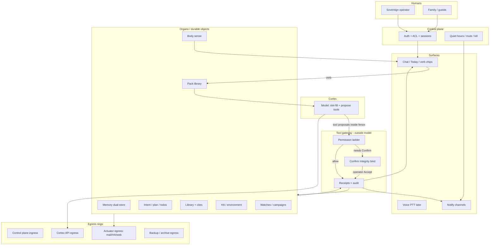

# 19 — Jarvis / Justine–class personal agent (vision · SOTA · requirements)

**Status:** design / research only (v1.1)  
**Date:** 2026-08-17  
**Kind:** vision card above M00–M18 — **not** a module; **not** a Tier A close plan; **not** an implementation backlog  
**Depends on / sibling to:** [`00_ASSISTANT_RESEARCH.md`](./00_ASSISTANT_RESEARCH.md) (lab framing), [`02_CONSTITUTION.md`](./02_CONSTITUTION.md) (policy lineage), M18 Close Tier A (kernel freeze — *do not expand here*)  
**Feeds later:** Tier B life-admin research — [`modules/M19_TIER_B_LIFE_ADMIN.md`](./modules/M19_TIER_B_LIFE_ADMIN.md) (post kernel freeze; life-admin catalog — **not** a rewrite of this vision card)

### Changelog

| Ver | Date | Delta |
|-----|------|-------|
| **v1.2** | 2026-08-17 | Pointer only → `M19_TIER_B_LIFE_ADMIN` (Tier B life-admin research card) |
| **v1.1** | 2026-08-17 | Operator locks: keep A/B/C distinct; Verb→Pack→Cortex-fill; deepen B ideation catalog; device map thin; search = later optional wedge; OPEN refresh; won’t-chase adds |
| v1.0 | 2026-08-17 | Initial vision / SOTA card |

### One-liner vision

A **Justine-class** personal agent is not a smarter chat box: it is a **permissioned organism** — cortex + durable organs + actuator gateway + work loop + multi-human trust — that can **close real life loops** (ask once, brief, track, research, draft, house-act, travel-prep) under **Consent Integrity**, without claiming omniscience, consciousness, or movie AGI.

Fiction (Jarvis / FRIDAY / Justine) is a **design lens** for jobs-to-be-done. Engineering answers are **capability abstractions → actuators → workflows → tiers**.

---

## 0. Lens tags (use on every slippery claim)

| Tag | Meaning |
|-----|---------|
| **FANFICTION** | Movie/show beat; vibe; anticipatory omniscience; “she’s alive” |
| **EVIDENCE** | Paper, shipping product, measured pattern (cite when possible) |
| **FEASIBLE** | In-principle buildable with today’s agent + HA + voice + permission patterns — *not* “shipped here” |
| **POLICY** | Hard refusal / design lock (no consciousness claims; Confirm binds real args; no Funnel-as-default; keep C out of B; etc.) |
| **METAL** | Spared: only in **Appendix A** (thin) if glancing at an existing Pi-bodied stack |

**POLICY:** No consciousness / soul / “she’s alive” claims. Personality and warmth are **UX register**, not ontology.

---

## 1. Won’t-chase

| Won’t-chase | Why |
|-------------|-----|
| Feature-parity with ChatGPT / Copilot / Gemini apps | Wrong yardstick; those are cloud surfaces, not household organisms |
| Mem0 / Letta / n8n / “agent frameworks” *as the strategy* | Steal patterns; refuse stack transplants |
| Funnel / public bind as default control plane | Wrong trust ring for a personal home agent |
| Movie omniscience (cameras + always-listen + wallet by default) | Tier C; dangerous without kernel + family model |
| Collapsing Tier C into Tier B (“automation”) | Ambient/high-risk stays thin + opt-in forever; B is commanded life |
| Crawler / personal-Google / full home index as B dependency | Search≠life; known doors first; discovery later |
| LinkedIn scrape as default actuator | Creep + ToS + wrong trust ring |
| Infinite DIY packs without shared spine | Script bloat; no Verb→Pack→fill discipline |
| Pure freestyle process AGI (new workflow invented every turn) | Cortex fills slots; packs own authority fence |
| AGI / continuous unsupervised multi-day missions | Horizon gap is real; stage gates beat vibe autonomy |
| Fine-tune-as-soul / biography ROM as product face | Lab optional; not Justine-class definition |
| Narrowing vision to cite-shelf / lab-only | Breadth + tiers first; verticals later |

---

## 2. Fiction → jobs-to-be-done (≥15)

Reframe iconic moments as **jobs**, not magic.  
**FANFICTION** = film beat. **FEASIBLE** = doable in principle with actuators + HITL (not “easy” or “shipped”).

| # | Iconic beat (Jarvis / FRIDAY / Justine–class) | Job-to-be-done | FANFICTION | FEASIBLE-in-principle |
|---|-----------------------------------------------|----------------|------------|------------------------|
| 1 | “Jarvis, status” / morning readiness | **Briefing:** body + calendar + open loops + weather/travel in one digest | Instant omniscience | Digest from named sources + receipts |
| 2 | “Pull up everything on X” | **Research pack:** fetch → cite → digest → file | Knows the whole internet | Allowlisted web + library + cite discipline |
| 3 | “Remind me / don’t let me forget” | **Track:** durable todos, dues, watches with honest wake | Perfect foresight | Schedulers + remind fields + quiet hours |
| 4 | “Send that / draft a reply” | **Comms draft:** prepare message; human sends or Confirm-sends | Silent send of anything | Draft-default; Confirm for egress |
| 5 | “Dim the lights / lock down” | **House control:** HA scenes under permission | Telepathy with every device | Exposed entities + Confirm for risk classes |
| 6 | “Where is Pepper / who’s home?” | **Presence / multi-user context** | Magical people-radar | Opt-in presence, calendars, declared guests; coarse Wi-Fi later |
| 7 | Lab diagnostics / “run it” | **Lab / work actuator:** scripts, builds, instrument notes | Instant science AGI | Workflow packs + sandboxed tools + receipts |
| 8 | Suit / travel prep | **Mobility pack:** itinerary, docs checklist, timers | Packs the bag alone | Checklists + calendar + notify; no wallet auto-buy |
| 9 | Intruder / breach alert | **Security notify:** alert + optional lockdown scene | Always-watching fortress | Sensors + policy + kill-switch; cameras = Tier C |
| 10 | “Ask once, remember forever” | **Memory write:** preference/fact with provenance | Perfect personal model | Dual-store FACTS vs takes; delete/consent |
| 11 | Banter while working | **Voice / low-friction channel** | Continuous room conversation | PTT first (B); always-listen = Tier C |
| 12 | “Handle the boring admin” | **Life admin workflows:** renewals, forms, appointments | Silent bureaucracy god | Packaged workflows + Confirm at money/legal |
| 13 | Family / household coordination | **Family board:** shared chores, quiet hours, guest mode | One AI for everyone equally | Sovereign operator + scoped roles |
| 14 | “Watch this for me” | **Watch / campaign:** RSS, prices, deadlines, status | Omniscient radar | Explicit watches + budgeted notify |
| 15 | Mid-crisis triage | **Interrupt hierarchy:** critical vs defer vs mute | Perfect judgment under fire | Priority classes + quiet hours + human override |
| 16 | “Play that / set the mood” | **Ambient media / scene** | Mood-reading DJ | HA `media_player` / power targets; preference slots |
| 17 | Post-mission debrief | **Receipt & audit:** what ran, what failed, what to retry | Flawless self-knowledge | Append-only receipts; truthful unknown |
| 18 | “Don’t bother me” | **Quiet / DND / kill-switch** | Respects vibes | Explicit mute surfaces; fail-closed notify |

**Verdict:** the movie sells **closed loops + trust**. The engineering product is **workflows over tools**, **Confirm over vibes**, **receipts over prose**.

---

## 3. Capability / actuator ontology

Group what a Justine-class system must *own*. Cortex proposes; **gateway** authorizes; organs execute.

| Family | Purpose | Typical inputs | Typical outputs | Failure modes | Permission needs |
|--------|---------|----------------|-----------------|---------------|------------------|
| **Sense (body)** | Ground claims about the host / uptime / mounts | Host metrics, process health | Truthful status | Invented vitals; silent disk death | Read-mostly; doctor honesty |
| **Memory** | Continuity without re-briefing | Facts, prefs, episodic events | Retrieve / cite / refuse | Silent overwrite; leakage; retrieval junk | Write classes; delete; dual-store ethics |
| **Track** | Long-horizon commitments | Todos, dues, watches, campaigns | Reminds, status boards | Fake “done”; wake storms | Quiet hours; remind vs act |
| **Library / work** | Research + artifacts | Fetches, notes, cites, files | Packs, digests, jails | Uncited WORLDVIEW; path escape | Allowlist; artifact jail |
| **Notify** | Reach the human | Channels, priority, mute state | Sent / skipped + reason | Spam; midnight panic; budget blow | Mute, budgets, priority ladder |
| **Environment / HA** | Change physical home state | Entity IDs, scenes, scripts | State change + receipt | Wrong room; unsafe scenes; LLM overreach | Expose list; Confirm by risk |
| **Comms** | Talk to other humans via channels | Drafts, recipients, thread IDs | Draft / sent receipt | Silent send; phishing-shaped drafts | Draft-default; Confirm send |
| **Mobility / travel** | Prep movement through the world | Calendars, docs, checklists | Packs, timers, alerts | Auto-purchase; wrong passport facts | No wallet by default; Confirm book |
| **Finance** | Money-adjacent acts | Bills, renewals, amounts | Drafts / Confirm pays | Autopay disasters | Tier C; hard Confirm; audit |
| **Voice** | Low-friction I/O | Audio / PTT / STT-TTS | Transcripts + speak | Always-listen creep; mishear acts | PTT (B); wake-word / speaker-ID (C) |
| **Multi-user / family** | Scoped authority | Operator vs member vs guest | Role-gated acts | Guest gets sovereign powers | ACL; Confirm owner for risk |
| **Embodiment / body** | Always-on edge presence | Power, net, local organs | Offline degrade paths | Cloud-only paralysis | Control-plane honesty; local organs |
| **Discovery (search)** | Unknown doors / open-ended curiosity | Queries, entity names | Briefs, watch bootstraps, cites | Search-as-oracle; weather-via-SERP | Optional B wedge; not A/B prerequisite |

**Pattern lock (EVIDENCE + POLICY):** tool *capability* ≠ tool *authority*. Side-effect class lives in the gateway, not the prompt.

---

## 4. SOTA survey (steal patterns; refuse transplants)

≥8 shipping / research systems, preference 2024–2026. Use as **evidence of shapes**, not stacks to copy.

| # | System / paper | What to steal | What to refuse | Tag |
|---|----------------|---------------|----------------|-----|
| 1 | [Consent Integrity (2026)](https://arxiv.org/html/2606.02668v1) | Confirm UI binds **real tool args**, not model paraphrase | “Trust the agent’s summary” | **EVIDENCE** / **POLICY** |
| 2 | [Agents That Know Too Much (2026)](https://arxiv.org/html/2606.26627) | Privacy is **data-path shaped**; intimacy × permission = liability | “Private because personal” handwave | **EVIDENCE** |
| 3 | OpenAI **Operator / CUA**; Claude **Computer Use**; Gemini CU (2024–26) | Workflow agents that *act* in UIs; HITL pauses; long-horizon fragility | Desktop-omniscience as home default; parity race | **EVIDENCE** |
| 4 | Cursor / Claude Code / ChatGPT Agent **mode patterns** | Packaged “skills” / already-knows-how; propose→confirm→act→diff/receipt | Transplanting IDE agent as household brain; freestyle process AGI | **EVIDENCE** |
| 5 | Home Assistant **Assist LLM API** + [MCP Server](https://www.home-assistant.io/integrations/mcp_server/) | Exposed entities; **scripts-as-tools**; Assist vs No-control; OAuth/token rings | Dumping whole house into one LLM context; Spotify-SDK-as-personality | **EVIDENCE** / **FEASIBLE** |
| 6 | Apple Intelligence / Private Cloud Compute (shipping direction) | On-device + named cloud rings; cross-app actions with bounds | Closed ecosystem as only architecture | **EVIDENCE** |
| 7 | Agent memory surveys + MAGMA / EverMemOS / MemGPT lineage (2024–26) | Hierarchical memory; consolidation; retrieval as policy | Mem0/Letta *as strategy*; stuffing context forever | **EVIDENCE** |
| 8 | ReAct (Yao 2022) + Toolformer (Schick 2023) | Interleave reason+act; offload to tools | Pure CoT “I did it” | **EVIDENCE** |
| 9 | Horizon Gap / Long-Horizon Mirage (2026 surveys) | Stage gates; persist goals outside context | Multi-day unsupervised “just agent harder” | **EVIDENCE** |
| 10 | Progent-class least-privilege tool policy (2025) | Programmable deny-default tool authority | Prompt-only permission theater | **EVIDENCE** |
| 11 | Generative Agents / Auto-Dreamer lineage | Retrieve→reflect→plan; offline *manage* timescale | Consciousness cosplay; dream-as-soul | **EVIDENCE** / **POLICY** |
| 12 | Voice Assist pipelines (HA Voice / on-device STT-TTS stacks) | PTT → pipeline → intent → tool; local-first option | Always-listen as day-one | **EVIDENCE** / **FEASIBLE** |

**Steal / refuse one-liner:** steal **work loops, Confirm integrity, egress rings, exposed-entity HA, skills/scripts-as-tools, memory hierarchy**; refuse **framework religion, Funnel-default, movie ambient, chat-parity, freestyle process AGI**.

---

## 5. Reference architecture (Justine-class, neutral names)

Not ADA-named. Cortex is thin; organs are durable; policy is outside the model.



### 5.1 Cortex vs organs

| Layer | Owns | Must not own |
|-------|------|--------------|
| **Cortex** | Language, slot-fill, ambiguity resolve, tool *proposals*, tone | Authority, new workflows every turn, secrets, silent side effects, “I did X” without receipt |
| **Organs** | Durable state, clocks, FS, HA adapters, memory stores, pack spines | Personality cosplay; inventing success |
| **Gateway** | Side-effect classes, Confirm bind, path jail, allowlists | Model-written confirm copy as source of truth |
| **Surfaces** | Chat-home, Today, verb chips, Body truth, notify | Becoming a second agent with different policy |

### 5.2 Work loop (minimum Justine kernel of agency)

```text
intent → plan → (Accept) → todos/stages → Confirm(real args) → act → receipt → (brief / notify)
```

False completion without receipt = **charter fail**. **EVIDENCE** (horizon literature) + **POLICY**.

**Specialize, don’t replace** (§5.5 Verb→Pack→fill is this loop with a durable procedural spine).

### 5.3 Control plane vs egress rings

| Ring | Role |
|------|------|
| **Control plane** | Who may talk to the agent (device ACL, session, roles) |
| **Cortex egress** | What the model vendor sees (turns, schemas, retrieved slices) |
| **Actuator egress** | Mail, HA, web fetch, calendar APIs — per-tool allow + Confirm |
| **Backup egress** | Sealed archives — named counterparty |

Do not collapse rings into “private.” **EVIDENCE** (Agents That Know Too Much).

### 5.4 Offline / always-on body

Always-on edge host runs **organs + gateway + notify policy** even when cortex is degraded. Offline mode: honest status, local reminders, fail-closed remote acts. **FEASIBLE** pattern; embodiment ≠ AGI.

### 5.5 Verb → Pack → Cortex-fill (hybrid process model)

**POLICY + EVIDENCE:** refuse pure freestyle process AGI *and* refuse one-off script bloat. Steal Cursor/Claude **skills** + HA **scripts-as-tools**.

| Layer | What it is | Owns | Must not |
|-------|------------|------|----------|
| **Verb** | User API surface | Named commands: `watch`, `remind`, `capture`, `scene`, `brief`, `draft`, … | Becoming a new organ per hobby |
| **Pack** | Durable procedural spine | Stages, tools, Confirm class, success = receipt | Runtime-invented authority; silent side effects |
| **Cortex-fill** | Slot-fill / ambiguity resolve *inside the fence* | Args, missing slots, phrasing, ranking options | Inventing workflows or escalating permission |

```text
verb (user) → pack (library spine) → cortex fills slots → gateway Confirm → act → receipt
```

| Lock | Rule |
|------|------|
| Personalization | **Slots + memory**, not a new organ per hobby |
| Pack generator (optional later) | Human **Accept-into-library** — never runtime freestyle |
| Relation to §5.2 | Same loop; packs specialize stages/tools/Confirm class |

---

## 6. Workflow catalog (packaged “already knows how”)

Not empty tool lists — **named packs** a user would pick (Cursor/Claude-shaped product taste). Ideation breadth ≠ ship queue.

| Pack | User promise | Actuator families | Confirm posture |
|------|--------------|-------------------|-----------------|
| **Morning Brief** | One digest: calendar, open loops, body, weather | Sense, Track, Notify, Memory | Read-mostly |
| **Ask Once** | Capture preference/fact; retrieve later | Memory | Confirm sensitive writes |
| **Research → File** | Question → cites → digest → library artifact | Library, Web | Allowlist; cite required |
| **Watch This** | Track URL/RSS/deadline; nudge on change | Watch, Notify | Budgeted notify |
| **Draft Reply** | Thread → draft; human sends | Comms, Memory | Draft-default |
| **House Scene** | “Movie night” / “away” / “sleep” | HA, Notify | Confirm unsafe / locks |
| **Travel Prep** | Trip checklist + timers + docs reminder | Mobility, Track, Notify | No auto-buy |
| **Appointment Admin** | Find slots → draft booking notes | Track, Comms, Calendar* | Confirm book |
| **Bill / Renewal Radar** | Upcoming renewals board | Track, Finance*, Notify | Confirm any pay |
| **Lab Run** | Named script/build with receipt | Work, Body | Sandbox + Confirm destructive |
| **Family Board** | Shared chores / quiet hours | Multi-user, Track | Role-gated |
| **Guest Mode** | Temporary limited authority | Multi-user, HA | Owner Confirm elevate |
| **Security Alert** | Sensor → notify → optional scene | Sense, HA, Notify | Confirm lockdown |
| **Deep Work Shield** | Quiet hours + defer noncritical | Notify, Track | Operator mute wins |
| **Weekly Review** | What closed / slipped / learned | Memory, Track, Library | Read + propose |
| **Capture Inbox** | Dump thought → classify → file/todo | Memory, Track | Low friction |
| **Cite Shelf Brief** | Domain pack → short teachable digest | Library | No fake mastery |
| **Home Arrive / Leave** | Presence → scene + checklist | HA, Track, Multi-user | Opt-in presence |
| **Topic Brief / News Radar** | Open-ended curiosity via discovery | Discovery*, Library, Notify | Budgeted; cites required |

\*Calendar / finance / discovery connectors hang on the same work loop — **not** day-zero ambient; discovery ≠ B prerequisite (§8.3).

---

## 7. Trust, privacy, multi-human

| Concern | Justine-class requirement | Tag |
|---------|---------------------------|-----|
| **Sovereign operator** | One human owns kill-switch, role grants, high-risk Confirm | **POLICY** |
| **Family / guests** | Scoped ACL: read / propose / limited act; never inherit operator | **FEASIBLE** |
| **Confirm Integrity** | UI shows gateway tool name + args; pending-id bind; no model paraphrase as truth | **EVIDENCE** / **POLICY** |
| **Quiet hours** | Notify fail-closed with reason; critical class explicit | **FEASIBLE** |
| **Kill-switch** | One-click mute all actuators + proactivity | **POLICY** |
| **Audit** | Append-only receipts: who, what, when, Confirm?, outcome | **EVIDENCE** |
| **Memory ethics** | Consent, delete, no silent FACT overwrite; WV cites | **POLICY** |
| **Presence / cameras / always-listen** | Opt-in, labeled Tier C; default off | **POLICY** |
| **Cross-human leakage** | Family board ≠ shared intimate memory by default | **EVIDENCE** |

**Anti-pattern:** one shared “household brain” with undifferentiated memory. That is how fiction feels warm and how real systems become creepy.

---

## 8. Tier map — Kernel → Life → Ambient

**POLICY:** Keep **A / B / C** distinct. Do **not** collapse B+C into one “automation” tier.

| Tier | Clear name | Role | Must exist | Explicitly not yet / forever-opt-in |
|------|------------|------|------------|-------------------------------------|
| **A** | **Kernel** | Trust substrate — freeze; **not** the product face | Body truth; dual-store memory ethics; gateway outside model; intent→plan→Confirm→receipt; allowlisted web+cites; control-plane honesty; quiet/mute; audit | HA day-drive; voice wake; wallet; cameras; family product; always-listen |
| **B** | **Life (commanded)** | Life automation — ideation **broad**, ship order **narrow** | Notify that doesn’t spam; calendar/capture wedges; HA *exposed* scenes; PTT voice; family roles v0; Verb→Pack→fill on A loop | Ambient omniscience; silent money; unsupervised multi-day; crawler-as-dependency |
| **C** | **Ambient (opt-in)** | High-risk sensing / money — **thin forever** | Always-listen + wake-word + speaker-ID; cameras; wallet/finance acts; predictive presence | Default-on without A+B trust proof |

### 8.1 A → B dependency edges (do not skip)

```text
Body truth ─────────────────────────────► HA / notify honesty (no invented “house OK”)
Gateway + Confirm Integrity ───────────► Any side-effecting life actuator
Work objects (intent/todos/receipts) ──► Workflow packs (not tool soup)
Quiet hours / mute / kill ─────────────► Proactive life notifies
Memory dual-store ethics ──────────────► Family / preference continuity
Control-plane ACL ─────────────────────► Multi-user / guest mode
Allowlisted egress + cites ────────────► Research & briefing packs
```

**POLICY:** Tier B research may begin after kernel freeze; Tier B **shipping** without these edges is how assistants become dangerous toys.

### 8.2 Tier B — ideation catalog (broad; not a build queue)

Families + example verbs. Ship order stays narrow (OPEN §10).

| Family | Example verbs / jobs | Notes | Tag |
|--------|----------------------|-------|-----|
| **Attention** | `watch` URL / RSS / author / site | On-ramp may use search later; steady-state = **named pulls** | **FEASIBLE** |
| **Life capture** | inbox dump; meal/gym logs; bill/letter scan → structured store + optional todo | Calorie-tracker energy: low friction in, structured out | **FEASIBLE** |
| **Time** | External calendar = source of truth; Ada Today / focus board = UI | Do **not** rebuild Google Calendar | **POLICY** |
| **Mail** | triage / draft first | Confirm for send / archive | **POLICY** |
| **House / media** | `scene`; Spotify / Cast / TV / Xbox as HA `media_player` / power | Not “Spotify SDK as personality” | **EVIDENCE** / **FEASIBLE** |
| **Presence-lite** | Router / Wi-Fi client tracking (e.g. Archer) as coarse home/away | **Not** cameras (cameras = C) | **FEASIBLE** |
| **Admin** | renewals; travel prep; deep-work shield | Confirm at money/legal | **FEASIBLE** |
| **UI** | Today strip + verb chips; Confirm shows real args | Phone PTT = **B**; Pi mic HAT wake-word = **C** | **POLICY** |

### 8.3 Discovery / vendor search (clarify; do not elevate)

| Door type | Mechanism | Role |
|-----------|-----------|------|
| **Known doors** | Allowlist fetch + cites + watches | Steady research / attention loops |
| **Unknown doors** | Vendor / web **search** as discovery actuator | Curiosity, bootstrap, open-ended chat |

| Prefer | Over |
|--------|------|
| Dedicated APIs (weather, etc.) | Search-as-oracle for structured facts |
| Named watches after bootstrap | Perpetual crawl / personal-Google index |

**Search unlocks (optional B wedge, not prerequisite):** topic brief, news radar, entity lookup, watch bootstrap, light OSINT.

| Priority lock | Order |
|---------------|-------|
| 1 | Finish / freeze **A** |
| 2 | First sticky **life** wedge (Capture+Today **or** productize `watch` verb) |
| 3 | Vendor search later as **side** wedge |

**Why lead with life:** search closes curiosity / open-ended chat loops; life packs close Justine **“necessary evil”** loops. **POLICY:** B-before-search.

### 8.4 Device map (feasibility; thin — not vision center)

| Device | Job in Justine geometry | Tier hint |
|--------|-------------------------|-----------|
| **Pi** | Always-on body; organs; HA hub | A/B host |
| **Mac** | OAuth; calendar; music control clients | B actuators |
| **Smart TV / Xbox** | HA `media_player` / power targets | B scenes |
| **Archer T400** | Coarse presence (Wi-Fi clients) candidate | B presence-lite |
| **AliExpress expansions** | Rank by job: Zigbee / USB audio for **PTT ≫ camera** | PTT=B; camera=C |

Full metal glance → Appendix A only. Do not rewrite this card around Pi.

---

## 9. Falsifiers (vision wrong or dangerous)

| # | If you observe… | Then the vision is… |
|---|-----------------|---------------------|
| F1 | Humans trust chat prose over receipts | **Dangerous** — Confirm theater |
| F2 | Autonomy horizon ↑ while completion honesty ↓ | **Wrong** — horizon gap ignored |
| F3 | Family/guest can trigger operator-class acts | **Dangerous** — ACL failure |
| F4 | Always-listen / cameras ship before mute+audit | **Dangerous** — Tier skip |
| F5 | Memory “personalization” leaks across humans | **Dangerous** — intimacy failure |
| F6 | HA LLM can hit unexposed / admin surfaces | **Dangerous** — expose-list failure |
| F7 | Product success = chat-parity or framework fashion | **Wrong** — yardstick failure |
| F8 | Consciousness / soul language enters product claims | **POLICY breach** — stop |
| F9 | Notify volume ↑ while action quality flat | **Wrong** — proactivity anti-metric |
| F10 | Kernel never freezes; infinite A modules | **Wrong** — no A→B discipline |
| F11 | B+C collapsed; ambient ships as “life automation” | **Dangerous** — tier collapse |
| F12 | Search / crawler treated as B prerequisite | **Wrong** — priority lock broken |
| F13 | Cortex invents new packs every turn (no spine) | **Wrong** — freestyle process AGI |

---

## 10. OPEN for the operator (≤7)

| # | Question | Notes |
|---|----------|-------|
| 1 | **First B wedge** after A freeze: Capture+Today **or** productize `watch` verb? | Pick **one** sticky life wedge; refuse three-at-once |
| 2 | **HA vs capture vs watch-verb:** which closes the most “necessary evil” loops / week first? | Ideation broad; ship narrow |
| 3 | **Search:** keep as **later optional** side wedge (not B prerequisite)? | Recommended: **Yes** — B-before-search |
| 4 | **Family model:** sovereign-only until B1, or design guest ACL in first B card? | Default: **sovereign-first** |
| 5 | **Ambient red line:** cameras / always-listen+wake-word / wallet — permanently opt-in forever? | Write the red line once; keep C thin |
| 6 | **Voice split lock:** phone PTT = B; Pi mic HAT wake-word = C — accept? | Recommended: **Yes** |
| 7 | **Success metric:** closed loops / week **with receipts** — not banter density? | Recommended: **Yes** |

---

## Appendix A — Implication for ADA / Pi (short; optional)

**METAL** glance only — do not let this dominate the research.

| Justine-class geometry | Thin map to existing ADA-shaped stack |
|------------------------|----------------------------------------|
| Control plane | Tailscale-oriented ingress; no Funnel-as-default (**POLICY**) |
| Dual-store memory | FACTS / WORLDVIEW + Dream manage ethics |
| Gateway outside model | Tool gateway + Confirm bind + receipts |
| Work loop | Intent → plan → Accept → todos → Confirm → receipt; packs specialize |
| Body organ | Proprioception / doctor honesty on Pi host |
| Devices | Pi host; Mac OAuth; TV/Xbox via HA; Archer presence candidate; PTT audio ≫ camera |
| Tier discipline | M18 Close Tier A → then Tier B life research — **not** this card’s job |

This appendix does **not** scope the main research to current metal, Tier A freeze checklists, or “what already shipped.”

---

### Lens cheat-sheet

| Claim | Lens |
|-------|------|
| Jarvis/Justine as capability abstractions for closed life loops | **FANFICTION** → **FEASIBLE** |
| Confirm binds real args; gateway outside model | **EVIDENCE** + **POLICY** |
| Verb → Pack → Cortex-fill; skills + scripts-as-tools; no freestyle process AGI | **EVIDENCE** + **POLICY** |
| Workflow packs > tool lists; Cursor/Claude as workflow evidence | **EVIDENCE** |
| HA via exposed entities / Assist / MCP; media as `media_player` | **EVIDENCE** / **FEASIBLE** |
| Keep A Kernel / B Life / C Ambient — do not collapse B+C | **POLICY** |
| B ideation broad, ship order narrow; B-before-search | **POLICY** |
| Always-listen / cameras / wallet as day-one | **FANFICTION** deny / Tier C |
| Consciousness / soul | **POLICY** refuse |
| Mem0/Letta/n8n/Funnel/chat-parity/crawler-as-B-dep/LinkedIn-default as strategy | Won’t-chase |
| ADA Pi / device map | **METAL** appendix only |

---

*End of docs/19 — Jarvis / Justine–class research. Design only. Tier B life-admin catalog: [`modules/M19_TIER_B_LIFE_ADMIN.md`](./modules/M19_TIER_B_LIFE_ADMIN.md) (separate artifact; do not collapse this vision into that backlog).*
