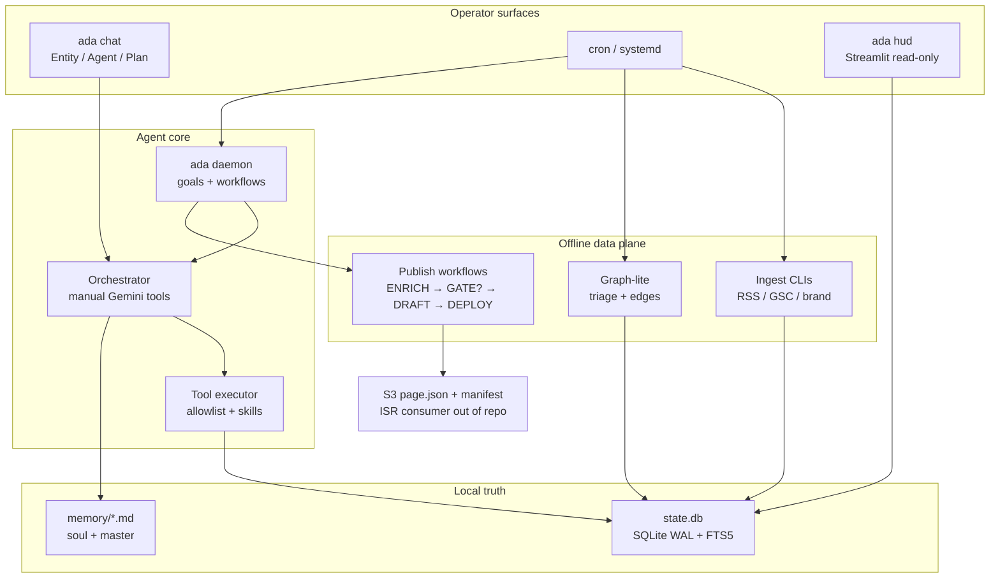

# Architecture — ADA

## Premise

ADA is a **headless Python 3.11+ asyncio harness** for a local operator agent on edge hardware (for example a Raspberry Pi). One install runs interactive chat, a background worker (`ada daemon`), offline ingest CLIs, and deterministic publish workflows (pSEO / ISR). Truth lives on disk: a per-profile **SQLite** database plus markdown memory files. There is **no HTTP agent API** in this repo—operators use the CLI and an optional localhost Streamlit HUD.

## Goals and non-goals

**Goals**

- Single-process local agent with durable transcript, goals, knowledge, and workflows
- Safe tool use on a personal machine (allowlisted shell, env-gated integrations, spend caps)
- Offline knowledge ingest and graph-lite enrichment separate from chat auto-fetch
- Deterministic publish pipeline that emits a strict `page.json` contract to S3

**Non-goals**

- Hosted multi-tenant SaaS or public session ingress
- Required TUI / MCP transport
- In-process periodic scheduler (use cron or systemd)
- Shipping the Next.js ISR frontend in this repository (consumer is documented only)

## Unique approach

Custom or adapted design choices (verified in code/docs):

- **Two-face Entity vs Work** — same package, different chat ingress and tool sets; global scope uses `mission_id IS NULL` ([`docs/ADA_CORE.md`](ADA_CORE.md))
- **Manual function calling** — Gemini SDK automatic function calling is disabled; the orchestrator runs multi-leg turns and persists tool rows itself ([`src/ada/adapters/gemini_stream.py`](../src/ada/adapters/gemini_stream.py))
- **Claude-inspired transcript** — `messages` with `parent_uuid`, sequence, tombstone + optional rewire ([`docs/claude_logic.md`](claude_logic.md))
- **Allowlisted shell + motor skills** — exact-line shell allowlist; YAML skills invoked via `run_skill` in Agent mode, not freeform plugin DAGs
- **Fact GATE on entity publish** — `publish_entity_v1` requires enough distinct HTTPS `source_url` facts before DRAFT/DEPLOY; keyword track skips GATE
- **ISR contract as Pydantic** — `PageJsonV1` with `extra="forbid"` for an out-of-repo Next consumer ([`docs/pseo-isr-contract.md`](pseo-isr-contract.md))
- **Single-owner job plane** — `ADA_JOB_QUEUE=legacy` vs `system_jobs`; do not mix on one `state.db` ([`docs/JOB_QUEUE_SINGLE_OWNER.md`](JOB_QUEUE_SINGLE_OWNER.md))
- **HUD is not the agent** — read-only SQLite + whitelisted `ada` argv only

## System overview

Canonical visitor diagram: [`docs/architecture.mmd`](architecture.mmd).



*(Keep this fence in sync with `architecture.mmd`.)*

## Key components

| Component | Role |
|-----------|------|
| **CLI** (`ada`) | Chat, daemon, goals/jobs, missions, ingest, graph, workflows, doctor/boot/hud |
| **Orchestrator** | Multi-leg Gemini turns, tool persistence, tombstone/retry |
| **PersistentState** | SQLite WAL: messages, tasks, knowledge (+ FTS5), graph, workflows, usage |
| **Memory files** | `soul.md` / `master.md` (and related); `ada dream` compresses **transcript**, not the knowledge corpus |
| **Daemon** | Long-running worker for goals and workflow steps |
| **Workflows** | Templates such as `publish_entity_v1` / `publish_keyword_v1` |
| **HUD** | Optional Streamlit observability; SELECT-only DB + argv whitelist |

## Data / control flow

1. **Chat turn** — persist user message → stream model legs with manual tools → write tool/assistant rows → tombstone on failure.
2. **Knowledge loop** — register sources → `ada ingest-*` → `knowledge_items` → optional triage / graph-lite → tools when `ADA_ENABLE_KNOWLEDGE_TOOLS=1`. Chat does **not** auto-fetch RSS.
3. **Goals** — `ada goal` enqueues work; `ada daemon` dequeues under the configured job plane.
4. **Publish** — entity track: ENRICH → **GATE** → DRAFT → DEPLOY; keyword track: ENRICH → DRAFT → DEPLOY. DEPLOY writes S3 `/{project_id}/{campaign_id}/{slug}/page.json` and merges `manifest.json`.
5. **Ops scheduling** — ingest, dream, matrix-scan, and daemon lifecycle are driven by **external** cron/systemd ([`ops/schedule.md`](../ops/schedule.md)).

## Notable implementation details

- **GATE threshold** — default `ADA_PUBLISH_MIN_UNIQUE_FACTS` (3): counts **distinct** canonical HTTPS `source_url` on non-hypothesis graph edges; repeating one URL does not help ([`src/ada/workflow/runner.py`](../src/ada/workflow/runner.py)).
- **Approvals** — optional `ADA_REQUIRE_APPROVAL_FOR_ENQUEUE` / `ADA_REQUIRE_APPROVAL_FOR_PUBLISH` (DEPLOY for both publish kinds when enabled).
- **Cost / safety** — `ADA_KILL_SWITCH`, daily/monthly token budgets, profile isolation (`ADA_PROFILE`, `ADA_PROFILE_DATA_ROOT`).
- **Integrations** — env-gated clients only (Serper, Jina, GSC, DataForSEO, Unsplash, S3, optional embeddings/Apprise); no in-repo REST server.
- **Deferred** — voice STT/TTS ([`VOICE_DEFERRED.md`](VOICE_DEFERRED.md)); built-in scheduler; full transcript RAG; Next.js ISR app (blueprint in [`isr.md`](../isr.md)).

## Tradeoffs and limitations

| Choice | Upside | Cost |
|--------|--------|------|
| Local SQLite + files | Simple Pi deploy, inspectable state | Not multi-writer SaaS; backup is operator-owned |
| Manual tool loop | Deterministic persistence / tombstones | More orchestration code than SDK auto-calling |
| Cron outside the process | Predictable on Pi; survives restarts | No “set and forget” in-process timers |
| Strict publish GATE | Fewer thin entity pages | Entity pipeline can stall until facts exist |
| HUD whitelist | Safer than embedding the agent in UI | Operators need CLI for full control |
| ISR frontend out of repo | Clear contract boundary | End-to-end “site live” is a second codebase |

Older phase-1 notes in [`system_architecure.md`](system_architecure.md) are partially stale; prefer this document and the root README for current maps.

## How to verify locally

See the root [`README.md`](../README.md) for install and CLI smoke paths. Short path:

```bash
pip install -e ".[dev]"
cp .env.example .env   # set GEMINI_API_KEY
ada chat
ada daemon             # separate terminal
pytest -q
```

Operator / Pi depth: [`ADA_CORE_OPS.md`](ADA_CORE_OPS.md), [`operator-runbook-raspberry-pi.md`](operator-runbook-raspberry-pi.md), [`pseo-isr-contract.md`](pseo-isr-contract.md).
