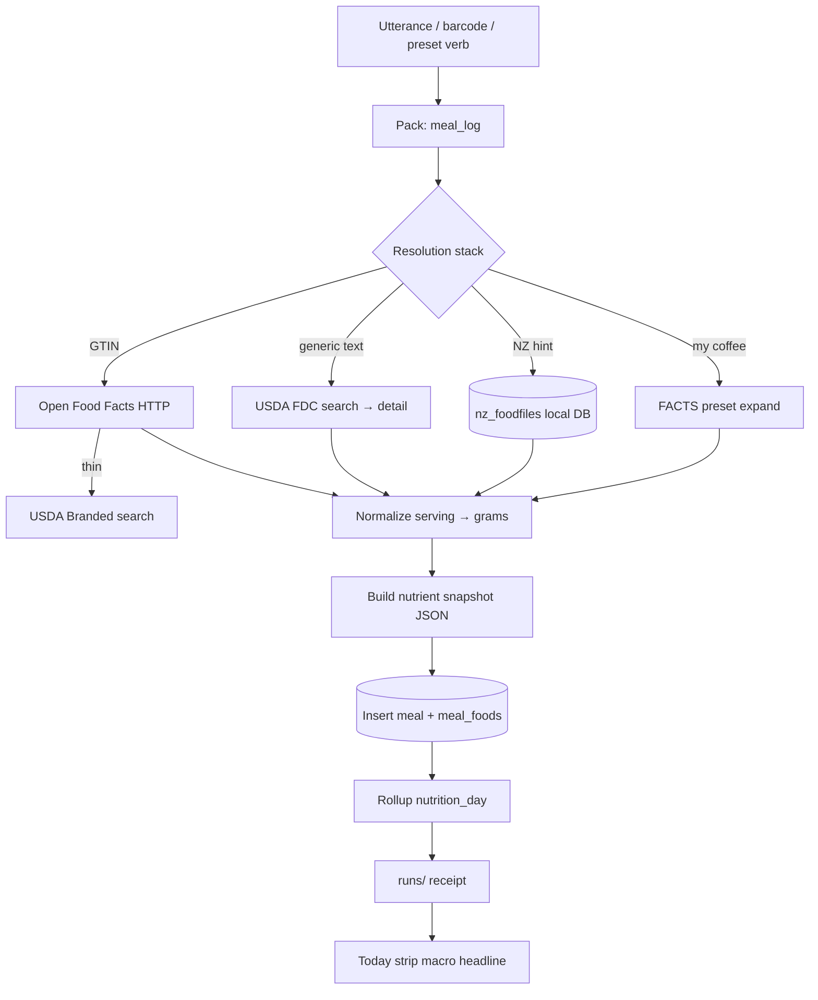
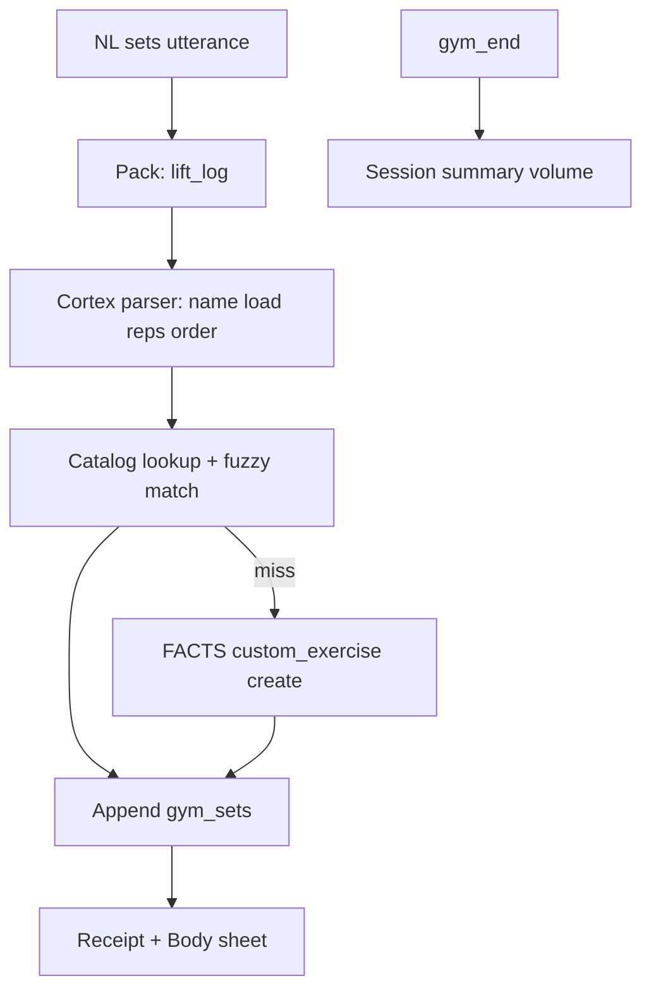
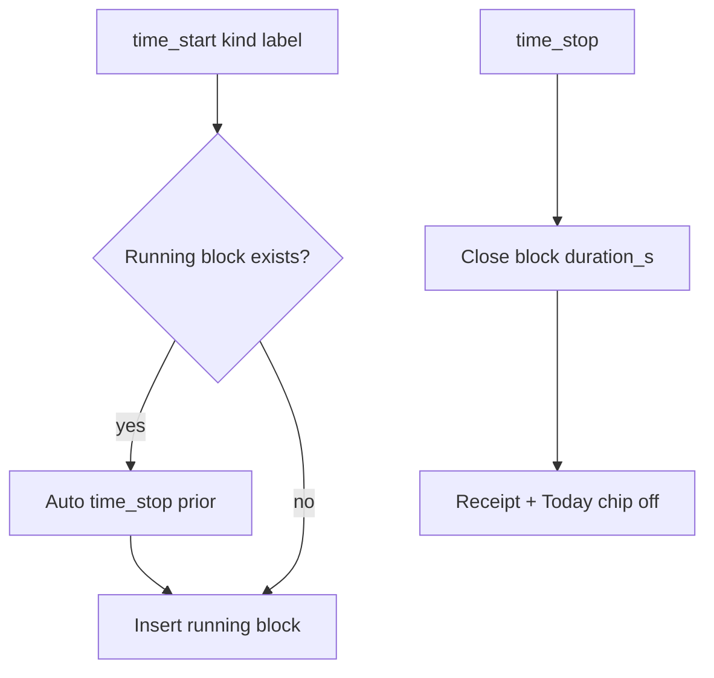
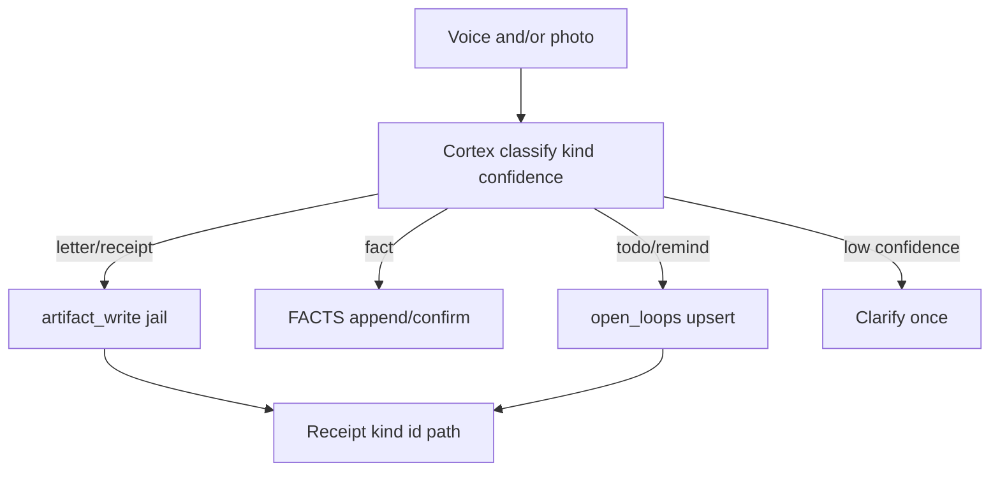

# M19a — P0 Life Capture (implement spec)

**Status:** design + implement spec (**v1.6**) — **P0.5 nutrition detail + bodyweight gym NL + HUD fast-path speak shipped**; M19b PTT/camera still blocked until **live** operator HUD smoke PASS  
**Date:** 2026-08-17  
**Kind:** Tier B **implement slice** — child of [`M19_TIER_B_LIFE_ADMIN.md`](./M19_TIER_B_LIFE_ADMIN.md)  
**Depends on:** M19 (catalog/phases) · [`M18_CLOSE_TIER_A.md`](./M18_CLOSE_TIER_A.md) (kernel freeze gate) · [`M15_INTENT_WORK_LOOP.md`](./M15_INTENT_WORK_LOOP.md) · [`M16_FIRST_PACKAGE.md`](./M16_FIRST_PACKAGE.md) / [`M16_OPERATOR_NOTE.md`](./M16_OPERATOR_NOTE.md) · [`M17_SURFACE_DESIGN.md`](./M17_SURFACE_DESIGN.md) (strip/sheet locks) · [`../02_CONSTITUTION.md`](../02_CONSTITUTION.md) · [`../01_BODY.md`](../01_BODY.md) (SQLite WAL durability notes §6.2) · [`../19_JARVIS_JUSTINE_AGENT_RESEARCH.md`](../19_JARVIS_JUSTINE_AGENT_RESEARCH.md) (Verb→Pack→Cortex-fill) · [`M07_WEB.md`](./M07_WEB.md) (egress for USDA/OFF only)  
**Feeds:** M19 P1+ (habits, people, mail, analysis packs)

### Filename choice

**`M19a_P0_LIFE_CAPTURE.md`** (not M20): this artifact is a **narrow implement spec under M19**, not a new top-level module slot. M20 would imply a sibling research card; `M19a` signals “parent catalog + P0 metal only.”

### Changelog

| Ver | Date | Delta |
|-----|------|-------|
| **v1.6** | 2026-08-18 | **P0.5 close:** FDC **detail** fetch (`GET /fdc/v1/food/{fdcId}`) before cache insert; expanded `FDC_NUTRIENT_MAP` + CORE slots (Ca/Fe/Mg/P/K/Zn, A/C/D, B-vits per §5); `honest_partial` on CORE null only. Bodyweight gym NL (`pull-ups x8`, `10 pull-ups`, `3x10 pull-ups`; `load_kg: null`). `gym-import-seed --path` accepts wger/exercisedb JSON. HUD fast-path emits `token_delta` canned speak (no Gemini; `steps=0`). Operator smoke: [`M19a_P05_HARDENING.md`](../reviews/M19a_P05_HARDENING.md). |
| **v1.5** | 2026-08-17 | **P0.2 close:** YAML `aliases:` (not per-organ ifs); read packs (`nutrition_day` / `time_status` / `due_list` / `gym_status` / `life_status`) fast-path in **Observe + Agent**; admin writes `due_add` / `remind` / `due_done` + `due_spine.py` Agent-only; due chip bind (`chips.due` → `due_add`, prefill `add due: `); custom Banana class-fix (`ada life food-forget`) — thin custom stubs miss through to USDA when key present. Do not invent Ca/Fe/C/D. |
| **v1.4** | 2026-08-17 | **P0.1g HUD edge smoke pack:** `tests/test_m19a_hud_edge_smoke.py` drives `run_turn` (same path as HUD chat) for canned utterances + edges. METAL: custom Banana cache = macros only; USDA only on cache miss; CORE slots + incomplete FDC map ⇒ `honest_partial`. Operator HUD: **restart** after code change (kill pid on `:8787` then `ada hud serve`); Agent + login. Appendix B: automated F-P0.1 HUD smokes **shipped**; live HUD still operator. |
| **v1.3** | 2026-08-17 | P0.1 executor close: meal/time/lift/capture **fast-paths** in `loop.py`; `gym_spine.py`; charter HARD block on `memory_facts_*` when pack hint is `life_*`; HUD chip bind; operator smoke notes |
| **v1.2** | 2026-08-17 | Post-implement audit: pack→M15→HUD glue gap; two-layer intent model; P0.1 wiring slice; HUD bind contract; transport-agnostic packs; falsifiers + close gate; Appendix B METAL audit |
| **v1.1** | 2026-08-17 | Operator review: habits P1 visible; time intent mapping; input modalities; P4 week reads; text-first P0 UI |
| **v1.0** | 2026-08-17 | Initial P0 implement spec from M19 + operator locks |

### One-liner

**Sticky daily capture** — meal + gym + time + admin capture — with honest receipts, Today strip honesty, and durable logs; calorie-tracker friction; **not** mail, jobs, habits product, analysis packs, Cronometer sync, or parallel timers.

---

## 1. P0 scope fence

| IN (P0) | OUT (P0) |
|---------|----------|
| Meal log: utterance parse, barcode, explicit verbs, named presets | Cronometer API sync · photo-only logging as default |
| Cronometer-*shaped* nutrient snapshot (~80–100 slots, nullable) at write time | Cronometer UI clone · ML coaching |
| Gym session: NL sets → catalog + custom exercises | Hevy import · coverage/PR analysis |
| Single active time/focus block (`kind` tags + intent-mapped label; e.g. skincare as `custom` timer) | Parallel timers · Google Calendar rebuild |
| Admin `capture` → classify → artifact / open_loop / FACT | Mail OAuth · job LaTeX |
| Extend M16 Today/dues/remind — do not replace | **Habits/routines/skincare product** (checklists, streaks, `habit_do`) → **P1** · weekly analysis packs |
| SQLite capture only for time/meals/gym (no week UI) | **Week/range aggregation UI** (`time_week`, `efficiency_week`, cross-log joins) → **P4 read surfaces** (data in P0 DB; queries deferred) |
| SQLite WAL logs + FACTS YAML presets | Embeddings day-one · new agent runtime |
| Today strip + composer chips + detail sheets | Dashboard soup (M17 refuse) |
| Receipts mandatory for every log write | Chat claims without log row |
| **P0.1 pack→M15→HUD wiring** (close gate — §3.7) | PTT/camera **implement** (M19b — after P0.1) |

**Won’t-chase P0:** mail OAuth, job LaTeX, HA, vendor web search as prerequisite, always-listen, weekly analysis packs, **habits/routines/skincare product (P1)**, **week/range time UI (P4)**, Hevy import, Cronometer API sync, rebuilding Google Calendar, new agent runtime, embeddings day-one.

---

## 2. Extension map (METAL)

| Existing organ | P0 extension | New surface (minimal) |
|----------------|--------------|------------------------|
| [`src/ada/io/paths.py`](../../src/ada/io/paths.py) `DataPaths` | Add `logs/`, `logs/life_logs.db`, `logs/food_reference.db` | **`NEW`** path props + `ensure_logs_dirs()` |
| [`src/ada/memory/facts.py`](../../src/ada/memory/facts.py) | Nutrition targets, custom_foods, custom_exercises, split templates under `facts/nutrition_*.yaml`, `facts/gym_*.yaml` | Extend FACTS docs; reuse overwrite→confirm |
| [`src/ada/memory/open_loops.py`](../../src/ada/memory/open_loops.py) | `capture` pack creates todos with `artifact_path` link | No schema fork |
| [`src/ada/memory/artifacts.py`](../../src/ada/memory/artifacts.py) | Capture photos/docs → `artifacts/` jail | Reuse path jail (`_resolve_under_artifacts`) |
| [`src/ada/hud/today.py`](../../src/ada/hud/today.py) `build_today()` | Running timer chip, meal-gap nudge, macro/micro headline | Extend payload keys only |
| [`src/ada/tools/toolspec.py`](../../src/ada/tools/toolspec.py) + [`gateway.py`](../../src/ada/tools/gateway.py) | New `life_*` tool group | **`NEW`** handlers in `src/ada/tools/life_tools.py` |
| [`src/ada/harness/pack_router.py`](../../src/ada/harness/pack_router.py) + [`packs/life_p0.yaml`](../../src/ada/harness/packs/life_p0.yaml) | **`route_utterance()`** prefix → YAML `aliases:` → structural parsers; **`resolve_chip()`** | **`METAL`** — aliases in YAML only |
| [`src/ada/harness/loop.py`](../../src/ada/harness/loop.py) | Sets **`session.pack_hint`**; **`_maybe_pack_fast_path()`** writes Agent-only; **reads Observe+Agent**; blocks `memory_facts_*` on life/read/admin packs | **`METAL`** (P0.1 + P0.2) |
| [`src/ada/harness/meal_spine.py`](../../src/ada/harness/meal_spine.py) | NL utterance → `life_food_search` → `lines[]` for `life_meal_log` | **`METAL`** (P0.1d) |
| [`src/ada/harness/gym_spine.py`](../../src/ada/harness/gym_spine.py) | NL `exercise load x reps` → `sets[]` for `life_lift_log` | **`METAL`** (P0.1e) |
| [`src/ada/harness/due_spine.py`](../../src/ada/harness/due_spine.py) | NL due/remind/done → `memory_open_loops_upsert` args | **`METAL`** (P0.2) |
| [`src/ada/harness/session.py`](../../src/ada/harness/session.py) | `pack_hint: dict \| None` field on `ChatSession` | **`METAL`** |
| [`src/ada/cortex/charter.py`](../../src/ada/cortex/charter.py) | Life tool recipes + **`pack_hint` addendum** (verb, tool spine, arg hints; HARD: no `memory_facts_*` on life turns) | **`METAL`** (P0.1a) |
| [`src/ada/hud/chat_service.py`](../../src/ada/hud/chat_service.py) | Routes before charter; passes `pack_hint`; optional `chip` param | **`METAL`** (P0.1a/b) |
| [`src/ada/hud/routes_api.py`](../../src/ada/hud/routes_api.py) | `/api/today`, **`/api/life/day`** read surfaces | **`METAL`** |
| [`src/ada/tools/life_tools.py`](../../src/ada/tools/life_tools.py) | Gateway DISPATCH; **`life_meal_log` requires `lines[]`** (`ValueError` if missing) | **`METAL`** — no utterance spine in gateway |
| [`src/ada/cli/main.py`](../../src/ada/cli/main.py) | `ada life …` subcommands for headless log/read; **`food-forget`** | **`METAL`** |
| M07 [`web_fetch`](../../src/ada/tools/web_tools.py) | USDA FDC + Open Food Facts HTTP GET | First-host confirm per M07; keys in `secrets/` |
| [`tests/test_m16_first_package.py`](../../tests/test_m16_first_package.py) pattern | **`NEW`** `tests/test_m19a_life_capture.py` | SQLite temp root via `ADA_DATA_ROOT` |

**New organ (justified):** `src/ada/logs/` — **one** Python package owning SQLite connection, migrations, append-only writers, day aggregations. Rationale: high-volume append logs do not belong in YAML (`open_loops` pattern is wrong for 3–10 meal lines/day × 100 nutrients × years). Not a second memory system: logs are **episodic operational truth**; FACTS hold prefs/presets; analysis P4 reads logs read-only.

**Not new:** separate `ada.nutrition` / `ada.gym` top-level packages — one `ada.logs` + tool facades keeps gateway surface small.

---

## 3. Verb → Pack catalog (P0 only)

**Confirm classes:** `none` · `soft` (prefs/targets/preset overwrite) · `confirm_args` (FACT overwrite) · `confirm_egress` (not used P0)

**M19 delta (operator wins):** M19 names time verbs `focus_*`; P0 locks **`time_start` / `time_stop` / `time_status`** with `kind` enum. Documented in §14 OPEN #1.

### Family — Meals / nutrition

| Verb | Pack spine | Inputs → outputs | Confirm | Receipt shape | UI | Tools (proposed ToolSpec names) |
|------|------------|------------------|---------|---------------|-----|--------------------------------|
| **`meal_log`** | resolve foods → normalize servings → snapshot nutrients → insert meal + lines → rollup day | utterance **or** barcode **or** preset id **or** explicit “add my coffee” | `none` | `{receipt_id, meal_id, day, kcal, protein_g, carb_g, fat_g, provenance_mix[], partial_micros: bool}` | Meal sheet; Today macro headline | `life_meal_log` |
| **`meal_fix`** | load target meal → patch lines/servings → **new revision row** (append-only) → re-rollup | `meal_id` or “last meal” + patch | `none` | `{receipt_id, meal_id, revision, superseded_revision}` | Meal sheet edit | `life_meal_fix` |
| **`nutrition_day`** | read day meals → sum snapshots → compare FACTS targets | `date` (default local today) | `none` | `{date, totals{}, targets{}, gaps{}, honest_partial: bool}` | Today strip headline | `life_nutrition_day` |
| **`food_preset_save`** | parse “save as my coffee” → validate components → write FACTS preset | name + components or last meal | `soft` if name clash | `{preset_id, path, version}` | chip confirm | `life_food_preset_save` |
| **`food_search`** | query → ranked candidates (local cache → USDA) | query string | `none` | `{candidates[{ref_id, name, source, score}]}` | picker chip (optional) | `life_food_search` |
| **`barcode_lookup`** | GTIN → OFF → USDA Branded fallback | barcode string | `none` | `{ref_id, name, source, nutrients_preview{}}` | scan result chip | `life_barcode_lookup` |

**Input modes inside `meal_log` (not separate verbs):** (1) say/utterance parse, (2) barcode scan → lookup, (3) explicit verbs / preset by id, (4) multi-ingredient utterance → multiple lines in one meal.

### Family — Gym

| Verb | Pack spine | Inputs → outputs | Confirm | Receipt shape | UI | Tools |
|------|------------|------------------|---------|---------------|-----|-------|
| **`gym_start`** | open session → optional split_day from FACTS | split hint or “today” | `none` | `{session_id, started_at, split_day}` | Body sheet header | `life_gym_start` |
| **`lift_log`** | cortex parse sets → catalog match → append sets | NL utterance or structured sets[] | `none` | `{session_id, set_ids[], exercise_names[], volume_kg}` | Body sheet rows | `life_lift_log` |
| **`gym_end`** | close session → summary metrics | `session_id` or active | `none` | `{session_id, duration_s, set_count, tonnage_kg, notes}` | Body sheet summary | `life_gym_end` |
| **`lift_fix`** | patch last set or specified set_id (append revision) | set_id + patch | `none` | `{set_id, revision}` | Body sheet | `life_lift_fix` |
| **`gym_status`** | active session + today’s sets + `gym_split` FACT if present | `date` (default local today) | `none` | `{active_session?, sets_today[], gym_split?}` | Body sheet / chat | `life_gym_status` |

### Family — Time / focus

| Verb | Pack spine | Inputs → outputs | Confirm | Receipt shape | UI | Tools |
|------|------------|------------------|---------|---------------|-----|-------|
| **`time_start`** | stop orphan? (policy: auto-stop prior) → insert open block | label + `kind` + optional note | `none` | `{block_id, kind, started_at}` | Today running chip | `life_time_start` |
| **`time_stop`** | close active block → duration | `block_id` or active | `none` | `{block_id, duration_s, kind}` | Today chip clears | `life_time_stop` |
| **`time_status`** | active block + today mix by kind | — | `none` | `{active?, blocks_today[], by_kind{}}` | Today + Time sheet | `life_time_status` |

**`kind` enum (P0):** `focus_deep` · `focus_maint` · `chore` · `cooking` · `wake` · `sleep` · `custom`

**Intent mapping** (cortex slot-fill → `{kind, label}` inside pack fence · **FEASIBLE**):

| Utterance pattern | `kind` | `label` (examples) |
|-------------------|--------|---------------------|
| “going to sleep” / bedtime | `sleep` | — |
| “woke up” / morning wake | `wake` | — |
| breakfast / meal prep / cooking | `cooking` | “breakfast prep” |
| deep work / PhD writing / focus | `focus_deep` or `custom` | “PhD writing” |
| maintenance / admin chores | `focus_maint` or `chore` | — |
| else | `custom` | inferred: “skincare”, “email triage”, … |

**POLICY:** gateway owns the write (`life_time_start` / `life_time_stop`); cortex fills slots only — **must not** invent duration or a second parallel block.

**Habits vs timer (operator lock):** skincare/habit **checklists** and streak product = **P1** (`habit_do`, `routine_run`). Logging skincare (or any activity) as a **time block** — `kind=custom` + label — is **valid P0** capture into `time_blocks`.

**Optional pack config (design only):** kind alias map in pack router YAML or `facts/time_kind_aliases.yaml` — e.g. `"deep work" → focus_deep`; not required for P0 implement gate.

### Family — Admin capture (extend M16)

| Verb | Pack spine | Inputs → outputs | Confirm | Receipt shape | UI | Tools |
|------|------------|------------------|---------|---------------|-----|-------|
| **`capture`** | classify → route | voice text and/or image ref | `soft` if FACT; `confirm_args` if FACT overwrite | `{kind, id, path?, open_loop_id?}` | capture chip | `life_capture` (+ `artifact_write`, `memory_open_loops_upsert`, `memory_facts_append`) |

**Classification enum:** `todo` · `remind` · `fact` · `receipt_stub` · `letter_doc` · `note` · `unknown`

### Family — Track (reuse M16 — not duplicated)

| Verb | Pack spine | Confirm | Tools (existing) |
|------|------------|---------|------------------|
| **`due_add`** / **`due_done`** / **`remind`** | M16 open_loops | `none` / confirm on delete | `memory_open_loops_upsert`, `memory_open_loops_list` |

### Family — Targets (P0 required for honest `nutrition_day`)

| Verb | Pack spine | Confirm | Tools |
|------|------------|---------|-------|
| **`targets_set`** | write nutrition targets to FACTS | `soft` | `memory_facts_append` / `memory_facts_propose_edit` on `nutrition.targets` |

---

## 3.5 Two intent layers (do not conflate)

**POLICY:** Do **not** add a new M15 module. P0.1 **extends harness + charter + pack YAML** — it does **not** rewrite [`M15_INTENT_WORK_LOOP.md`](./M15_INTENT_WORK_LOOP.md) intent→work.

| Layer | Owner (METAL) | Role |
|-------|---------------|------|
| **M15 intent→work** | [`harness/loop.py`](../../src/ada/harness/loop.py) + [`tools/gateway.py`](../../src/ada/tools/gateway.py) + [`hud/chat_service.py`](../../src/ada/hud/chat_service.py) | Mode (Observe / Plan / Agent), ReAct, Confirm bind, receipts — **unchanged**; all **`life_*`** tools already on this path via `function_declarations()` |
| **M19 pack router** | [`pack_router.py`](../../src/ada/harness/pack_router.py) + [`packs/life_p0.yaml`](../../src/ada/harness/packs/life_p0.yaml) | Utterance prefix / chip id → `{verb, tool, arg_hints}` — **DIY short loop** binding verbs to tool spine |

### Current METAL truth (post–P0.1 implement)

| Claim | Status | Lens |
|-------|--------|------|
| `route_utterance()` runs at start of each HUD/CLI turn in `run_turn()` | **METAL** | **METAL** |
| `session.pack_hint` set on prefix/NL/chip routes | **METAL** | **METAL** |
| `pack_hint` injected into `build_system_charter()` same turn (HUD routes before charter) | **METAL** — [`charter.py`](../../src/ada/cortex/charter.py), [`chat_service.py`](../../src/ada/hud/chat_service.py) | **METAL** |
| Agent fast-path executor for meal/time/lift/capture/due writes when args complete | **METAL** — [`loop.py`](../../src/ada/harness/loop.py) `_maybe_pack_fast_path()` Agent-only | **METAL** |
| Observe+Agent fast-path for read packs (`nutrition_day`, `time_status`, `due_list`, `gym_status`, `life_status`) | **METAL** — P0.2; `stop=pack_fast_path`; no model step | **METAL** |
| `memory_facts_append` blocked when pack hint is `life_*` / read / admin due | **METAL** — loop deny + charter HARD line | **METAL** |
| HUD NL meal/lift/time → SQLite row (Agent) | **METAL** when fast-path args resolve; else `missing_life_receipt` | **METAL** |
| Meal spine: utterance → `lines[]` | **METAL** — [`meal_spine.py`](../../src/ada/harness/meal_spine.py) | **METAL** |
| Lift spine: `50kg x6` + bodyweight (`pull-ups x8`, `10 pull-ups`, `3x10`) → `sets[]` | **METAL** — [`gym_spine.py`](../../src/ada/harness/gym_spine.py); `gym-import-seed` for catalog | **METAL** |
| Composer chips | Prefill + `data-chip` → `POST /api/chat` `chip` param → `resolve_chip()` | **METAL** (P0.1b) |
| Food cache / USDA for meal NL | **METAL**: thin custom miss → USDA **detail** when key present; CORE slots null ⇒ `honest_partial` (do not invent Ca/Fe/C/D). `ada life food-forget --name banana` | **METAL** |
| HUD fast-path speak | **METAL**: `token_delta` canned text on pack fast-path; `steps=0`; no Gemini | **METAL** (P0.5) |

---

## 3.6 Pack executor model (doc-19 spine · half-shipped)

Doc [`19_JARVIS_JUSTINE_AGENT_RESEARCH.md`](../19_JARVIS_JUSTINE_AGENT_RESEARCH.md) promises **Verb→Pack→Cortex-fill**. P0 implement shipped **tools + DB + thin router**; the **executor glue** to M15/HUD is **P0.1**.

```text
utterance | chip | (future) PTT transcript | (future) camera OCR text
    → pack_router (life_p0.yaml prefixes + aliases + structural parsers)
    → pack_hint { verb, tool, args, preferred_tools, spine }
    → build_system_charter(pack_hint) addendum
    → [Observe+Agent] _maybe_pack_fast_path() for read packs
    → [Agent] _maybe_pack_fast_path() when write args complete (meal/time/lift/capture/due)
    → else M15 ReAct (model); memory_facts_* denied when pack is life_* / read / admin due
    → gateway life_* / memory_open_loops_* (real args; Confirm if FACT / egress)
    → SQLite + open_loops + runs/ receipt → build_today() → HUD stream
```

**Not a second agent runtime** — short loop bound to existing `ToolSpec` + gateway policy.

### Pack YAML spine (current + P0.1 target)

**Shipped in [`life_p0.yaml`](../../src/ada/harness/packs/life_p0.yaml)** (P0.1 + P0.2):

| Key | METAL |
|-----|--------|
| `packs.<verb>.tool` | ToolSpec name (e.g. `life_meal_log`, `memory_open_loops_upsert`) |
| `packs.<verb>.prefill` | Prefix string for `route_utterance()` + HUD chip prefill |
| `packs.<verb>.preferred_tools[]` | Ordered spine for charter addendum |
| `packs.<verb>.spine` | `search_then_log` · `parse_then_log` · `intent_then_start` · `classify_then_write` · `parse_then_upsert` · `read` · `read_concat` |
| `packs.<verb>.alias_of` | `focus_start` → `time_start` (deprecated alias) |
| `packs.<verb>.arg_hints` | Default tool args (e.g. `due_list` kind=todo status=open) |
| `chips.<label>` | HUD chip id → pack verb; `resolve_chip()` + `POST /api/chat` `chip` |
| `aliases[]` | `{pattern, verb}` literal/contains, case-insensitive — **doors in YAML**, not NLU |

**Packs (P0.2):** `meal_log` · `lift_log` · `time_start` · `time_stop` · `capture` · **`due_add`** · **`remind`** · **`due_done`** · **`nutrition_day`** · **`time_status`** · **`due_list`** · **`gym_status`** · **`life_status`**. No `meal_read` / `lift_read` / `capture_read`. Due chip: `chips.due` → `due_add`, prefill **`add due: `** (matches `index.html`).

**NL in [`pack_router.py`](../../src/ada/harness/pack_router.py):** prefixes first, then YAML aliases, then structural parsers only (`_ADD_MEAL`, `_LIFT_LINE`, `start focus`/`start timer` without colon). Sleep/wake/good morning/stop timer live in **YAML aliases**. Date parse for dues lives in [`due_spine.py`](../../src/ada/harness/due_spine.py).

### Fast-path rule (P0.1b + P0.2)

**Writes: Agent mode only.** **Reads: Observe + Agent** (before first model step). When `pack_hint` + spine returns **complete** gateway args, harness calls gateway:

| Pack | Mode | Fast-path spine | Gateway calls |
|------|------|-----------------|---------------|
| `meal_log` | Agent | [`meal_spine.py`](../../src/ada/harness/meal_spine.py) | `life_food_search`* → `life_meal_log` → `life_nutrition_day` |
| `time_start` | Agent | [`time_intent.py`](../../src/ada/harness/time_intent.py) | `life_time_start` → `life_time_status` |
| `time_stop` | Agent | prefix / alias | `life_time_stop` → `life_time_status` |
| `lift_log` | Agent | [`gym_spine.py`](../../src/ada/harness/gym_spine.py) | `life_lift_log` |
| `capture` | Agent | text in hint | `life_capture` |
| `due_add` / `remind` / `due_done` | Agent | [`due_spine.py`](../../src/ada/harness/due_spine.py) | `memory_open_loops_upsert` → `memory_open_loops_list` |
| `nutrition_day` | Observe+Agent | — | `life_nutrition_day` (speak `honest_partial`; never invent Ca/Fe/C/D) |
| `time_status` | Observe+Agent | — | `life_time_status` |
| `due_list` | Observe+Agent | — | `memory_open_loops_list` kind=todo open |
| `gym_status` | Observe+Agent | — | `life_gym_status` |
| `life_status` | Observe+Agent | concat | `life_nutrition_day` + `life_time_status` + `memory_open_loops_list` |

\*Search steps emit receipts; thin custom-only hits count as miss → USDA **detail** fetch if `USDA_FDC_API_KEY` set. Expanded FDC map (§5); snapshot at write unchanged when cache updates.

**POLICY:** Never bypass Confirm for FACT overwrite, notify first-enable, or web egress. Never fast-path FACT overwrite (`memory_facts_append` / `propose_edit` stay Confirm-bound). On spine miss → `stop_reason=missing_life_receipt` (honest; no chat-only “logged it”). `due_done` with 0 or >1 open-todo matches → `missing_life_receipt` (do not guess).

---

## 3.7 P0.1 wiring slice (required close gate)

**Life capture CLOSED** (operator sign-off) requires **P0 metal** (§2) **+ P0.1 PASS**. PTT/camera (**M19b**) blocked until P0.1 PASS.

| # | Task | Status |
|---|------|--------|
| **P0.1a** | Inject `pack_hint` into charter; HUD routes before charter | **DONE** |
| **P0.1b** | Chip/prefix UX bind + fast-path executor (Agent) | **DONE** |
| **P0.1c** | NL patterns in `route_utterance()` | **DONE** |
| **P0.1d** | Meal utterance spine (`meal_spine.py`) | **DONE** |
| **P0.1e** | Gym spine + time intent fast-path | **DONE** |
| **P0.1f** | HUD receipt contract + falsifier tests | **DONE** (automated); operator HUD smoke pending |
| **P0.1g** | HUD edge-case smoke pack (`run_turn` + canned utterances) | **DONE** (automated); live HUD still operator |
| **P0.2** | Read packs + admin due/remind fast-loops + YAML aliases + banana class-fix | **DONE** (automated); live HUD still operator |
| **P0.5** | FDC detail nutrients + bodyweight gym NL + HUD fast-path speak + optional gym import | **DONE** (automated); operator smoke [`M19a_P05_HARDENING.md`](../reviews/M19a_P05_HARDENING.md) |

**OUT of P0.1 / P0.2 / P0.5:** Plan artifact multi-step meals (P1-ish), always-listen, camera **binary** ingest (text stub / GTIN string OK), full 90-slot Cronometer parity, PTT, systemd HUD, habits, people, parallel timers, Gemini narrate pass on HUD writes.

### Operator HUD smoke (P0.1 + P0.2 close gate)

**Prereqs:** **Agent** session + login; `ada life gym-import-seed`; meal foods in cache or `secrets/usda_fdc.env` ([USDA FDC free key](https://fdc.nal.usda.gov/api-key-signup.html)).

**Restart HUD after code change** (stale `ada hud serve` will not load this tree):

```bash
# kill listener on :8787, then serve again
pid=$(ss -ltnp 'sport = :8787' | sed -n 's/.*pid=\([0-9]*\).*/\1/p' | head -1)
[ -n "$pid" ] && kill "$pid"
ada hud serve --host 127.0.0.1 --port 8787
```

Automated pack (no live Gemini): `pytest tests/test_m19a_hud_edge_smoke.py -q` — see [`docs/reviews/M19a_P01g_HUD_SMOKE.md`](../reviews/M19a_P01g_HUD_SMOKE.md) and [`docs/reviews/M19a_P02_READ_ADMIN.md`](../reviews/M19a_P02_READ_ADMIN.md).

| Step | HUD (Agent unless noted) | Pass |
|------|--------------------------|------|
| 1 | `log meal: one medium banana for breakfast` | Tool cards: `life_food_search`, `life_meal_log`, `life_nutrition_day`; `stop=pack_fast_path` |
| 2 | `going to sleep` | `life_time_start` + `life_time_status`; Today running timer |
| 3 | `log lift: flat bench 50kg x6` | `life_lift_log` receipt; gym set row |
| 4 | `ada life nutrition-day --today` | Totals match Today strip |
| 5 | `log meal: flurmble glorp` (negative) | `missing_life_receipt`; no fake meal row |
| 6 | `what did i eat` / `macros` (Observe or Agent) | `life_nutrition_day` receipt; `stop=pack_fast_path`; speak `honest_partial`; no `memory_facts_append` |
| 7 | `what's running` / `what's due` | `life_time_status` / `memory_open_loops_list`; Observe allowed |
| 8 | `add due: finish thesis by Friday` or `gotta finish X by Thursday` | open_loop row with `due_at`; `memory_open_loops_list` receipt |
| 9 | Banana class-fix (CLI, not HUD) | `ada life food-forget --name banana --json` then `ada life food-search banana --json` then re-log meal |

**Banana class-fix (operator one-liner):** forget the thin custom stub, search (USDA on miss if key present), re-log. Tests never run destructive sqlite against `/mnt/ada-data`.

---

## 3.8 HUD bind contract (transport-agnostic)

**POLICY:** Input modalities are **ears/eyes**; pack router + M15 loop are **hands**. Bind packs to HUD in P0.1 so PTT/camera plug in without new organs.

| Transport | Enters as | Same pack router? |
|-----------|-----------|-------------------|
| Chat text | utterance string → `route_utterance()` | **yes** |
| Composer chip | pack id + prefill (P0.1b target) | **yes** |
| Phone PTT (M19b) | STT transcript → same router | **yes** (after P0.1) |
| Camera barcode (M19b) | GTIN string → `barcode_lookup` / meal pack | **yes** |
| Photo meal (P1+) | vision → text / estimate → meal spine | **yes** |

### API surfaces that must stay stable (METAL)

| Surface | Path / field | Role |
|---------|--------------|------|
| Chat turn | `POST /api/chat` → [`chat_service.run_user_turn`](../../src/ada/hud/chat_service.py) | M15 loop entry |
| Session hint | `ChatSession.pack_hint` | P0.1a charter feed |
| Today reads | `GET /api/today` → [`build_today()`](../../src/ada/hud/today.py) | Strip honesty |
| Life day reads | `GET /api/life/day` | `nutrition_day` + `time_status` JSON |
| Confirm | `POST /api/confirm` | Unchanged M15/M16 bind |

---

## 4. Schemas

**Location:** `/mnt/ada-data/logs/life_logs.db` (SQLite **WAL** mode, `PRAGMA synchronous=NORMAL`, foreign keys ON).  
**Reference cache:** `/mnt/ada-data/logs/food_reference.db` (WAL; rebuildable from imports/API).

**Append-only rule:** log tables never UPDATE in place for semantic fields. Corrections insert new revision rows (`meal_fix`, `lift_fix`) or superseding meal row with `supersedes_meal_id`. Deletes: operator-only CLI `ada life purge --confirm` (P0 minimal; default deny in tools).

**Timezone:** all `ts` stored **UTC**; day bucketing uses `prefs.preferred_tz` (`Pacific/Auckland` default per [`facts.py`](../../src/ada/memory/facts.py)).

### 4.1 Meals

```sql
-- life_logs.db
CREATE TABLE meals (
  meal_id           TEXT PRIMARY KEY,  -- uuid
  local_day         TEXT NOT NULL,     -- YYYY-MM-DD in operator TZ
  logged_at         TEXT NOT NULL,     -- ISO8601 UTC
  meal_slot         TEXT,              -- breakfast|lunch|dinner|snack|other|null
  note              TEXT,
  revision          INTEGER NOT NULL DEFAULT 1,
  supersedes_meal_id TEXT REFERENCES meals(meal_id),
  source_verb       TEXT NOT NULL,     -- meal_log|meal_fix
  receipt_id        TEXT NOT NULL,
  created_at        TEXT NOT NULL
);
CREATE INDEX idx_meals_local_day ON meals(local_day, logged_at);

CREATE TABLE meal_foods (
  line_id           TEXT PRIMARY KEY,
  meal_id           TEXT NOT NULL REFERENCES meals(meal_id),
  sort_order        INTEGER NOT NULL,
  display_name      TEXT NOT NULL,
  ref_id            TEXT,              -- food_reference.foods.food_ref_id nullable
  preset_id         TEXT,              -- FACTS custom preset id nullable
  serving_qty       REAL NOT NULL,
  serving_unit      TEXT NOT NULL,     -- g|ml|cup|piece|serving|...
  serving_grams     REAL,              -- normalized mass for aggregation
  provenance        TEXT NOT NULL,     -- verified|barcode|api|estimate|custom|manual
  snapshot_json     TEXT NOT NULL,     -- full nutrient map at write (see §4.1.1)
  revision          INTEGER NOT NULL DEFAULT 1,
  supersedes_line_id TEXT
);
CREATE INDEX idx_meal_foods_meal ON meal_foods(meal_id);

CREATE TABLE nutrition_day_rollup (
  local_day         TEXT PRIMARY KEY,
  computed_at       TEXT NOT NULL,
  totals_json       TEXT NOT NULL,     -- summed snapshot keys
  target_snapshot_json TEXT,           -- copy of targets at compute time (nullable)
  meal_count        INTEGER NOT NULL,
  honest_partial    INTEGER NOT NULL   -- 0/1 — any line missing expected micros
);
```

#### 4.1.1 `snapshot_json` shape (per line)

```json
{
  "schema_version": 1,
  "nutrients": {
    "energy_kcal": 95.0,
    "protein_g": 3.2,
    "fat_g": 5.1,
    "carb_g": 8.0,
    "...": null
  },
  "source": {
    "provider": "usda_fdc|open_food_facts|nz_foodfiles|custom_preset|manual",
    "external_id": "2345678",
    "Fetched_at": "2026-08-17T06:00:00Z"
  }
}
```

**Rule:** snapshot is **immutable** after insert. Historical meals never re-fetch API.

### 4.2 Food reference cache

```sql
-- food_reference.db
CREATE TABLE foods (
  food_ref_id       TEXT PRIMARY KEY,
  source            TEXT NOT NULL,     -- off|usda_fdc|nz_foodfiles|custom
  external_id       TEXT,
  barcode           TEXT,
  name              TEXT NOT NULL,
  brand             TEXT,
  default_serving_g REAL,
  nutrients_per_100g_json TEXT,      -- template; scaled at log time
  meta_json         TEXT,
  imported_at       TEXT NOT NULL,
  UNIQUE(source, external_id),
  UNIQUE(barcode) WHERE barcode IS NOT NULL
);
CREATE INDEX idx_foods_name ON foods(name);
CREATE INDEX idx_foods_barcode ON foods(barcode);

CREATE TABLE food_search_fts (
  food_ref_id TEXT,
  name TEXT,
  brand TEXT,
  -- FTS5 virtual table; rebuildable
);
```

### 4.3 Gym

```sql
CREATE TABLE gym_sessions (
  session_id        TEXT PRIMARY KEY,
  started_at        TEXT NOT NULL,
  ended_at          TEXT,
  split_day         TEXT,
  session_notes     TEXT,
  status            TEXT NOT NULL,     -- open|closed
  receipt_id        TEXT NOT NULL
);
CREATE INDEX idx_gym_sessions_started ON gym_sessions(started_at);

CREATE TABLE exercise_catalog (
  exercise_id       TEXT PRIMARY KEY,
  canonical_name    TEXT NOT NULL,
  aliases_json      TEXT,              -- ["bench press", "flat bench"]
  body_parts_json   TEXT NOT NULL,     -- ["chest","triceps"]
  equipment_json    TEXT,
  movement          TEXT,              -- push|pull|hinge|squat|carry|other
  source            TEXT NOT NULL,     -- wger|exercisedb|seed|custom
  external_id       TEXT
);
CREATE INDEX idx_exercise_name ON exercise_catalog(canonical_name);

CREATE TABLE gym_sets (
  set_id            TEXT PRIMARY KEY,
  session_id        TEXT NOT NULL REFERENCES gym_sessions(session_id),
  sort_order        INTEGER NOT NULL,
  exercise_id       TEXT NOT NULL,
  exercise_name_raw TEXT NOT NULL,     -- operator/cortex surface form
  set_type          TEXT,              -- warmup|working|drop|other
  load_kg           REAL,
  reps              INTEGER,
  rir               REAL,
  rpe               REAL,
  tempo             TEXT,
  rest_s            INTEGER,
  notes             TEXT,
  revision          INTEGER NOT NULL DEFAULT 1,
  supersedes_set_id TEXT,
  logged_at         TEXT NOT NULL
);
CREATE INDEX idx_gym_sets_session ON gym_sets(session_id, sort_order);
```

**Custom exercises (FACTS, not SQL):** `facts/gym_custom_exercises.yaml`

```yaml
schema_version: 1
exercises:
  - id: custom_landmine_press
    display_name: "Landmine press"
    body_parts: [shoulders, chest]
    equipment: [barbell]
    movement: push
    provenance: { source: operator, at: "..." }
```

Catalog lookup order: `exercise_catalog` → FACTS custom → cortex infer once → persist custom to FACTS.

### 4.4 Time blocks

```sql
CREATE TABLE time_blocks (
  block_id          TEXT PRIMARY KEY,
  kind              TEXT NOT NULL,
  label             TEXT,
  started_at        TEXT NOT NULL,
  ended_at          TEXT,
  duration_s        INTEGER,
  status            TEXT NOT NULL,     -- running|stopped|orphan_closed
  auto_stopped_by   TEXT,              -- block_id if chained single-active policy
  receipt_id        TEXT NOT NULL
);
CREATE UNIQUE INDEX idx_time_one_running ON time_blocks(status) WHERE status = 'running';
-- Enforced in code: before insert running, close prior running (single active block P0)
CREATE INDEX idx_time_started ON time_blocks(started_at);
CREATE INDEX idx_time_local_day ON time_blocks(started_at); -- filter in app by TZ day
```

### 4.5 FACTS — nutrition targets & presets

**`facts/nutrition_targets.yaml`**

```yaml
schema_version: 1
goal: maintain  # gain|lose|maintain
targets:
  energy_kcal: 2400
  protein_g: 160
  fat_g: 70
  carb_g: 250
  fiber_g: 30
  # ... nullable micro slots mirror appendix ids
micro_priority: [vitamin_d_ug, iron_mg, calcium_mg, b12_ug, folate_ug]
```

**`facts/nutrition_presets.yaml`**

```yaml
schema_version: 1
presets:
  - id: my_coffee
    display_name: "My coffee"
    components:
      - ref_id: "...|preset|manual"
        serving_qty: 1
        serving_unit: cup
    provenance: custom
```

**Split templates:** `facts/gym_split.yaml` — days → focus body_parts (for `gym_start` default).

### 4.6 Capture classification

| `kind` | Route | Store |
|--------|-------|-------|
| `todo` | `open_loops` upsert | `open_loops.yaml` |
| `remind` | upsert with `remind_at` | `open_loops.yaml` |
| `fact` | `memory_facts_append` | FACTS |
| `receipt_stub` | meal-adjacent optional stub row **or** artifact only P0 | `artifacts/` + optional note in open_loop |
| `letter_doc` | `artifact_write` | `artifacts/YYYY-MM-DD/…` |
| `note` | artifact md | `artifacts/` |
| `unknown` | artifact + ask operator | no silent todo |

---

## 5. Nutrient field list (appendix)

**Design:** ~90 internal slot ids (Cronometer-*shaped*, many nullable per food). Internal id is stable; map to USDA FDC `nutrient.id` where available; NZ FOODfiles column names noted where import script maps them.

**Gaps vs Cronometer NCCDB:** amino acid profile completeness, some tocopherol subforms, biotin, choline, fluoride, oxalate, phytosterols — mark **GAP**; store null in snapshot; do not invent.

| id | name | unit | DRI relevance | USDA FDC id | NZ FOODfiles | Notes |
|----|------|------|---------------|-------------|--------------|-------|
| energy_kcal | Energy | kcal | yes | 1008 | Energy (kJ→kcal) | prefer 1008 |
| protein_g | Protein | g | yes | 1003 | Protein | |
| fat_g | Total fat | g | yes | 1004 | Total fat | |
| carb_g | Carbohydrate | g | yes | 1005 | Available carbohydrate | |
| fiber_g | Fiber | g | yes | 1079 | Dietary fibre | |
| water_g | Water | g | low | 1051 | Water | |
| alcohol_g | Alcohol | g | low | 1018 | Alcohol | |
| ash_g | Ash | g | low | 1007 | — | GAP NZ |
| sugar_g | Total sugars | g | moderate | 2000 | Total sugars | |
| added_sugar_g | Added sugars | g | yes | 1235 | — | often null |
| starch_g | Starch | g | low | 1009 | Starch | |
| sucrose_g | Sucrose | g | low | 1010 | — | |
| glucose_g | Glucose | g | low | 1011 | — | |
| fructose_g | Fructose | g | low | 1012 | — | |
| lactose_g | Lactose | g | low | 1013 | — | |
| maltose_g | Maltose | g | low | 1014 | — | |
| galactose_g | Galactose | g | low | 1075 | — | |
| saturated_fat_g | Saturated fat | g | yes | 1258 | Saturated fatty acids | |
| monounsaturated_fat_g | MUFA | g | moderate | 1292 | — | |
| polyunsaturated_fat_g | PUFA | g | moderate | 1293 | — | |
| trans_fat_g | Trans fat | g | yes | 1257 | — | |
| cholesterol_mg | Cholesterol | mg | yes | 1253 | Cholesterol | |
| omega3_g | Omega-3 | g | moderate | 1404 | — | sum alias |
| omega6_g | Omega-6 | g | moderate | 1406 | — | |
| epa_mg | EPA | mg | low | 1278 | — | |
| dha_mg | DHA | mg | low | 1272 | — | |
| caffeine_mg | Caffeine | mg | low | 1057 | Caffeine | |
| theobromine_mg | Theobromine | mg | low | 1058 | — | GAP common |
| calcium_mg | Calcium | mg | yes | 1087 | Calcium (Ca) | |
| iron_mg | Iron | mg | yes | 1089 | Iron (Fe) | |
| magnesium_mg | Magnesium | mg | yes | 1090 | Magnesium | |
| phosphorus_mg | Phosphorus | mg | yes | 1091 | Phosphorus | |
| potassium_mg | Potassium | mg | yes | 1092 | Potassium | |
| sodium_mg | Sodium | mg | yes | 1093 | Sodium | |
| zinc_mg | Zinc | mg | yes | 1095 | Zinc | |
| copper_mg | Copper | mg | yes | 1098 | Copper | |
| manganese_mg | Manganese | mg | yes | 1101 | Manganese | |
| selenium_ug | Selenium | µg | yes | 1103 | Selenium | |
| iodine_ug | Iodine | µg | yes | 1100 | Iodine | often null |
| chromium_ug | Chromium | µg | low | 1096 | — | GAP |
| molybdenum_ug | Molybdenum | µg | low | 1102 | — | GAP |
| chloride_mg | Chloride | mg | low | 1088 | — | |
| vitamin_a_rae_ug | Vitamin A RAE | µg | yes | 1106 | Retinol activity | |
| retinol_ug | Retinol | µg | low | 1105 | — | |
| beta_carotene_ug | Beta-carotene | µg | low | 1107 | — | |
| alpha_carotene_ug | Alpha-carotene | µg | low | 1108 | — | |
| beta_cryptoxanthin_ug | Beta-cryptoxanthin | µg | low | 1120 | — | |
| lycopene_ug | Lycopene | µg | low | 1122 | — | |
| lutein_ug | Lutein+zeaxanthin | µg | low | 1123 | — | |
| vitamin_c_mg | Vitamin C | mg | yes | 1162 | Vitamin C | |
| vitamin_d_ug | Vitamin D (D2+D3) | µg | yes | 1114 | — | often null |
| vitamin_e_mg | Vitamin E (alpha-toc) | mg | yes | 1109 | — | |
| vitamin_k_ug | Vitamin K | µg | yes | 1185 | — | |
| thiamin_mg | Thiamin (B1) | mg | yes | 1165 | Thiamin | |
| riboflavin_mg | Riboflavin (B2) | mg | yes | 1166 | Riboflavin | |
| niacin_mg | Niacin (B3) | mg | yes | 1167 | Niacin | |
| pantothenic_mg | Pantothenic acid | mg | yes | 1170 | — | |
| vitamin_b6_mg | Vitamin B6 | mg | yes | 1175 | Vitamin B6 | |
| biotin_ug | Biotin | µg | low | 1176 | — | GAP |
| folate_ug | Folate DFE | µg | yes | 1177 | Folate | |
| vitamin_b12_ug | Vitamin B12 | µg | yes | 1178 | Vitamin B12 | |
| choline_mg | Choline | mg | moderate | 1180 | — | GAP |
| tryptophan_g | Tryptophan | g | low | 1210 | — | GAP NCCDB-rich |
| threonine_g | Threonine | g | low | 1211 | — | GAP |
| isoleucine_g | Isoleucine | g | low | 1212 | — | GAP |
| leucine_g | Leucine | g | low | 1213 | — | GAP |
| valine_g | Valine | g | low | 1219 | — | GAP |
| lysine_g | Lysine | g | low | 1214 | — | GAP |
| methionine_g | Methionine | g | low | 1215 | — | GAP |
| phenylalanine_g | Phenylalanine | g | low | 1217 | — | GAP |
| histidine_g | Histidine | g | low | 1220 | — | GAP |
| net_carb_g | Net carbs | g | derived | — | — | **computed** carb−fiber; not stored per line |
| glycemic_load | Glycemic load | — | low | — | — | **PARK** P4 |

*(Remaining slots to 100: reserve `custom_*` operator keys in snapshot JSON; schema_version bump if adding required ids.)*

---

## 6. Food pipeline



| Step | Owner | Deterministic? |
|------|-------|----------------|
| Parse utterance → food candidates + qty/unit | Cortex (slot-fill) | No — fenced to candidates |
| Barcode → OFF → fallback USDA | Gateway HTTP | Yes |
| Search / cache hit | `ada.logs.food` + SQLite | Yes |
| Serving conversion | Code (unit table) | Yes |
| Snapshot nutrients | Code scales per-100g | Yes |
| Write + receipt | `life_meal_log` | Yes |

### Edge cases — food

| Case | Behavior |
|------|----------|
| Unknown barcode | Receipt `{ok:false, reason:barcode_miss}`; offer manual name + `provenance=manual` or `estimate` |
| Partial micros | Log line with CORE nulls; set `honest_partial=true` on day rollup; Today shows “partial micros”; never invent Ca/Fe/C/D |
| Multi-ingredient utterance | One meal, multiple `meal_foods` lines; cortex returns structured list |
| Unit conversion unknown | Fail closed; ask one clarifier (cup vs ml); no guess on density |
| Duplicate meal (double tap) | Distinct `meal_id`s; optional `meal_fix` merge **PARK** P1 — P0: operator `meal_fix` delete line |
| Timezone midnight | `local_day` from `prefs.preferred_tz`; UTC `logged_at` preserved |
| Quiet hours | Logging always OK; **no notify** for meal nudges during quiet (M16 suppress) |
| Web egress disabled | Cache + presets + manual only; USDA/OFF returns blocked with honest reason |
| API rate limit | Cache result; backoff; do not block local preset/custom |

---

## 7. Gym pipeline



### Edge cases — gym

| Case | Behavior |
|------|----------|
| Typo exercise name | Fuzzy match score ≥ threshold → catalog; else infer once → FACTS custom |
| Supersets | Multiple exercises interleaved; `sort_order` preserves utterance order |
| kg vs lb | Normalize to **kg** at write; cortex converts with explicit factor |
| Incomplete session | `status=open` until `gym_end`; Today shows “open gym session” optional chip |
| Edit last set | `lift_fix` supersedes row; session summary recomputed |
| No `gym_start` | Auto-open session on first `lift_log` (receipt notes `auto_session`) |
| Unknown load/reps | Allow partial row with null load (bodyweight); volume/tonnage skip null load |

**Seed catalog:** bundled `exercise_seed.json` default; optional `ada life gym-import-seed --path /path/to/wger-or-exercisedb.json` (idempotent INSERT OR IGNORE). Bundled seed enough for P0.5; wger/exercise-db optional enrichment.

---

## 8. Time pipeline



### Edge cases — time

| Case | Behavior |
|------|----------|
| Start without stop (orphan) | On next `time_start` or daily heal job: close with `status=orphan_closed`, `ended_at=now` |
| Stop with none running | `{ok:false, reason:no_active_block}` — honest, no fake duration |
| Kind aliases (“deep work”) | Map to `focus_deep` via alias table in pack YAML |
| Sleep spanning midnight | Single block; `local_day` attribution = **start** day |
| Parallel timers | **Denied P0** — UNIQUE running index + auto-stop policy |

### Input modalities (cross-cutting · not P0 blockers)

| Modality | Phase | Notes | Tag |
|----------|-------|-------|-----|
| Chat / composer / verb chips + CLI | **P0** | Text utterances — primary transport | **METAL** / M15 |
| Barcode | **P0** | Typed GTIN + `ada life …` CLI (see §15 OPEN #5) | **FEASIBLE** |
| Photo capture | **P0** | Artifact path ref / text stub via `capture` → `artifacts/` | **FEASIBLE** |
| Phone PTT (STT → transcript → same verbs) | **P0.5 / early P1** | Sticky unlock after core logs proven; register per [`M05_VOICE_PERSONALITY_CONTROL.md`](./M05_VOICE_PERSONALITY_CONTROL.md) text-first | **FEASIBLE** |
| HUD camera / barcode scan field | **P1** | UX convenience — not P0 implement gate | **FEASIBLE** |
| Pi wake-word always-listen | **Tier C** | **PARK** — not life-capture center | **POLICY** |

Voice and camera are **transport**, not new life organs — same packs and `life_*` tools; thin input-modality research card later (**suggested PARK name:** `M19b` or `M05b` — design only, no implement in this pass).

---

## 9. Capture pipeline



### Edge cases — capture

| Case | Behavior |
|------|----------|
| Low confidence | One clarifier; default route `note` artifact, not silent todo |
| FACT overwrite | `confirm_args` via existing gateway |
| Photo path | Store under `artifacts/YYYY-MM-DD/`; image bytes via future ingest — P0 text stub + path ref OK |
| Artifact jail | Reuse [`artifacts.py`](../../src/ada/memory/artifacts.py) `_resolve_under_artifacts` — no `..` escape |
| Duplicate capture | Allowed; operator dedupes in P1 |

---

## 10. Integration with A kernel

### Two-layer flow (METAL + P0.1 target)

```text
utterance / composer chip / (future) STT / (future) GTIN
    → pack_router.route_utterance()  [METAL: prefix match only today]
    → session.pack_hint  [METAL: set in loop.py; NOT read downstream today — GAP]
    → build_system_charter(mode)  [METAL: life recipes; P0.1a: + pack_hint addendum]
    → M15 run_turn: ReAct (Observe | Plan | Agent)
    → cortex tool calls (Agent) OR Plan propose / Accept
    → gateway.execute(life_*)  [METAL: receipt_id injected for writes]
    → Confirm if FACT overwrite / first food API host
    → SQLite append + runs/ life_<receipt_id>.json crumb
    → build_today() → GET /api/today | /api/life/day
    → HUD stream tool receipt card (success contract — §3.7 P0.1f)
```

**Aspiration vs METAL:** Diagram above shows **P0.1a** dashed where pack_hint must reach charter. Without P0.1, HUD free-form NL depends on model choosing `life_*` tools unprompted.

| Concern | Observe | Agent | Plan |
|---------|---------|-------|------|
| `life_nutrition_day`, `life_time_status`, `life_gym_status`, lists | yes | yes | yes |
| `life_meal_log`, `life_lift_log`, `life_time_start`, … | denied | append | denied |
| USDA/OFF via `life_food_search` / `life_barcode_lookup` | read (+ web on miss) | read (+ web) | read (+ web) |

**Gateway side-effect classes (METAL — [`toolspec.py`](../../src/ada/tools/toolspec.py)):**

| Tool | side_effect | egress |
|------|-------------|--------|
| `life_meal_log`, `life_meal_fix`, `life_gym_*`, `life_time_*` | `append_local` | `none` |
| `life_food_search`, `life_barcode_lookup`, `life_nutrition_day`, `life_time_status`, `life_gym_status` | `read_local` + maybe `web_get` on food miss | `none` / `web` on cache miss |
| `life_capture` | `append_local` | `none` |

**Cortex must not:** invent day totals without `life_nutrition_day` read; invent body_part without catalog/custom FACT; start second running timer.

**P4 extensibility:** analysis packs query SQL views (`v_meals_by_day`, `v_gym_volume_by_week`, `v_time_by_kind`) — add views only; do not mutate snapshot schema.

---

## 11. Egress & secrets

| Secret / config | Path | Use |
|-----------------|------|-----|
| USDA FDC API key | `/mnt/ada-data/secrets/usda_fdc.env` `USDA_FDC_API_KEY=` | `api.nal.usda.gov` |
| (none for OFF) | — | `world.openfoodfacts.org` public read |
| NZ FOODfiles 2024 | Import bundle under `/mnt/ada-data/imports/nz_foodfiles/` (operator download) | Offline import CLI |
| Web allowlist | `prefs.web_allowlist` | Add `api.nal.usda.gov`, `world.openfoodfacts.org` on first enable |

**POLICY:** no secrets in git; first fetch new host → Confirm (`M07` / constitution §8.2).  
**Not P0:** Cronometer OAuth, Google APIs.

**CLI import (operator):**

```bash
ada life food-import-nz --path /mnt/ada-data/imports/nz_foodfiles/2024/
ada life gym-import-seed   # bundled seed; optional --path wger/exercisedb JSON
```

---

## 12. UI (P0 surfaces)

| Surface | Content | Source |
|---------|---------|--------|
| **Input (P0 gate)** | **Text-first:** composer + chips + CLI utterances; barcode = typed GTIN / CLI | M15 + `ada life` — **HUD pack bind = P0.1**; PTT/camera **after P0.1** (**M19b**, not P0 gate) |
| **Today strip** | due · remind · **running timer** · meal-gap nudge (“log lunch?”) · macro headline (honest partial) · pending Confirm | extend [`today.py`](../../src/ada/hud/today.py) |
| **Composer chips** | meal · lift · focus · due · capture | HUD static chips → prefill composer |
| **Meal sheet** | day meals, lines, provenance badges, fix action | new lightweight sheet route or Body tab |
| **Body sheet** | open/closed session, sets, volume | same |
| **Time sheet** | active block + today by kind | same |

**Locks (M17/M16):** strip max ~2 lines; no dashboard column; mono on receipts only.

**Today payload keys (new):**

```json
{
  "running_timer": {"block_id", "kind", "label", "started_at"},
  "nutrition_headline": {"local_day", "kcal", "protein_g", "partial": true},
  "meal_gap_nudge": {"suggested_slot": "lunch", "since_hours": 5}
}
```

---

## 13. Storage justification (METAL)

| Store | Why | Why not alternative |
|-------|-----|---------------------|
| **SQLite WAL** for logs | Append-heavy, indexed day queries, torn-write safety per [`01_BODY.md`](../01_BODY.md) §6.2 | Pure YAML: rewrite whole file per meal; bad for 100 nutrients × lines |
| **YAML FACTS** for targets/presets/custom exercises | Low volume; Confirm overwrite pattern exists | SQL for prefs: duplicates dual-store ethics |
| **Keep** `open_loops.yaml`, `runs/`, `artifacts/` | M16 geometry proven | Parallel todo system |
| **Single `ada.logs` module** | One migration path, shared WAL pragmas | Three organs = migration drift |

**Not chosen:** JSONL-only meal logs (query pain for `nutrition_day`); Mem0/embeddings (PARK); separate Pi service.

**Durability:** on write connection: `PRAGMA journal_mode=WAL;` + transaction per meal/session; mount gate via `ada_data_mounted()` same as FACTS.

---

## 14. Falsifiers (P0-specific)

| # | If observed… | Then… |
|---|--------------|-------|
| F1 | Assistant states day macros without `life_nutrition_day` / SQL read | Theater — fail |
| F2 | Historical meal nutrients change when USDA updates | Snapshot violation — fail |
| F3 | Two `running` time blocks | Parallel timer leak — fail |
| F4 | `body_parts` on set with no catalog/custom FACT | Invented metadata — fail |
| F5 | Barcode hit claims `verified` without OFF/USDA receipt | Provenance lie — fail |
| F6 | Meal logged, no `runs/` receipt_id | Receipt culture break — fail |
| F7 | Today totals from cortex mental math | Fail — rollup table only |
| F8 | Capture writes FACT without Confirm on overwrite | POLICY breach |
| F9 | Food API key in repo or chat log | Secrets breach |
| F10 | `nutrition_day` hides partial micros as complete | Honesty fail |
| **F-P0.1a** | `pack_hint` set on session but charter/system prompt unchanged for that turn | Routing theater — fail |
| **F-P0.1b** | Agent mode + “add banana breakfast” (or prefix meal utterance) with **no** `life_*` tool calls and no SQLite meal row | Chat capture lie — fail (extends F6) |
| **F-P0.1c** | `life_meal_log` for unknown food with no prior `life_food_search` / cache / manual nutrients and no `honest_partial` | Provenance / spine violation — fail |

**P0.1 close gate:** F-P0.1a–c must PASS in HUD smoke before operator stamps life capture CLOSED or opens M19b implement.

---

## 15. OPEN (operator ≤7)

| # | Question | Recommendation |
|---|----------|----------------|
| 1 | M19 `focus_*` vs operator `time_*` verb names | **Operator wins:** ship `time_*`; alias `focus_*` → same pack in router (deprecation note) |
| 2 | Auto-stop prior timer on new `time_start` vs reject second start | **Auto-stop** (single-active policy) |
| 3 | One SQLite file vs two (logs vs food cache) | **Two files:** `life_logs.db` + `food_reference.db` (cache rebuild independent) |
| 4 | Meal-gap nudge thresholds | Default: no log by 14:00 local → lunch nudge; suppress quiet hours |
| 5 | Barcode + voice/camera timing; week reads | P0: typed GTIN + CLI + text chat; **P0.5/early P1** phone PTT + HUD camera/barcode **after** core logs; **`time_week` / range joins → P4** (SQLite capture already P0) |
| 6 | `gym_start` required vs auto-session on first lift | **Auto-session OK** with receipt flag |
| 7 | NZ FOODfiles import cadence | Manual operator import 2024 baseline; re-import CLI idempotent |
| 8 | P0.1 required before M19b PTT/camera? | **Recommended: Yes** — bind pack router to M15/HUD first (§3.7–3.8); transport is stub until packs are hands |

---

## 16. P1+ PARK pointers

| Phase | One line |
|-------|----------|
| P1 habits | `habit_do` / `routine_run` / skincare **checklists** + streaks on `log:habits` — distinct from P0 `custom` timer blocks |
| P0.5 / early P1 input | Phone PTT + HUD camera/barcode — **depends on P0.1 HUD bind**; same packs, STT → transcript; thin card **`M19b` / `M05b`** suggested |
| P1 people | `alias_set` / `who_is` for dues — see M19 Family F |
| P2 mail | OAuth ingest → objects; Confirm send |
| P4 analysis | `nutrition_week`, `coverage_gaps`, `efficiency_week`, **`time_week` / `v_time_by_kind` range reads** — read P0 SQL only; no new capture verbs |
| P4 Cronometer sync | Optional API pull **after** local log truth proven |
| P5 calendar | Busy sync substrate only — not brain |
| Photo meal | `estimate` provenance + `meal_fix`; not default capture |
| Tier C | always-listen, HA center, OSINT — PARK |

---

## 17. Lens cheat-sheet

| Claim | Lens |
|-------|------|
| Sticky capture like calorie tracker | **EVIDENCE** + operator lock |
| Verb→Pack→Cortex-fill | **EVIDENCE** (doc 19) + **POLICY** |
| Snapshot at write time | **EVIDENCE** (Cronometer provenance norm) |
| SQLite WAL for logs | **METAL** ([`01_BODY.md`](../01_BODY.md) §6.2) + **FEASIBLE** |
| Single active timer | **FEASIBLE** / operator lock |
| Time intent mapping (sleep/wake/cooking/custom) | **FEASIBLE** — cortex slot-fill; gateway writes |
| Skincare as `custom` timer vs habit checklist P1 | **POLICY** / operator lock |
| Text-first P0; PTT/camera transport wedge | **FEASIBLE** / **EVIDENCE** (M05 Tier B PTT) |
| Voice/camera = transport not organs | **POLICY** |
| Pack hint stored but not consumed | **METAL** (v1.2 audit) / **GAP** → P0.1 |
| P0.1 before M19b | **POLICY** / operator lock (v1.2) |
| NZ FOODfiles offline import | **FEASIBLE** (no public API) |
| Gemini parses sets/foods only | **FEASIBLE** — catalog resolves truth |
| “Am I doing good?” coaching | **PARK** P4 — not P0 |
| Mail/jobs/HA | **PARK** / wrong center |
| Consciousness / soul | **POLICY** refuse |

---

## 18. Exec summary (operator)

1. **P0 metal (shipped):** SQLite WAL logs, `life_*` tools + gateway, `ada life` CLI, Today strip keys, pack router.  
2. **P0.1 wiring (shipped v1.3 + P0.1g v1.4):** charter `pack_hint` addendum, NL router, **fast-path executor** (meal/time/lift/capture), `memory_facts_*` guard on life turns, HUD chip bind, **HUD edge smoke** (`run_turn`).  
3. **P0.2 (shipped v1.5):** YAML aliases; read packs Observe+Agent; due/remind/done Agent fast-loops + due chip bind; banana class-fix (`food-forget` + thin-custom USDA miss).  
4. **P0.5 (shipped v1.6):** FDC detail nutrients; bodyweight gym NL; HUD `token_delta` on fast-path; optional gym catalog import path.  
5. **P0 CLOSED** requires **operator live HUD smoke PASS** (§3.7 + P0.5 hardening) — F-P0.1a–c. Automated HUD-path smoke is **P0.1g + P0.2 + P0.5** (`run_turn`); live HUD still operator.  
6. **Operator setup:** `gym-import-seed`; food cache or USDA key for meals; Agent session for writes. Forget thin custom Banana before expecting USDA micros.  
7. **PTT/camera (M19b):** after P0 operator sign-off — same pack router, new transport only.  
8. **PARK:** full 90-slot Cronometer parity, PTT, systemd HUD, habits, people, multi-ingredient meal NL polish, Plan multi-step meals, week reads P4, Gemini narrate pass.

---

## Appendix B — Current wiring audit (METAL · 2026-08-18 v1.6)

| File / symbol | Shipped | Gap |
|---------------|---------|-----|
| [`src/ada/logs/food.py`](../../src/ada/logs/food.py) | FDC search + **detail** fetch; expanded `FDC_NUTRIENT_MAP`; CORE `honest_partial` | Full 90-slot Cronometer parity → P4 |
| [`src/ada/logs/`](../../src/ada/logs/) | SQLite schemas, writers, receipts; `food.delete_food` / `forget_foods` / thin-custom miss | — |
| [`src/ada/tools/life_tools.py`](../../src/ada/tools/life_tools.py) + toolspec + gateway | All P0 `life_*` handlers incl. **`life_gym_status`** | Gateway requires structured args (by design) |
| [`src/ada/harness/meal_spine.py`](../../src/ada/harness/meal_spine.py) | utterance → `lines[]`; strips `for/to {meal_slot}` from search query | Complex multi-item NL → P1 polish |
| [`src/ada/harness/gym_spine.py`](../../src/ada/harness/gym_spine.py) | `Nkg x reps` + bodyweight `exercise x reps` / `N exercise` / `3x10 exercise` → `sets[]` | lb-only without kg label → extend |
| [`src/ada/logs/gym_import.py`](../../src/ada/logs/gym_import.py) | bundled seed + `--path` wger/exercisedb normalize | — |
| [`src/ada/harness/due_spine.py`](../../src/ada/harness/due_spine.py) | due/remind/done parse + open-todo match | — |
| [`src/ada/harness/pack_router.py`](../../src/ada/harness/pack_router.py) | Prefix + **YAML aliases** + structural `_ADD_MEAL` / `_LIFT_LINE` | New modules later = new YAML rows |
| [`src/ada/harness/packs/life_p0.yaml`](../../src/ada/harness/packs/life_p0.yaml) | verb→tool, chips, aliases, `due_add`/`remind`/`due_done`, read packs | — |
| [`src/ada/harness/loop.py`](../../src/ada/harness/loop.py) | `pack_hint` + writes Agent / reads Observe+Agent + facts guard + **fast-path `token_delta`** | — |
| [`src/ada/cortex/charter.py`](../../src/ada/cortex/charter.py) | Life rules + pack addendum (read HARD: no facts for day totals) | — |
| [`src/ada/hud/chat_service.py`](../../src/ada/hud/chat_service.py) | Route-before-charter, chip param | — |
| [`src/ada/hud/templates/index.html`](../../src/ada/hud/templates/index.html) + chips JS | Prefill + `data-chip` (`add due: `) | — |
| [`src/ada/cli/main.py`](../../src/ada/cli/main.py) | `ada life food-forget` | — |
| [`tests/test_m19a_*.py`](../../tests/test_m19a_life_capture.py) | F1–F10 + F-P0.1a–c + P0.2 read/admin/food-forget | — |
| [`tests/test_m19a_hud_edge_smoke.py`](../../tests/test_m19a_hud_edge_smoke.py) | **P0.1g + P0.2 + P0.5** HUD-path smokes **shipped** (automated `run_turn`, pull-ups, `token_delta`) | Live HUD checklist still **operator** |

---

*End M19a P0 Life Capture implement spec v1.6.*
