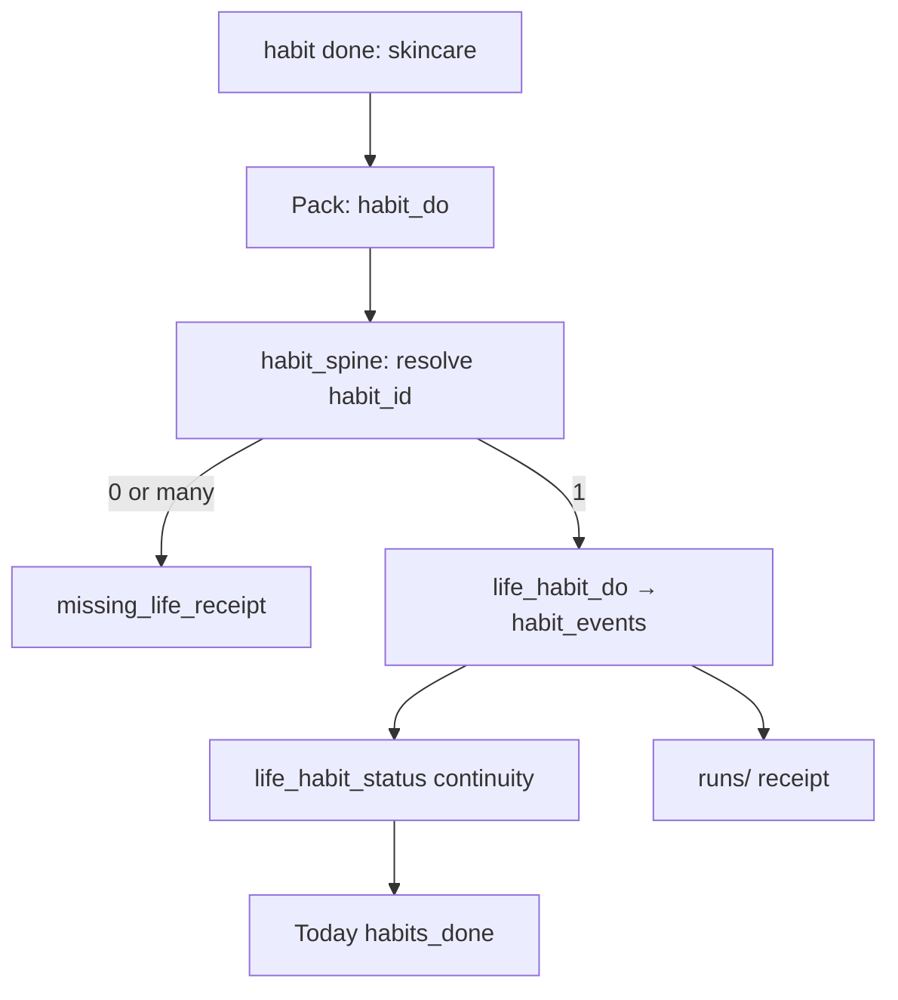
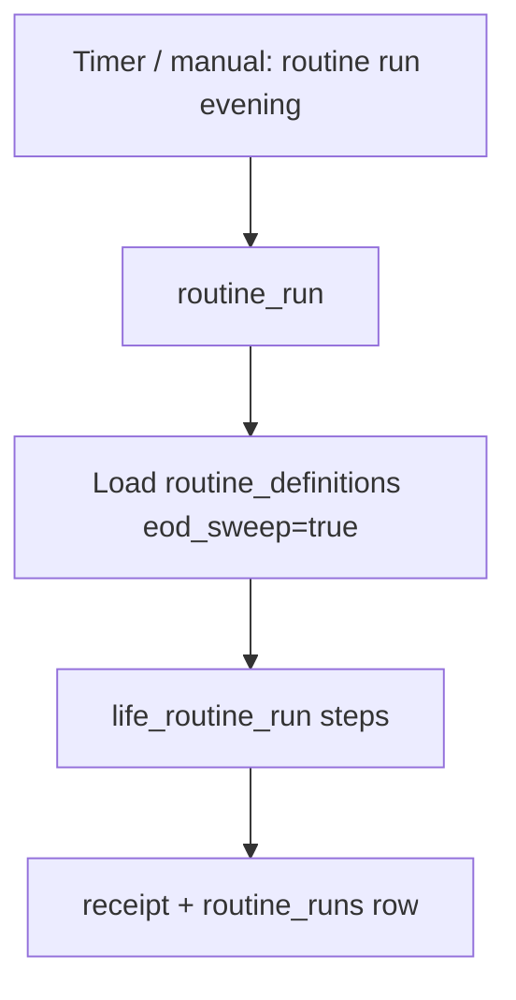
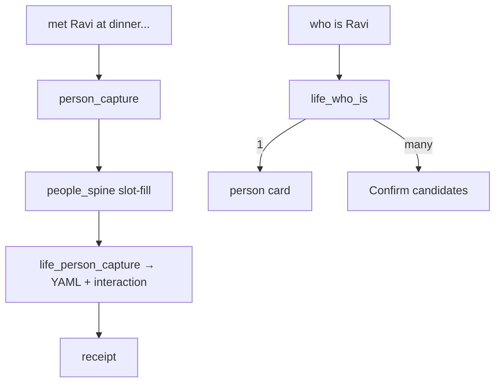
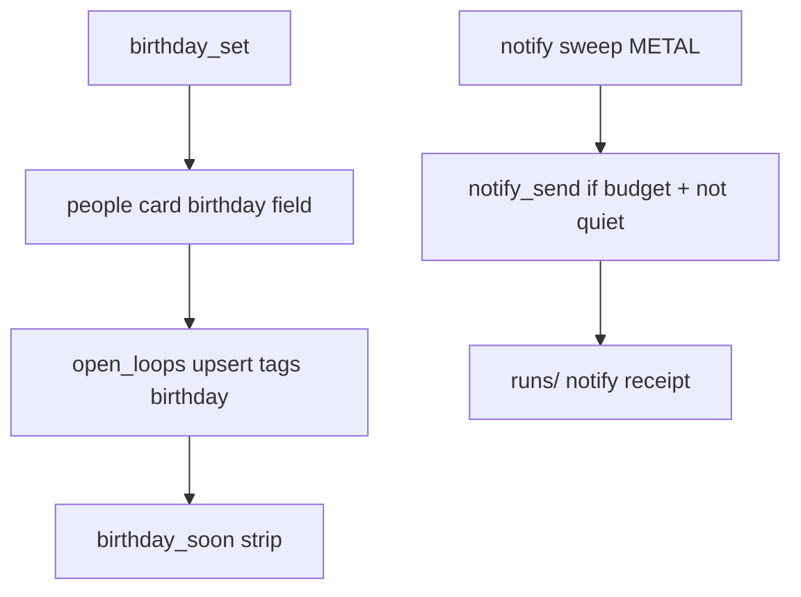

# M19a — P1 Habits + People (implement spec)

**Status:** design + implement spec (**v1.0**) — **not shipped**; depends on P0 operator HUD smoke PASS  
**Date:** 2026-08-18  
**Kind:** Tier B **implement slice** — child of [`M19_TIER_B_LIFE_ADMIN.md`](./M19_TIER_B_LIFE_ADMIN.md) · sibling of [`M19a_P0_LIFE_CAPTURE.md`](./M19a_P0_LIFE_CAPTURE.md)  
**Depends on:** M19 P3.1 P1 row · P0 metal (pack router, `life_logs.db`, due spine, Today strip) · [`M16_FIRST_PACKAGE.md`](./M16_FIRST_PACKAGE.md) (`remind_at`, `people_ids`, ntfy budget) · [`M04_MEMORY_DREAM.md`](./M04_MEMORY_DREAM.md) (people stubs; Dream never auto-merges people) · [`M17_SURFACE_DESIGN.md`](./M17_SURFACE_DESIGN.md) (strip/sheet locks) · [`M15_INTENT_WORK_LOOP.md`](./M15_INTENT_WORK_LOOP.md) · [`../19_JARVIS_JUSTINE_AGENT_RESEARCH.md`](../19_JARVIS_JUSTINE_AGENT_RESEARCH.md) (Verb→Pack→Cortex-fill)  
**Feeds:** M19 P2 (mail) · P4 (analysis packs) · M19b (PTT/camera transport — still blocked on P0 live smoke)

### Filename choice

**`M19a_P1_HABITS_PEOPLE.md`** — same `M19a` prefix as P0: narrow implement spec under M19, not a new top-level module slot.

### Changelog

| Ver | Date | Delta |
|-----|------|-------|
| **v1.0** | 2026-08-18 | Initial P1 implement spec: habits + people + birthday/kin notify; operator locks from P0 + M19 brainstorm; phased close gates P1.1→P1.3; falsifiers + HUD smoke stub |

### One-liner

**Continuity capture for routines and kin** — one-tap habit ticks + capture-first people cards + alias-safe resolve + birthday→Today/ntfy — compounding P0 Today/notify; **not** mail, jobs, analysis packs, CRM sync, learned ML schedules, parallel timers, or a standalone habit app.

---

## 1. P1 scope fence

| IN (P1) | OUT (P1) |
|---------|----------|
| **`log:habits`** SQLite append-only (same `life_logs.db` file or sibling tables) | Standalone Streaks clone · gamified guilt UX · 10 pings/day |
| Verbs: `habit_do`, `habit_miss`, `routine_run`, `streak_show` | `routine_edit` full checklist builder UI (soft FACT write only) |
| Habit **definitions** in FACTS YAML or log meta (OPEN #1) | Learned per-habit ML schedules (**PARK**) |
| Nudge v1: **static windows** + one **EOD routine sweep** | Parallel timers · Google Calendar rebuild |
| People **schema v2** on `facts/people/*.yaml` (aliases, kin, birthday, `last_contact_at`, notes) | Clay auto-graph · LinkedIn scrape · CRM sync |
| Capture-first people (`met X today…`) not “add contact” wizard | People/Habits dashboard soup (M17 refuse) |
| `who_is` resolve: 0→create stub · 1→bind · many→**Confirm** | Silent alias bind on clash |
| Interactions = timestamped notes on person card | Separate interaction SQL table (**OPEN #2** — notes-only v1) |
| Glue: `due_add`/`remind` with **`people_ids`**; `birthday_set` → person + open_loop | Mail OAuth · job LaTeX |
| Extend M16 **`notify_send`** for birthday/kin (budget + quiet hours) | Notify spam without closed-loop receipts |
| **`life_p1.yaml`** pack router + `habit_spine.py` + `people_spine.py` | New agent runtime |
| Today strip keys + composer chips (`habit`, `met`, `who`) | Week habit charts · People board column |
| Receipts mandatory for every habit/people write | Chat claims without log/FACT row |
| **P1.x HUD smoke** (`tests/test_m19a_p1_*.py`) | PTT/camera implement (M19b) |

**Won’t-chase P1:** mail OAuth, job LaTeX, HA, vendor web search prerequisite, always-listen, weekly analysis packs, Hevy import, Cronometer sync, rebuilding Google Calendar, embeddings day-one, CRM auto-import, shame streak fire, learned nudge schedules, full Monica feature parity, People/Habits dashboard.

**P0 §16 PARK → P1 IN (explicit):**

| P0 PARK item | P1 disposition |
|--------------|----------------|
| `habit_do` / `routine_run` / skincare checklists | **IN** — Family E |
| `alias_set` / `who_is` for dues | **IN** — Family F |
| Phone PTT + HUD camera/barcode | **Still M19b** — same pack router; not P1 gate |

---

## 2. Extension map (METAL vs NEW)

| Existing organ | P1 extension | New surface (minimal) |
|----------------|--------------|------------------------|
| [`src/ada/logs/`](../../src/ada/logs/) + `life_logs.db` | **`NEW`** tables: `habit_definitions` (optional meta), `habit_events`, `routine_runs` | **`NEW`** `src/ada/logs/habits.py` |
| [`src/ada/io/paths.py`](../../src/ada/io/paths.py) | Reuse `logs/life_logs.db` — habits live beside meals/gym/time | No new DB file (OPEN #1) |
| [`src/ada/memory/facts.py`](../../src/ada/memory/facts.py) + `facts/people/` | People **schema v2**; habit defs in `facts/habits.yaml` (optional) | Extend `_template.yaml`; Dream **always stages** people overwrites (**METAL** — [`dream/merge.py`](../../src/ada/dream/merge.py)) |
| [`seeds/facts/people/_template.yaml`](../../seeds/facts/people/_template.yaml) | Bump to schema v2 seed | **`NEW`** fields documented |
| [`src/ada/memory/open_loops.py`](../../src/ada/memory/open_loops.py) | `people_ids` on birthday dues (**METAL** shipped M16) | Birthday → todo with `due_at` + `people_ids` |
| [`src/ada/memory/notify.py`](../../src/ada/memory/notify.py) | Birthday/kin class in sweep (**METAL** ntfy budget/quiet) | Wire `birthday_set` → remind todos |
| [`src/ada/hud/today.py`](../../src/ada/hud/today.py) | `habits_due`, `habits_done`, `people_remind`, `birthday_soon` keys | Extend payload only |
| [`src/ada/tools/life_tools.py`](../../src/ada/tools/life_tools.py) | **`NEW`** `life_habit_*`, `life_people_*` handlers | Gateway DISPATCH |
| [`src/ada/tools/toolspec.py`](../../src/ada/tools/toolspec.py) + [`gateway.py`](../../src/ada/tools/gateway.py) | Register P1 tool group | **`NEW`** ToolSpec entries |
| [`src/ada/harness/pack_router.py`](../../src/ada/harness/pack_router.py) | Load **`life_p1.yaml`** merged with or after `life_p0.yaml` | **`NEW`** pack file |
| [`src/ada/harness/packs/life_p1.yaml`](../../src/ada/harness/packs/life_p1.yaml) | Verb→tool, chips, aliases for E+F+glue | **`NEW`** |
| [`src/ada/harness/habit_spine.py`](../../src/ada/harness/habit_spine.py) | NL → `habit_id` + day tick args | **`NEW`** (mirror `due_spine.py`) |
| [`src/ada/harness/people_spine.py`](../../src/ada/harness/people_spine.py) | Capture utterance → person fields; `who_is` mention parse | **`NEW`** |
| [`src/ada/harness/loop.py`](../../src/ada/harness/loop.py) | Fast-path for P1 writes; read packs Observe+Agent; extend `READ_PACK_VERBS` / facts guard | **`METAL`** extend |
| [`src/ada/harness/due_spine.py`](../../src/ada/harness/due_spine.py) | Optional `people_ids` extract from `@mention` / resolved person | **`METAL`** extend |
| [`src/ada/cortex/charter.py`](../../src/ada/cortex/charter.py) | P1 recipes + HARD: no `memory_facts_append` on life/habit/people **read** packs; people **write** → propose/confirm path | **`METAL`** extend |
| [`src/ada/hud/chat_service.py`](../../src/ada/hud/chat_service.py) | Chip bind for `habit`, `met`, `who` | **`METAL`** |
| [`src/ada/hud/templates/index.html`](../../src/ada/hud/templates/index.html) | Composer chips | **`METAL`** |
| [`src/ada/cli/main.py`](../../src/ada/cli/main.py) | `ada life habit-do …`, `ada life who …` headless | **`NEW`** subcommands |
| [`tests/test_m19a_life_capture.py`](../../tests/test_m19a_life_capture.py) pattern | **`NEW`** `tests/test_m19a_p1_*.py` | F-P1.* falsifiers |

**Not new:** separate `ada.habits` / `ada.people` top-level packages — extend `ada.logs` + `life_tools` + FACTS people dir.

**Habits vs P0 time blocks (operator lock):** logging “did skincare” as **`time_start` `kind=custom`** remains valid P0. **`habit_do`** is the P1 **checklist tick** with continuity rate — distinct store (`habit_events`), distinct Today keys. Do not merge the two.

---

## 3. Verb → Pack catalog (P1 only)

**Confirm classes:** `none` · `soft` (new person stub, habit def) · `confirm_args` (alias clash, FACT overwrite, people field conflict) · `confirm_egress` (not used P1)

**Router:** [`life_p1.yaml`](../../src/ada/harness/packs/life_p1.yaml) — merged at load with P0 config (P1 aliases append; verb names must not collide except glue).

### Family E — Habits / Routines (M19 §P3.2)

| Verb | Pack spine | Inputs → outputs | Confirm | Receipt shape | UI | Tools | Fast-path |
|------|------------|------------------|---------|---------------|-----|-------|-----------|
| **`habit_do`** | resolve habit_id (name/alias) → insert `habit_events` done → rollup day continuity | habit name or id; optional note | `none` | `{receipt_id, habit_id, local_day, event_id, continuity_7d}` | Today habit chip | `life_habit_do` | Agent when habit resolves 1:1 |
| **`habit_miss`** | insert miss event → optional reason | habit + reason? | `none` | `{receipt_id, habit_id, local_day, event_id, kind:miss}` | chat | `life_habit_miss` | Agent when habit resolves 1:1 |
| **`routine_run`** | load routine def → tick all/specified steps → one `routine_runs` row | routine id or name; optional `steps[]` | `none` | `{receipt_id, routine_id, run_id, steps_done[]}` | EOD sweep / chat | `life_routine_run` | Agent when routine resolves |
| **`streak_show`** | read window → **continuity rate** (not shame streak) | habit_id? · days=7 default | `none` | `{habits[{id, continuity_rate, done_days, window_days}]}` | Today strip / chat | `life_habit_status` | Observe+Agent |
| **`routine_edit`** | validate slots → write FACTS `habits.yaml` routines section | name + steps[] | `soft` if new; `confirm_args` on overwrite | `{routine_id, path, version}` | sheet (later) | `memory_facts_propose_edit` on `habits.routines` | **No** fast-path (Confirm) |

**Steal:** [BJ Fogg Tiny Habits](https://www.behavioralmodel.org/) — anchor + tiny behavior; celebrate success (**EVIDENCE**). **Refuse:** gamified guilt, loss-aversion streak fire (**POLICY** — M16 continuity pulse).

**Nudge v1 (static):**

| Window | Behavior | Store |
|--------|----------|-------|
| Morning (prefs `habit_nudge_morning` default 07:00–10:00 local) | Today `habits_due` lists open defs not ticked today | read-only |
| EOD sweep (default 21:00 local, suppress quiet hours for *logging* not notify) | `routine_run` pack for defs tagged `eod_sweep: true` | `routine_runs` |
| Miss inference | **No auto-miss** — only explicit `habit_miss` or operator EOD “anything missed?” chip | — |

**Learned schedules per habit → PARK** (operator lock).

### Family F — People / Kin (M19 §P3.2–P3.3)

| Verb | Pack spine | Inputs → outputs | Confirm | Receipt shape | UI | Tools | Fast-path |
|------|------------|------------------|---------|---------------|-----|-------|-----------|
| **`person_capture`** | parse “met X …” → lazy slot-fill → create/patch `people/*.yaml` + interaction note | utterance | `soft` if new stub | `{person_id, path, interaction_id?, created: bool}` | `met` chip | `life_person_capture` | Agent when name + note parse |
| **`person_update`** | patch fields on existing card | person_id + fields | `confirm_args` if identity fields | `{person_id, path, fields[]}` | sheet | `life_person_update` | No — Confirm on clash |
| **`alias_set`** | bind surface → person_id | alias + person + sense? | **`confirm_args`** if clash | `{alias, person_id, sense}` | Confirm sheet | `life_alias_set` | No — always Confirm on clash |
| **`kin_link`** | structured edge on card | person_id + relation + side | `soft` | `{person_id, kin}` | sheet | `life_person_update` | No |
| **`birthday_set`** | write birthday on card → upsert open_loop(s) with `people_ids` + optional remind rules | person + date | `none` | `{person_id, birthday, open_loop_ids[]}` | Today | `life_birthday_set` | Agent when person resolves 1:1 |
| **`who_is`** | mention → resolve algorithm → 0/1/many | mention string | `none` read; write branch Confirm | `{candidates[{person_id, display_name, confidence, reason}]}` | chat chip | `life_who_is` | Observe+Agent read |
| **`people_remind`** | scan cards → upcoming birthdays/kin → optional notify todos | horizon days=14 | `none` | `{upcoming[{person_id, event, due_at}]}` | Today | `life_people_remind` | Observe+Agent |
| **`person_note`** | append timestamped interaction on card | person_id + text | `none` | `{person_id, interaction_at, note}` | chat | `life_person_note` | Agent when person_id known |

**Capture-first POLICY:** default utterance “met Sarah at …” routes **`person_capture`**, not `person_add` wizard. Empty slots stay empty — lazy fill on next mention.

**Resolution (`who_is` / any person-bearing verb):**

```text
mention → normalize (lower, strip honorifics)
  → exact alias match (operator-scoped, sense-aware)
  → dialect term + kin side (M19 indian_terms[])
  → display_name fuzzy (threshold ≥ 0.85)
  → if 0: offer create stub (person_capture)
  → if 1 high-confidence: bind person_id
  → if many / alias clash: Confirm sheet — never silent pick
```

**Steal:** [Monica](https://www.monicahq.com/) birthdays + reminders + interaction log shape (**EVIDENCE**); [Dex keep-in-touch](https://getdex.com/docs/workflows/keep-in-touch) cadence concept (**EVIDENCE** — refuse cloud sync). **Refuse:** Clay auto-graph, LinkedIn scrape (**POLICY**).

### Family — Glue to M16 Track (extend P0)

| Verb | Pack spine | Confirm | Tools | Fast-path |
|------|------------|---------|-------|-----------|
| **`due_add`** / **`remind`** (extended) | `due_spine` + optional `people_spine.resolve_mention` → `people_ids` | `none` | `memory_open_loops_upsert` | Agent — **METAL** base; **NEW** people_ids injection |
| **`due_list`** (extended) | include `people_ids` in speak | `none` | `memory_open_loops_list` | Observe+Agent |

Example: “remind me to call **Mama** Friday” → resolve `Mama` → `{remind_at, people_ids: [person_mama_priya]}`.

---

## 3.5 Two intent layers (do not conflate)

**POLICY:** Same as P0 — extend harness + charter + pack YAML; do **not** rewrite M15.

| Layer | Owner | P1 role |
|-------|-------|---------|
| **M15 intent→work** | `loop.py` + gateway + `chat_service.py` | Unchanged geometry; P1 **`life_habit_*` / `life_people_*`** on gateway path |
| **M19 pack router** | `pack_router.py` + `life_p0.yaml` + **`life_p1.yaml`** | Prefix / chip / alias → `{verb, tool, spine}` |

### Target METAL truth (post–P1 implement)

| Claim | Status | Lens |
|-------|--------|------|
| P1 packs load merged with P0 | **NEW** | **NEW** |
| `habit_do` Agent fast-path when habit name resolves 1:1 | **NEW** | **NEW** |
| `who_is` / `streak_show` / `people_remind` Observe+Agent fast-path | **NEW** | **NEW** |
| `alias_set` / `person_update` identity → Confirm; no fast-path | **NEW** | **POLICY** |
| `memory_facts_append` blocked on life **and** habit/people **read** packs | **METAL** extend | **METAL** |
| People writes via gateway; Dream never auto-merges people | **METAL** | **METAL** / M04 |
| Birthday due carries `people_ids` | **NEW** | **NEW** |
| HUD fast-path `token_delta` speak on P1 writes | **METAL** pattern | **METAL** |

---

## 3.6 Pack executor model

Same spine as P0 — **not a second agent runtime**.

```text
utterance | chip | (future) PTT transcript
    → pack_router (life_p0.yaml + life_p1.yaml)
    → pack_hint { verb, tool, args, preferred_tools, spine }
    → build_system_charter(pack_hint) addendum
    → [Observe+Agent] _maybe_pack_fast_path() for read packs
    → [Agent] _maybe_pack_fast_path() when write args complete
    → else M15 ReAct; memory_facts_* denied on life/habit/people read turns
    → gateway life_* / memory_open_loops_* / memory_facts_propose_edit (Confirm)
    → SQLite habit_events + people YAML + open_loops + runs/ receipt → build_today()
```

### Pack YAML spine (P1 target)

| Key | Example |
|-----|---------|
| `packs.habit_do.tool` | `life_habit_do` |
| `packs.habit_do.prefill` | `habit done: ` |
| `packs.habit_do.spine` | `resolve_then_tick` |
| `packs.who_is.spine` | `read` |
| `packs.person_capture.spine` | `capture_then_write` |
| `packs.birthday_set.spine` | `resolve_then_birthday` |
| `chips.habit` | `habit_do` |
| `chips.met` | `person_capture` |
| `chips.who` | `who_is` |

### Fast-path rule (extends P0 §3.6)

**Writes: Agent only.** **Reads: Observe + Agent.**

| Pack | Mode | Spine module | Gateway calls |
|------|------|--------------|---------------|
| `habit_do` / `habit_miss` | Agent | [`habit_spine.py`](../../src/ada/harness/habit_spine.py) | `life_habit_do` / `life_habit_miss` → `life_habit_status` |
| `routine_run` | Agent | `habit_spine.py` | `life_routine_run` → `life_habit_status` |
| `person_capture` | Agent | [`people_spine.py`](../../src/ada/harness/people_spine.py) | `life_person_capture` |
| `person_note` | Agent | `people_spine.py` | `life_person_note` |
| `birthday_set` | Agent | `people_spine.py` | `life_birthday_set` → `memory_open_loops_upsert` |
| `due_add` / `remind` (+ person mention) | Agent | `due_spine.py` + `people_spine.py` | `memory_open_loops_upsert` (with `people_ids`) |
| `streak_show` / `who_is` / `people_remind` | Observe+Agent | — | `life_habit_status` / `life_who_is` / `life_people_remind` |
| `alias_set` / `person_update` / `routine_edit` | Agent | — | **No fast-path** — Confirm-bound |

**POLICY:** On habit/person ambiguity → `stop_reason=missing_life_receipt`. On alias clash → Confirm sheet with candidates — never silent bind.

---

## 3.7 Phased close gates (P1.1 → P1.3 → P1.x)

**P1 CLOSED** (operator sign-off) requires **P1 metal** (§2) **+ P1.x PASS**. M19b PTT/camera still blocked on **P0 live** smoke.

| # | Task | Gate |
|---|------|------|
| **P1.1a** | SQLite `habit_events` + `routine_runs` migrations | P1.1 |
| **P1.1b** | `life_habit_do` / `miss` / `routine_run` / `life_habit_status` tools + gateway | P1.1 |
| **P1.1c** | `habit_spine.py` + `life_p1.yaml` habit packs + loop fast-path | P1.1 |
| **P1.1d** | Today `habits_due` / `habits_done` keys | P1.1 |
| **P1.1e** | `tests/test_m19a_p1_habits.py` falsifiers F-P1.1* | P1.1 |
| **P1.2a** | People schema v2 + `life_person_capture` / `life_who_is` / `life_person_note` | P1.2 |
| **P1.2b** | `people_spine.py` resolve algorithm + Confirm on clash | P1.2 |
| **P1.2c** | `due_spine` + `people_ids` on remind/due | P1.2 |
| **P1.2d** | Composer chips `met`, `who` | P1.2 |
| **P1.2e** | `tests/test_m19a_p1_people.py` falsifiers F-P1.2* | P1.2 |
| **P1.3a** | `life_birthday_set` → open_loops + `people_remind` read pack | P1.3 |
| **P1.3b** | Birthday sweep hooks `notify_due_todos` / quiet hours (**METAL** [`notify.py`](../../src/ada/memory/notify.py)) | P1.3 |
| **P1.3c** | Today `birthday_soon` / `people_remind` keys | P1.3 |
| **P1.3d** | `tests/test_m19a_p1_birthday_notify.py` | P1.3 |
| **P1.x** | HUD smoke pack [`M19a_P1_HUD_SMOKE.md`](../reviews/M19a_P1_HUD_SMOKE.md) · `tests/test_m19a_p1_hud_smoke.py` | **CLOSE** |

### Operator HUD smoke (P1.x close gate)

**Prereqs:** P0 pytest green; **Agent** session + login; at least one habit def seeded; one people card or capture utterance.

**Restart HUD after code change** (same as P0):

```bash
pid=$(ss -ltnp 'sport = :8787' | sed -n 's/.*pid=\([0-9]*\).*/\1/p' | head -1)
[ -n "$pid" ] && kill "$pid"
ada hud serve --host 127.0.0.1 --port 8787
```

Automated: `pytest tests/test_m19a_p1_hud_smoke.py -q` — utterance table in [`M19a_P1_HUD_SMOKE.md`](../reviews/M19a_P1_HUD_SMOKE.md).

| Step | HUD (Agent unless noted) | Pass |
|------|--------------------------|------|
| 1 | `habit done: skincare` | `life_habit_do` + `life_habit_status`; `stop=pack_fast_path`; SQLite `habit_events` row |
| 2 | `who is Mama` (Observe or Agent) | `life_who_is`; candidates or 1 bind; no silent wrong father |
| 3 | `met Ravi at dinner, his kid starts school` | `life_person_capture`; new/updated `people/*.yaml`; interaction note |
| 4 | `set birthday: Ravi 1990-05-20` | `life_birthday_set`; open_loop with `people_ids`; Today `birthday_soon` |
| 5 | `remind me to call Ravi Friday` | `memory_open_loops_upsert` with `people_ids` when resolve 1:1 |
| 6 | `habit done: flurmble routine` (unknown) | `missing_life_receipt`; no fake tick |
| 7 | Alias clash setup → `alias set: Dad → …` | Confirm sheet; no silent overwrite |

---

## 3.8 HUD bind contract (transport-agnostic)

Extends P0 §3.8 — same router for PTT/camera later.

| Transport | Enters as | Same pack router? |
|-----------|-----------|-------------------|
| Chat text | utterance → `route_utterance()` | **yes** |
| Composer chip | `habit` / `met` / `who` → `resolve_chip()` | **yes** |
| Phone PTT (M19b) | STT transcript | **yes** (after P0 live smoke) |

### API surfaces (stable)

| Surface | Role |
|---------|------|
| `POST /api/chat` | M15 loop; P1 packs via merged YAML |
| `GET /api/today` | + `habits_due`, `habits_done`, `birthday_soon`, `people_remind` |
| `GET /api/life/day` | optional P1.2+: habit status JSON |
| `POST /api/confirm` | alias clash, people overwrite, routine_edit |

---

## 4. Schemas

**Location:** `/mnt/ada-data/logs/life_logs.db` (same WAL file as P0 — **NEW** tables only).  
**People:** `/mnt/ada-data/facts/people/<id>.yaml` (FACTS — not SQLite).  
**Append-only:** `habit_events` never UPDATE semantic fields; corrections insert superseding event with `supersedes_event_id`.

**Timezone:** `local_day` from `prefs.preferred_tz` (same as P0 meals).

### 4.1 Habits (SQLite)

```sql
-- life_logs.db (P1 migration)
CREATE TABLE habit_definitions (
  habit_id          TEXT PRIMARY KEY,
  display_name      TEXT NOT NULL,
  aliases_json      TEXT,              -- ["skincare", "SPF"]
  anchor_hint       TEXT,              -- optional Fogg anchor label — display only v1
  schedule_json     TEXT,              -- {"windows":["morning"], "eod_sweep": false}
  active            INTEGER NOT NULL DEFAULT 1,
  source            TEXT NOT NULL,     -- facts|operator|seed
  receipt_id        TEXT,
  created_at        TEXT NOT NULL
);

CREATE TABLE habit_events (
  event_id          TEXT PRIMARY KEY,
  habit_id          TEXT NOT NULL REFERENCES habit_definitions(habit_id),
  local_day         TEXT NOT NULL,
  logged_at         TEXT NOT NULL,
  kind              TEXT NOT NULL,     -- done|miss
  note              TEXT,
  supersedes_event_id TEXT,
  receipt_id        TEXT NOT NULL,
  source_verb       TEXT NOT NULL      -- habit_do|habit_miss
);
CREATE INDEX idx_habit_events_day ON habit_events(habit_id, local_day);
CREATE UNIQUE INDEX idx_habit_one_done_per_day ON habit_events(habit_id, local_day)
  WHERE kind = 'done' AND supersedes_event_id IS NULL;

CREATE TABLE routine_definitions (
  routine_id        TEXT PRIMARY KEY,
  display_name      TEXT NOT NULL,
  steps_json        TEXT NOT NULL,     -- [{id, label, habit_id?}]
  eod_sweep         INTEGER NOT NULL DEFAULT 0,
  active            INTEGER NOT NULL DEFAULT 1,
  source            TEXT NOT NULL,
  created_at        TEXT NOT NULL
);

CREATE TABLE routine_runs (
  run_id            TEXT PRIMARY KEY,
  routine_id        TEXT NOT NULL REFERENCES routine_definitions(routine_id),
  local_day         TEXT NOT NULL,
  logged_at         TEXT NOT NULL,
  steps_done_json   TEXT NOT NULL,
  receipt_id        TEXT NOT NULL
);
CREATE INDEX idx_routine_runs_day ON routine_runs(local_day);
```

**Continuity metric (not streak shame):**

```python
continuity_rate = done_days / window_days  # default window=7; miss lowers rate; no "streak broken" copy
```

### 4.2 People schema v2 (YAML)

```yaml
# facts/people/person_mama_priya.yaml
schema_version: 2
id: person_mama_priya
display_name: "Priya Auntie"
legal_name: ""
kin:
  relation_to_operator: "mother_sibling"
  side: "maternal"
  indian_terms: ["mama", "mami"]
aliases:
  - surface: "Mama"
    sense: "mother_sibling"
    confidence: 1.0
    locale: "en-IN-family"
birthday: "1968-03-12"
remind:
  birthday: { days_before: [7, 1, 0] }
last_contact_at: "2026-08-10T09:00:00Z"
interactions:
  - at: "2026-08-10T09:00:00Z"
    note: "Phone call — school starts next week"
    source: "person_capture"
notes: ""
provenance: { source: "operator", at: "2026-08-18T..." }
```

**Migration v1→v2:** `schema_version: 1` stubs (`name`, `role`, `notes`) remain valid; loader treats `name` as `display_name` fallback.

**Dream POLICY:** all people doc overwrites → stage (`people_always_stage` **METAL**). Agent **`life_person_update`** / Confirm path for apply.

### 4.3 Habit definitions (FACTS optional)

**`facts/habits.yaml`** (optional mirror — SQL is operational truth if both exist; sync on write **OPEN #1**):

```yaml
schema_version: 1
habits:
  - id: habit_skincare
    display_name: "Skincare"
    aliases: [skincare, SPF]
    schedule: { windows: [morning, evening] }
routines:
  - id: routine_evening
    display_name: "Evening wind-down"
    eod_sweep: true
    steps:
      - { label: "Skincare", habit_id: habit_skincare }
```

**v1 recommendation:** seed `habit_definitions` from YAML on first `life_habit_do` miss or CLI import; SQL authoritative for ticks.

### 4.4 Open loops (birthday glue)

Birthday pack creates/updates todos:

```yaml
kind: todo
status: open
text: "Birthday — Priya Auntie"
due_at: "2026-03-12T09:00:00+13:00"   # next occurrence, operator TZ
people_ids: [person_mama_priya]
tags: [birthday, kin]
notify: true
remind_at: "2026-03-05T09:00:00+13:00"  # days_before[0]
```

---

## 5. Pipelines

### 5.1 Habit tick



| Step | Owner | Deterministic? |
|------|-------|----------------|
| Parse habit name | `habit_spine.py` | Yes — alias table + defs |
| Insert event | `life_habit_do` gateway | Yes |
| Continuity rollup | `life_habit_status` | Yes |
| Today keys | `build_today()` | Yes |

### 5.2 Routine EOD sweep



**POLICY:** sweep is **one ntfy max** per EOD via existing budget — not per-habit spam.

### 5.3 People capture / resolve



### 5.4 Birthday → due → notify



**M16 POLICY:** claiming a push requires `notify_send` receipt or honest “scheduled / notify off” ([`charter.py`](../../src/ada/cortex/charter.py) **METAL**).

### Edge cases

| Case | Behavior |
|------|----------|
| Unknown habit name | `missing_life_receipt`; suggest `routine_edit` or seed |
| Double tap same day | UNIQUE done index → second insert returns `{ok:false, reason:already_done}` |
| “Dad” → two candidates | Confirm sheet; **F-P1.2c** |
| Birthday Feb 29 | Store `1968-02-29`; next due uses Feb 28 in non-leap years (document in tool) |
| Notify budget exhausted | `notify_send` outcome `skipped` + honest Today; still have due row |
| Quiet hours | Suppress ping; due remains on strip |
| People path escape | Jail under `facts/people/` only — no `..` |
| Cortex invents continuity | Denied — must call `life_habit_status` |

---

## 6. Integration with A kernel

Extends P0 §10 — same two-layer flow.

| Concern | Observe | Agent | Plan |
|---------|---------|-------|------|
| `life_habit_status`, `life_who_is`, `life_people_remind` | yes | yes | yes |
| `life_habit_do`, `life_person_capture`, `life_birthday_set`, … | denied | append | denied |
| `life_alias_set`, `memory_facts_propose_edit` (people) | denied | Confirm | denied |
| `notify_send` | denied | append (budget) | denied |

**Gateway side-effect classes (proposed):**

| Tool | side_effect | egress |
|------|-------------|--------|
| `life_habit_*` | `append_local` | `none` |
| `life_people_*` (capture/note) | `append_local` | `none` |
| `life_alias_set` | `append_local` + Confirm | `none` |
| `life_birthday_set` | `append_local` + open_loops | `none` |
| `notify_send` | `notify` | `web` (ntfy) |

**Charter HARD lines (P1 addendum):**

- Do not state habit continuity without `life_habit_status` read.
- Do not resolve “Dad”/“Mama” without `life_who_is` or spine bind.
- Do not `memory_facts_append` on habit/people **read** turns.
- People FACT overwrites → `memory_facts_propose_edit` / Confirm only.

---

## 7. UI (P1 surfaces)

| Surface | Content | Source |
|---------|---------|--------|
| **Today strip** | habits due/done chips · `birthday_soon` · people remind · (existing P0 keys) | `build_today()` |
| **Composer chips** | **`habit`** · **`met`** · **`who`** + P0 meal/lift/focus/due/capture | HUD static |
| **Chat** | Confirm sheet for alias clash; continuity speak (not streak shame) | M15 |
| **Sheet (minimal)** | Person card read from `life_who_is` — optional P1.2+ route | no People column |

**Today payload keys (new):**

```json
{
  "habits_due": [{"habit_id", "display_name", "window"}],
  "habits_done": [{"habit_id", "display_name", "logged_at"}],
  "habit_continuity": {"window_days": 7, "rate": 0.71},
  "birthday_soon": [{"person_id", "display_name", "due_at", "days_until"}],
  "people_remind": [{"person_id", "display_name", "reason", "due_at"}]
}
```

**M17 locks:** strip max ~2 lines visible; habit/people detail in sheet on chip click — no dashboard soup.

---

## 8. Storage justification

| Store | Why | Why not alternative |
|-------|-----|---------------------|
| **SQLite** `habit_events` | Append-heavy ticks; indexed day queries; same WAL discipline as meals | YAML rewrite per tick |
| **YAML** people cards | Low volume; Confirm overwrite pattern; Dream staging | SQL people = dual-store confusion |
| **open_loops** birthday dues | Reuse M16 notify path + Today | Separate birthday DB |
| **FACTS** habit defs (optional) | Operator-editable routines | Defs-only in chat |

---

## 9. Falsifiers (P1-specific)

| # | If observed… | Then… |
|---|--------------|-------|
| **F-P1.1a** | Assistant states continuity rate without `life_habit_status` / SQL read | Theater — fail |
| **F-P1.1b** | `habit_do` chat success, no `habit_events` row | Extends P0 F6 — fail |
| **F-P1.1c** | Shame streak copy (“streak broken!”, guilt nudge) | POLICY fail — continuity only |
| **F-P1.1d** | >1 `done` event same habit same day (non-superseding) | UNIQUE leak — fail |
| **F-P1.2a** | “Dad” binds wrong kin without Confirm | M19 F3 — fail |
| **F-P1.2b** | `person_capture` without YAML row or receipt | Fail |
| **F-P1.2c** | `who_is` many candidates → silent pick | Fail |
| **F-P1.2d** | Dream auto-merged people YAML | M04 breach — fail |
| **F-P1.3a** | Birthday chat claim, no open_loop + `people_ids` | Fail |
| **F-P1.3b** | `notify_send` storm; closed loops flat | M19 F4 — fail |
| **F-P1.3c** | Chat ping claim without `notify_send` receipt / honest skip | M16 F13 — fail |
| **F-P1.xa** | P1 pack_hint set but charter unchanged | Routing theater — fail |
| **F-P1.xb** | Habits UI creep (standalone habit app board) | M17 fail |

**Pytest files:**

| File | Covers |
|------|--------|
| [`tests/test_m19a_p1_habits.py`](../../tests/test_m19a_p1_habits.py) | F-P1.1a–d |
| [`tests/test_m19a_p1_people.py`](../../tests/test_m19a_p1_people.py) | F-P1.2a–d |
| [`tests/test_m19a_p1_birthday_notify.py`](../../tests/test_m19a_p1_birthday_notify.py) | F-P1.3a–c |
| [`tests/test_m19a_p1_hud_smoke.py`](../../tests/test_m19a_p1_hud_smoke.py) | F-P1.xa–b; utterance table |

---

## 10. OPEN (operator ≤7)

| # | Question | Recommendation |
|---|----------|----------------|
| 1 | Habit **definitions** authoritative: SQLite only vs YAML+sync | **SQL authoritative** for ticks; YAML seed/import; optional one-way sync CLI |
| 2 | Interactions: append to YAML list vs separate `person_interactions` table | **YAML notes-only v1**; table P2 if volume hurts |
| 3 | Merge `life_p1.yaml` vs single growing `life_p0.yaml` | **Separate `life_p1.yaml`** merged at load — keeps P0 smoke isolated |
| 4 | Default habit seeds (skincare, vitamins) | Ship **empty** + operator seed; one bundled `habits_seed.yaml` optional |
| 5 | `kin_link` vs inline `kin` on card | **Inline v1**; `kin_link` verb aliases `person_update` |
| 6 | EOD sweep: manual chip vs systemd timer | **Manual + optional** `ada life routine-sweep` CLI; timer P2 |
| 7 | People fuzzy threshold | **0.85** display_name; alias exact match first |

---

## 11. P2+ PARK pointers

| Phase | One line |
|-------|----------|
| P2 mail | OAuth ingest → objects; Confirm send |
| P4 analysis | `nutrition_week`, habit continuity trends read-only |
| Learned habit schedules | ML nudge windows — **PARK** |
| CRM sync / LinkedIn | **PARK** / refuse |
| `person_interactions` SQL | If YAML list > ~500 entries |
| M19b PTT/camera | After P0 live smoke — same router |
| Full Monica parity | Journals, gifts, debts — **PARK** |
| People/Habits dashboard | **PARK** — M17 refuse |

---

## 12. Lens cheat-sheet

| Claim | Lens |
|-------|------|
| Tiny Habits anchor + tiny behavior | **EVIDENCE** ([Fogg B=MAP](https://www.behavioralmodel.org/)) |
| Continuity rate > shame streaks | **EVIDENCE** + **POLICY** (M16 §Phase 1) |
| One-tap done + optional EOD sweep | **EVIDENCE** (Streaks-class UX steal) · refuse full clone **POLICY** |
| Monica birthdays + interaction log | **EVIDENCE** ([monicahq.com](https://www.monicahq.com/)) |
| Dex keep-in-touch cadence | **EVIDENCE** ([Dex docs](https://getdex.com/docs/workflows/keep-in-touch)) · refuse cloud sync **POLICY** |
| Alias Confirm on kin clash | **FEASIBLE** + **POLICY** (M19 §P3.3) |
| Indian kin dialect first-class | **FEASIBLE** · operator data not mind-read **POLICY** |
| Structured FACTS + episodic append | **EVIDENCE** ([Agent memory survey 2026](https://arxiv.org/abs/2512.13564)) |
| Dream never auto-merges people | **METAL** / **POLICY** (M04) |
| ntfy budget + quiet hours | **METAL** + **EVIDENCE** ([ntfy.sh](https://ntfy.sh/)) |
| Notify spam without closed loops | **FANFICTION** / falsifier F4 |
| Clay auto-graph / LinkedIn scrape | **REFUSE** **POLICY** |
| RAG-vibes CRM / silent FACT overwrite | **REFUSE** **POLICY** |
| Verb→Pack→Cortex-fill | **EVIDENCE** (doc 19) + **POLICY** |
| Habits compound P0 Today not beside it | **POLICY** / operator lock |
| Standalone habit app | **FANFICTION** / M17 refuse |

---

## 13. Exec summary (operator)

1. **P1 scope (locked):** habits + people + birthday/kin notify — compounds P0 Today/dues/ntfy; no mail/jobs/analysis/CRM/learned schedules/habit app soup.  
2. **Stores:** `habit_events` + optional defs in same `life_logs.db`; people **schema v2** YAML; birthday dues in **open_loops** with `people_ids`.  
3. **Harness:** extend P0 pack router with **`life_p1.yaml`**, **`habit_spine.py`**, **`people_spine.py`** — same fast-path discipline (Agent writes, Observe reads, `missing_life_receipt` on ambiguity).  
4. **People:** capture-first; `who_is` 0/1/many→Confirm; Dream always stages people overwrites (**METAL**).  
5. **Habits:** continuity rate not shame streaks; static nudge windows + EOD sweep only.  
6. **Close gates:** P1.1 habits → P1.2 people → P1.3 birthday notify → **P1.x HUD smoke** ([`M19a_P1_HUD_SMOKE.md`](../reviews/M19a_P1_HUD_SMOKE.md)).  
7. **P0 PARK now IN:** Family E+F verbs; M19b transport still separate.  
8. **Quality bar:** every pack names tool + receipt shape + fast-path rule; every ship claim tagged **METAL** or **NEW**; no feature without durable row.

---

## Appendix B — Wiring audit (pre-implement · v1.0)

| File / symbol | Shipped | Gap / P1 task |
|---------------|---------|---------------|
| [`src/ada/logs/`](../../src/ada/logs/) | P0 meals/gym/time | **NEW** habit tables + writers |
| [`src/ada/tools/life_tools.py`](../../src/ada/tools/life_tools.py) | P0 `life_*` | **NEW** `life_habit_*`, `life_people_*` |
| [`src/ada/harness/packs/life_p0.yaml`](../../src/ada/harness/packs/life_p0.yaml) | P0 verbs | Unchanged; P1 in separate YAML |
| [`src/ada/harness/packs/life_p1.yaml`](../../src/ada/harness/packs/life_p1.yaml) | — | **NEW** |
| [`src/ada/harness/habit_spine.py`](../../src/ada/harness/habit_spine.py) | — | **NEW** |
| [`src/ada/harness/people_spine.py`](../../src/ada/harness/people_spine.py) | — | **NEW** |
| [`src/ada/harness/pack_router.py`](../../src/ada/harness/pack_router.py) | P0 load | **NEW** merge P1 config |
| [`src/ada/harness/loop.py`](../../src/ada/harness/loop.py) | P0 fast-path | **NEW** P1 verbs + speak lines |
| [`src/ada/harness/due_spine.py`](../../src/ada/harness/due_spine.py) | due/remind/done | **NEW** optional `people_ids` |
| [`src/ada/memory/open_loops.py`](../../src/ada/memory/open_loops.py) | `people_ids` **METAL** | Birthday tag convention |
| [`src/ada/memory/notify.py`](../../src/ada/memory/notify.py) | budget/quiet **METAL** | Birthday class in sweep |
| [`src/ada/dream/merge.py`](../../src/ada/dream/merge.py) | `people_always_stage` **METAL** | — |
| [`src/ada/hud/today.py`](../../src/ada/hud/today.py) | P0 keys **METAL** | P1 strip keys |
| [`seeds/facts/people/_template.yaml`](../../seeds/facts/people/_template.yaml) | v1 stub | **NEW** schema v2 |
| [`tests/test_m19a_p1_*.py`](../../tests/test_m19a_p1_habits.py) | — | **NEW** all P1 falsifiers |
| [`docs/reviews/M19a_P1_HUD_SMOKE.md`](../reviews/M19a_P1_HUD_SMOKE.md) | stub | Operator + pytest table |

---

*End M19a P1 Habits + People implement spec v1.0.*
