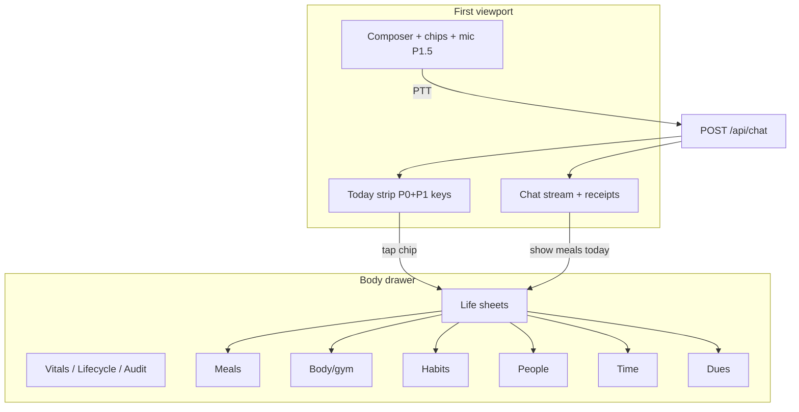

# M19b — Daily surface + voice UX (research card)

**Status:** **v1.6.2 shipped** (2026-08-19) — provenance + faces + Mac desk slot + **first-open face+name modal** on the live HUD, plus M17 P1 light markdown, additive SSE `view_open`, and the first deterministic `nutrition_day` panel. v1.6 addendum remains the lock pass. **Not shipped:** P1.5 PTT/STT/TTS, register-pass mouth, extra panels beyond `nutrition_day`.  
**Date:** 2026-08-18  
**Host:** `ada-pi5` (Raspberry Pi 5, 8 GiB) · Client: Mac / phone / later display via Tailscale Serve  
**Branch:** `rewrite/v1-body`  
**Kind:** Tier B **surface + transport** card — child of [`M19_TIER_B_LIFE_ADMIN.md`](./M19_TIER_B_LIFE_ADMIN.md)  
**Depends on:** [`M17_SURFACE_DESIGN.md`](./M17_SURFACE_DESIGN.md) (chat-home **default**, strip, Body drawer) · [`M19a_P0_LIFE_CAPTURE.md`](./M19a_P0_LIFE_CAPTURE.md) (P0 logs + fast-path) · [`M19a_P1_HABITS_PEOPLE.md`](./M19a_P1_HABITS_PEOPLE.md) (P1 habits/people — reference only) · [`M05_VOICE_PERSONALITY_CONTROL.md`](./M05_VOICE_PERSONALITY_CONTROL.md) (register, not soul) · [`M14_AGENT_SURFACE.md`](./M14_AGENT_SURFACE.md) (ASGI+static, Mac packaging, B-voice) · [`M15_INTENT_WORK_LOOP.md`](./M15_INTENT_WORK_LOOP.md) (Confirm bind) · [`M12_BODY_PROPRIOCEPTION.md`](./M12_BODY_PROPRIOCEPTION.md) (vitals truth for Body blueprint) · [`../19_JARVIS_JUSTINE_AGENT_RESEARCH.md`](../19_JARVIS_JUSTINE_AGENT_RESEARCH.md) (Verb→Pack→Cortex-fill) · [`../02_CONSTITUTION.md`](../02_CONSTITUTION.md) · [`../00_ASSISTANT_RESEARCH.md`](../00_ASSISTANT_RESEARCH.md) §8  
**Feeds:** M17 P1 markdown + Body life sheets · M05 audio channel · M19 P2 mail (**after** this slice — **not started here**)

**Filename stays `M19b_DAILY_SURFACE_VOICE.md`:** this is an addendum on the same surface+voice slice. A sibling `M19c_FACES.md` / `M19c_DEVICES.md` would split skeleton from faces/registry and force implement chats to merge two cards. Ontology belongs here.

### Changelog

| Ver | Date | Delta |
|-----|------|-------|
| **v1.0** | 2026-08-18 | Initial research card: market + SOTA + METAL + IA + voice wedge + phased plan |
| **v1.5** | 2026-08-18 | Addendum lock: organism/organ/ingress/**face** ontology; Mac companion as **opt-in mode** (chat-home remains default); view registry (receipt JSON → templates); optional receipt-bound register pass; phone thin / HDMI display faces; PTT simplex; PARK split-session + ADA-own-face + Mac actuator |
| **v1.6** | 2026-08-18 | Operator lock pass: **thin device registry + turn provenance**; collapse two Mac faces into **one assistant face**; voice **preview-then-Send** (auto-send SUPERSEDED); **Gemini register pass ON** as the mouth after fast-path tools (template = fail-closed fallback). v1.5 treated device provenance as a gap, kept two Mac faces, PTT auto-send, register-pass OFF — those defaults are **SUPERSEDED** |
| **v1.6.1** | 2026-08-18 | **Shipped on HUD:** `ada_hud_device` cookie + `facts/hud_devices.yaml` + HUD `user` event stamp (`input`/`face`/`device_*`/`tailscale_user`); `data-face=phone\|mac\|display` + picker + phone CSS; one Mac desk (small idle orb + visible stream + one panel slot + Body); M17 P1 **light markdown**; deterministic `nutrition_day` view registry from receipt/API JSON; additive SSE `view_open` filling the Mac slot. P1.5 PTT/mouth still **not** shipped |
| **v1.6.2** | 2026-08-19 | **First-open (M20 phase 3a):** modal requires face confirm (phone/mac/display) + optional name; Save posts existing `/api/device`; Skip still stamps uuid and hinted/chosen face. `?face=` still wins. Session picker remains the later override. Name-only prompt **SUPERSEDED**. |

### One-liner

**Named windows over one Pi HUD** — same Serve URL; phone = thin ingress; Mac = one personal-assistant face (orb + visible chat + one panel + Body); display = panels; first shipped panel = deterministic `nutrition_day`; **not** a native app, **not** a second login, **not** a canonical ADA face, **not** P2 mail.

---

## Core research question

**v1.0 (still holds):** How should a Pi-bodied personal agent surface daily life capture (meals, gym, habits, people, dues, time) so interaction feels frictionless and human-warm in chat/voice, while still allowing full drill-down on demand — without dashboard soup, consciousness cosplay, or chat-only hallucination?

**v1.5 (still holds except SUPERSEDED defaults):** How should ADA serve device-specific **FACES** (phone thin ingress, Mac, optional HDMI display) over **one Pi-hosted ASGI HUD**, so daily capture + drill-down feels frictionless and warm — without a second cortex, without LLM-hallucinated UI, without dashboard soup, and without claiming a canonical ADA face?

**v1.6 (this pass):** How should those faces sit on a **thin named-device registry** with **turn provenance** in `runs/`, one Mac **assistant** face (not two products), voice as a **keyboard that waits for Send**, and **fast-path tools / Gemini mouth** — without collapsing Tailscale ACL, HUD password, and device names into one login?

Secondary lenses:

| Sub-question | Where answered |
|--------------|----------------|
| Progressive disclosure vs glance strip vs detail sheets — what do winners do? | §A market table · §4 principles · v1.5 §C view registry |
| Voice as transport (PTT → same packs) vs voice as product — feasible on Pi 5 8GB? | §B papers · §6 voice wedge · v1.5 §E |
| “Human AI UI” under ADA locks (register, not sentience; presence, not uncanny avatar) | §7 presence · M05 · v1.5 companion orb |
| Operator vision → design locks | §4 principles · §5 IA · v1.5 faces · **v1.6 registry / one Mac face / mouth** |
| Faces vs one responsive page | v1.5 §A · **v1.6 face catalog** |
| Companion mode vs M17 chat-home | v1.5 §B **SUPERSEDED as two named Mac faces** — v1.6 one Mac assistant face |
| Fast-path + register pass | v1.5 §D **SUPERSEDED default** — v1.6 §D (pass ON; template fallback) |
| Split ingress ≠ display | v1.5 §F (**PARK**) |
| Device registry vs ACL vs HUD password | v1.6 §A |
| Voice preview-then-Send | v1.6 §C |

---

## Scope fence

| IN (M19b slice) | OUT (explicit) |
|-----------------|----------------|
| M17 P0 polish continuation + P1 markdown stream | Next/React on Pi without EVIDENCE+FEEDBACK+OPEN |
| Today strip content contract (P0+P1 keys) | Today as peer dashboard column |
| Body drawer **life tabs/sheets** (Meals, Body/gym, Habits, People, Time, Dues, Shelf) | Iron Man HUD / holographic Jarvis / purple SaaS dashboard |
| Composer mic affordance + listen/speak states (**design**) | Always-listen · voice-ID · realistic talking head |
| PTT wedge spec: mic → STT → `POST /api/chat` → `token_delta` → TTS | New agent runtime · parallel voice brain |
| Fast-path canned replies + optional TTS (reuse `token_delta`) | Chat claims without log/FACT receipt |
| Voice = **transport** to Verb→Pack→Cortex-fill | Consciousness / sentience UX copy |
| **v1.5:** device faces + companion **mode** + view registry (**design**; speak/Mac-face defaults **SUPERSEDED** by v1.6) | Canonical “ADA face” · LLM-drawn HTML · split ingress≠display as v1 · Mac-as-brain · Next/React on Pi |
| **v1.6:** thin device registry + `runs/` provenance; one Mac assistant face; PTT preview-then-Send; register pass **ON** as mouth (**design**) | Native HUD app · second OAuth · device registry as permission ladder · auto-send-on-release · ear-only Confirm · Gemini-chosen kcal |
| Phased plan: P0 polish → P1 sheets/registry → P1.5 companion+PTT → phone CSS → PARK | **P2 mail** · mail OAuth · job LaTeX · HA center |

**Sequence lock:** UI/surface + voice wedge **before** M19 P2 mail. This card is the gate for that implement slice.

**Stack lock:** Python ASGI + static HUD 1. No Next/React on Pi unless a future card documents EVIDENCE + FEASIBLE + OPEN and operator accepts RAM/ops cost.

---

## §8 gate fields ([`00_ASSISTANT_RESEARCH.md`](../00_ASSISTANT_RESEARCH.md))

| Field | Answer |
|-------|--------|
| **Question / capability** | Daily life surface IA + voice transport wedge for frictionless capture with honest drill-down |
| **Lens tags** | EVIDENCE (market + papers) · FEASIBLE (Pi PTT transport) · FANFICTION (Jarvis HUD, Replika face) · POLICY (Confirm bind, no consciousness, chat-home) |
| **Citations** | ≥5 in §B; market patterns in §A |
| **Pi 5 8GB feasibility** | Text + strip + Body sheets: **yes**. Cloud STT + Gemini cortex + cloud TTS on PTT: **yes** as Tier B transport. Full local voice loop (STT+LLM+TTS on Pi): **novelty/offline only** — 8–25s E2E community benches; not primary UX |
| **Learning objective** | After this card, operator should be able to order an implement chat (M17 P1 + Body sheets + P1.5 PTT) **without re-researching** market IA or Pi voice tradeoffs |
| **Harder-but-correct vs shortcut** | **Correct:** chat owns viewport; logs via packs + receipts; Confirm binds gateway args; voice posts normal user turns to `run_turn`. **Shortcut rejected:** life dashboard home; model-narrated Confirm; separate voice agent; TTS-only “success” without tool receipt |
| **Won’t-chase (this slice)** | Full-duplex GPT-Live parity · local main-LLM voice · 3D avatar · always-listen · Next on Pi · mail triage UI · week analytics boards · formal LoCoMo eval gate |
| **Acceptance falsifiers** | §10 table (F-M19b-*) + v1.5 F-M19b-7…11 + v1.6 F-M19b-12…16 |
| **Egress impact** | **Control plane:** Tailscale HUD unchanged. **Cortex:** unchanged per turn for tools. **New rings (P1.5):** STT provider (audio → transcript) · TTS provider (assistant text → audio) — both optional; **the operator-sent composer text** is the `runs/` user event (not raw audio). **v1.6 register pass (default mouth):** same Gemini cortex ring, extra short completion after receipts — never a new trust ring; never chooses kcal/tools |

---

## Executive summary

**v1.6 recommend (do this next — operator daily habit, not a thesis):** lock **named windows + provenance + one Mac assistant face + preview-then-Send + Gemini-as-mouth** before painting two Mac products. Implement in order **(0) device cookie + `runs/` user-event stamp + FACT device list**, **(1) `data-face` phone/mac/display + phone CSS**, **(2) Mac one assistant face** (orb + **visible stream** + one panel slot + Body 1 click), **(3) M17 P1 markdown + view registry `nutrition_day`**, **(4) P1.5 PTT fills composer → operator Send + register-pass mouth with numeric guard**, **(5) phone thin PTT**, then **PARK** split-session / ADA-own-face / Mac actuator / Pi HDMI kiosk / week boards / live-caption-while-talking. Open M19 P2 mail **only after** surface + voice wedge falsifiers pass.

**M17 conflict — LOCKED resolution (v1.6):** the Mac assistant face still has a **visible transcript/stream**; it is **not** a dashboard home. Companion-as-separate-named-face (`mac-companion`) is **retired**. Density may shift inside that one face (desk = stream larger; glance = orb/panel larger). Do not make orb-only hide transcript or Confirm.

**Operator daily habit (target feel):**

- Talk or type naturally → STT **fills the composer** (voice) or typed text → operator **reads** → Send → ADA logs life (P0+P1 packs) → Today strip updates → warm spoken ack via **register pass** on receipt JSON (template if guard fails).
- “Pull up yesterday’s nutrition / gym today” → read pack + **templated panel** from receipt JSON (math/CSS) + short Gemini ack. Model does not emit HTML/CSS.
- Phone: PTT + tiny composer + Confirm if needed + one-line ack. Mac: **one** assistant face. HDMI: panels + presence (**PARK** as first code, CSS face is cheap).
- Surface reads as **AI–human companion** (mic, listen/speak, M05 register, abstract orb on Mac) — not ops NOC, not Iron Man OS, not Replika intimacy theater, **not “ADA’s face.”**

**Pi honesty:** the Pi is the **organism** (cortex + gateway + packs + logs). Phone / Mac / HDMI are **named windows**, not personalities. Cloud STT/TTS + existing Gemini cortex is the feasible happy path. Extra short Gemini call after fast-path is **accepted** so she doesn’t sound like Alexa. `ChatService` is **one** interactive session (**METAL**) — split “talk on phone, panel on monitor” is **not cheap**; PARK. Local STT+TTS without cloud remains a PARK offline demo.

**METAL gap (honest):** no `device_id` anywhere today; `ChatBody` is `message` / `mode` / `chip` only; `runs/` user events are `{text}` only. Soft `Tailscale-User-Login` is display-only (`auth.py`).

**Optional eval metrics (not formal study gates):** provenance present on HUD user turns; register-pass numeric-fail rate **0**; voice turn in `runs/` = composer text the operator **sent** (not auto-sent STT); time-to-log-meal; % Agent writes with tool receipt; strip → panel ≤1 extra click. Don’t block on CARE-style n=22 studies.

---

## §A — Market / product patterns (≥6)

Focus: **capture verb · glance surface · detail drill-down · voice loop latency**.

| Product | Steal | Adapt | Reject | Voice / latency note |
|---------|-------|-------|--------|----------------------|
| **Cronometer** | Diary-top **Energy Summary** circles; tap circle → macro/micro drill-down; optional Siri voice logging; “design for understanding” not judgment colors | Today **macros chip** + Body **Meals sheet** with nullable micro slots (P0 honest_partial); tap chip → sheet not new route | Full diary clone; purple nutrient guilt UI; Cronometer sync as gate | Siri logging = OS transport; we use PTT→same chat |
| **MacroFactor** | Timeline-first day view; **glance rings** + scroll for depth; low-tap repeat logging; watch complications as **glance not home** | Strip headline + “+N”; composer chips for repeat presets; fast-path speak line on log | Coaching algorithm as product center; mobile-only trap (we’re Tailscale web) | Voice logging marketed on watch — **transport**, not separate brain |
| **Hevy / Strong** | **Live set table** as session home; history/calendar for drill-down; previous values pre-filled (progressive overload) | Chat/gym sheet: active session + today sets; “last time” in read pack; no social feed | Social gym network as ADA home; chart wall on first viewport | No voice loop — text/tap speed wins |
| **Things 3** | **Today** as pull-focused glance; color only for meaning; completion delight; “when will I do” ≠ “when due” | Today strip = **pull** not push dashboard; dues vs habits vs timer semantics separated | Full GTD app parity; dense multi-column project UI on home | — |
| **OmniFocus** (contrast) | Saved perspectives for power users **inside** Body, not home | Body tab “Dues” with filters | Forecast-as-home; outline density on chat viewport | — |
| **Clay / Mesh** (personal CRM) | **Card** as depth unit; capture-first notes; birthday/remind surfaces; search like you think | People sheet = YAML card + interaction notes; birthday → Today chip (P1); `who is` in chat | Auto LinkedIn graph; Nexus AI as oracle; CRM board as home | — |
| **Apple Intelligence / Siri surfaces** | System **glance + confirm** for cross-app actions; on-device story for sensitive ops | Confirm sheets bind real action; quiet system voice for readbacks | Closed ecosystem; pretending on-device when cortex is Gemini | OS-integrated latency budget — **not Pi parity** |
| **ChatGPT voice (GPT-Live 2026)** | Full-duplex **product** reference; transcript visible alongside speech; interrupt-friendly | **Reject architecture for ADA v1** — steal “transcript in stream” honesty only | Full-duplex on Pi; separate voice model path | Cloud scale + dedicated media path; 6mo engineering — **FANFICTION on Pi** |
| **Character.ai / Replika** (anti-pattern) | — | — | Parasocial “she’s real” UI; emotional dependency design; chat-only memory without receipts | Voice as **relationship product** — **POLICY reject** |
| **Humane Ai Pin / Rabbit R1** (anti-pattern) | — | — | Hardware-gated vague agent; no drill-down; no Confirm bind; launcher cosplay | Latency + trust failures — **FEASIBLE cautionary** |
| **Smart-home assistants (Alexa/Google Home)** | Short confirm for destructive acts; **routine** as named pack | Optional future HA packs — not M19b center | Always-listen home hub as ADA identity | Cloud STT; local wake only — Tier C for ADA |

**Market synthesis (EVIDENCE):** sticky winners combine **one capture verb → durable log row → glance strip → tap for sheet**. Chat-only assistants fail daily life because they optimize conversation, not **objects with receipts**. Voice winners in 2026 treat audio as **I/O transport** tied to a visible transcript and structured side-effects — not a separate personality product.

---

## §B — Papers / SOTA (≥5)

| # | Citation | Relevance to M19b | Tag |
|---|----------|-------------------|-----|
| 1 | [Consent Integrity / LITL (Weng 2026)](https://arxiv.org/html/2606.02668v1) | Confirm cards must show **gateway-rendered args**, not model paraphrase; applies to voice-triggered writes same as text | **EVIDENCE** / **POLICY** |
| 2 | [Agents That Know Too Much (2026)](https://arxiv.org/html/2606.26627) | Personal assistant = intimate data + high permission; strip/sheets must **minimize** accidental exposure; voice readbacks need data-minimization | **EVIDENCE** |
| 3 | [Horizon Gap survey (2026)](https://arxiv.org/html/2608.06663) | Externalize state in logs/FACTS, not chat prose; Body sheets = **persisted goal/capture state** | **EVIDENCE** |
| 4 | [Long-Horizon Task Mirage (2026)](https://arxiv.org/html/2604.11978v1) | Chat-only “I logged that” without receipt = mirage; falsify with tool rows | **EVIDENCE** |
| 5 | [OpenAI GPT-Live engineering post (Aug 2026)](https://openai.com/index/continuous-voice-interaction-with-gpt-live/) | Full-duplex + async tool delegation = **product** architecture; ADA steals **async tools don’t block ack** pattern, not media stack | **EVIDENCE** / **FANFICTION on Pi** |
| 6 | [CARE: Collaborative UI for exploration (2024)](https://arxiv.org/html/2410.24032) | Dual-panel: chat for input, structured panel for output — maps to **stream + Body sheet** | **EVIDENCE** |
| 7 | Pi5 local voice community benchmarks ([BMD 2026](https://bmdpat.com/blog/raspberry-pi-5-local-voice-ai-2026), [TrooperAI](https://github.com/m15-ai/TrooperAI)) | Local STT+small LLM+TTS: **8–25s E2E**; sentence-stream TTS helps perceived latency | **FEASIBLE** (offline) / **POLICY** (not primary) |

**Progressive disclosure (UX literature, EVIDENCE):** [UX Tigers 2026](https://www.uxtigers.com/post/progressive-disclosure) — agent UI should show **outcome + pending Confirm** at level 1; full tool trace in drawer. [Multimodal patterns 2026](https://theuxshop.com/patterns/multimodal-ui-patterns-zero-ui/) — escalate modality with complexity; maintain single conversation state.

**Anthropomorphism without consciousness (POLICY):** warmth = register + continuity (M05); presence = motion/state chips, not claims of feeling. Fiction research card [`19_JARVIS`](../19_JARVIS_JUSTINE_AGENT_RESEARCH.md) explicitly tags “she’s alive” as **FANFICTION**.

---

## §C — ADA METAL inventory (2026-08-18)

Live HUD: [`index.html`](../../src/ada/hud/templates/index.html) · [`today.js`](../../src/ada/hud/static/js/today.js) · [`stream.js`](../../src/ada/hud/static/js/stream.js) · [`today.py`](../../src/ada/hud/today.py) · [`routes_api.py`](../../src/ada/hud/routes_api.py)

| Surface | Shipped (METAL) | Gap for frictionless daily use |
|---------|-----------------|--------------------------------|
| **IA skeleton** | Chat-home + `#today-strip` + Body `<dialog>` + composer chips (meal/lift/focus/due/capture/habit/met/who) | Body tabs still **organism ops** (Vitals/Lifecycle/Shelf/X-ray/Audit) — no **Meals/Body/Habits/People/Time/Dues** life sheets |
| **Today strip** | `running_timer`, `nutrition_headline`, `meal_gap_nudge`, `habits_due/done`, `birthday_soon`, `people_remind`, dues/reminds/plan/confirm/artifacts; MAX_VISIBLE=4 + “+N” | Chips are **display-only** (no tap→sheet); no gym headline chip; habit continuity not in strip |
| **Stream** | SSE turns, tool/plan/confirm cards, `token_delta` on fast-path; assistant **light markdown** | No inline “logged ✓” receipt chip style; markdown stays intentionally small/safe |
| **Composer** | Sticky textarea + Send + chips | **No mic**; no listen/speak state; no PTT hold UI |
| **Read API** | `GET /api/today`, `GET /api/life/day` (nutrition + time) | No `/api/life/gym`, habits aggregate, people list endpoints for sheets; sheets not rendered in HUD |
| **Voice** | M05 register + `token_delta` canned speak on fast-path ([`loop.py`](../../src/ada/harness/loop.py)) | No STT/TTS pipeline; no audio egress policy doc in HUD |
| **Confirm** | Gateway-rendered confirm cards in stream | Voice-initiated writes still need visible Confirm — no ear-only confirm |
| **Pack router** | `life_p0.yaml` + `life_p1.yaml`, spines, fast-path | Camera/barcode HUD capture **design only** (M19b PARK) |
| **Faces / companion / view_open** | One `index.html`; viewport meta; PWA `display: standalone`; **one** `ChatService` session; `?face=` + picker aliases; additive `view_open` SSE; Mac slot fills with deterministic `nutrition_day` panel | No mic; no extra panel kinds yet; phone may ignore the panel; split-session still parked |

**Verdict:** **capture spine is shipped**; **surface depth and voice transport are not**. The gap is IA wiring + polish, not new life organs.

---

## §4 — Lens-tagged synthesis → design principles

Operator vision compressed into **five locks**:

| # | Principle | Source lens | ADA lock |
|---|-----------|-------------|----------|
| **P1** | **Chat owns the viewport** | Things 3, M17, CARE | First screen = stream + composer; no peer dashboard column |
| **P2** | **Strip = glance, not home** | MacroFactor rings, M16 F12 | ≤2 visual lines; honest chips from `build_today()`; overflow “+N” → Body or ask |
| **P3** | **Body = depth on demand** | Cronometer tap circles, Hevy history, Clay cards | Tab/sheet per family; charts secondary to **receipt rows** |
| **P4** | **Voice = PTT transport** | M14 B-voice, M19a §input modes | STT → same `POST /api/chat` → same packs; transcript in stream; TTS optional readback of **final** text |
| **P5** | **Warmth = register + presence, not soul** | M05, constitution | M05 dials; state chips (listening/speaking/busy); **no** consciousness copy, **no** uncanny face |

**Progressive disclosure rule (EVIDENCE):** Level 0 = strip chip or one-line ack. Level 1 = chat answer with numbers. Level 2 = Body sheet / expandable tool receipt. Level 3 = X-ray/audit (operator/debug).

---

## §5 — IA proposal

### First viewport (locked)

```text
┌─────────────────────────────────────────────────────────────┐
│ ADA · mode · session crumb · Body                           │
├─────────────────────────────────────────────────────────────┤
│ TODAY  [timer] [macros 842·P 120] [habit Due: skincare] +2  │  ← strip only
├─────────────────────────────────────────────────────────────┤
│                                                             │
│  stream (chat owns height)                                  │
│    You: log meal: chicken rice                              │
│    ADA: Logged lunch — 520 kcal, 42g P. (receipt)           │
│                                                             │
├─────────────────────────────────────────────────────────────┤
│ [meal][lift][focus][due][habit][met][who]                   │
│ ┌───────────────────────────────────────┐ [🎤] [Send]       │
│ │ Message ADA…                          │                   │
│ └───────────────────────────────────────┘                   │
└─────────────────────────────────────────────────────────────┘
```

### Body drawer — life tabs (proposed)

Keep existing **Vitals · Lifecycle · Shelf · X-ray · Audit** for organism ops. Add **Life** section (second row or grouped nav):

| Tab | Sheet content | Data source |
|-----|---------------|-------------|
| **Meals** | Day meals, lines, macro/micro totals, `honest_partial` flag | `/api/life/day`, `nutrition_day` pack |
| **Body** | Active gym session, today sets, split hint | `gym_status` / future gym day API |
| **Habits** | Due/done today, 7d continuity rate | `build_today` + `habit_status` |
| **People** | Reminders, birthdays, recent stubs | `people_remind`, FACTS cards |
| **Time** | Running block + today mix by kind | `/api/life/day` time, `time_status` |
| **Dues** | Open loops due/remind | existing M16 todos |
| **Shelf** | (existing) artifacts | unchanged |



**Interaction locks:**

- Strip chip click → open relevant Body sheet tab (or scroll to confirm/plan card if kind=`confirm|plan`).
- “Show detail” utterances → read pack in chat **and** offer quiet link chip “Open Meals sheet”.
- Never auto-navigate away from stream on successful log (ack in place; strip refreshes).

---

## §6 — Voice wedge spec (design only)

### Tier placement

Constitution: Tier A none · **Tier B PTT** · Tier C always-listen. M19b implements **B only**.

### PTT flow (locked architecture)

**v1.6 SUPERSEDES the last mile:** STT fills the composer; operator Send — do **not** auto-POST on release (see v1.6 §C). Capture → cloud STT → TEXT still holds.

```text
[Hold mic] → capture audio (Mac/browser MediaRecorder)
          → STT (cloud default · local PARK)
          → transcript string
          → POST /api/chat { message, mode, chip? }   ← v1.0; v1.6: composer first, then this
          → SSE: token_delta | tool_card | confirm_card | turn_done
          → optional TTS(read final assistant text or fast-path delta)
          → [release mic] → idle
```

**Falsifier (M14/M19a):** STT output appears as normal user turn in `runs/` JSONL; tools still gateway-gated; no side effects from audio alone.

### STT / TTS tradeoffs (Pi 5 8GB + Mac client)

| Option | Latency (typical) | RAM on Pi | Egress | Verdict |
|--------|-------------------|-----------|--------|---------|
| **Cloud STT** (Gemini/OpenAI Whisper API) | 0.5–2s | minimal | audio → vendor | **Default Tier B** — Mac or Pi proxy |
| **Cloud TTS** (Google/ElevenLabs/Piper cloud) | 0.3–1s first chunk | minimal | text → vendor | Optional; M05 brevity keeps cost down |
| **Local faster-whisper tiny/base on Pi** | 2–3s per 10s audio | ~0.7–1.5GB | none | PARK offline; contends with cortex |
| **Local Piper TTS on Pi** | 0.3–0.8s/phrase | moderate | none | OK for canned fast-path acks only |
| **Full local loop (STT+LLM+TTS on Pi)** | 8–25s E2E | swaps | none | **Novelty / offline** — not daily driver |

**Recommendation:** **Mac-browser PTT** → cloud STT → Pi `run_turn` (Gemini) → cloud TTS playback. Pi runs gateway + logs; Mac runs mic/speaker. Matches M14 “Mac may host heavier client.”

### Constitution + M05 reuse

- **Register:** TTS uses same M05 intent classes; voice replies **shorter** (social ≤3 sentences; task = result first).
- **Confirm:** side-effecting tool from voice → Confirm card **must appear in stream** (and optionally spoken “needs your OK on screen”).
- **Observe mode:** read-only packs OK via voice; Agent writes require session — **OPEN:** spoken login is out; voice read-only in Observe without password is acceptable for vitals/reads only.
- **Fast-path:** existing `token_delta` canned lines ([`loop.py`](../../src/ada/harness/loop.py)) remain the **fail-closed template**. **v1.6 SUPERSEDES** “no Gemini for Logged lunch” as the user-visible default — Gemini register pass is the mouth; template on guard fail (v1.6 §D).

### States (composer mic UI)

| State | Visual | Behavior |
|-------|--------|----------|
| **idle** | ghost mic icon | tap/hold to arm |
| **listening** | accent ring + waveform/level | capture; **v1.6:** release → STT fills composer (not auto-send) |
| **busy** | muted mic + stream busy | disable send/mic while turn in flight |
| **speaking** | speaking chip near last ADA turn | TTS playing; tap to stop |
| **confirm-pending** | warn dot on mic | do not speak over Confirm; user looks at stream |

---

## §7 — Human presence without cosplay

### Approved (FEASIBLE + POLICY)

| Pattern | Use |
|---------|-----|
| **Soft state orb / waveform** | Listening/speaking; tied to mic state only |
| **Speaking chip** | “ADA speaking…” with stop |
| **Warm copy** | M05 register; time-speak; friend-first social |
| **Continuity pulse** | existing `continuity` in Today (body ok / attention) — not faux emotion |
| **Receipt honesty** | “Logged” + numbers; unknowns stated plainly |

### Rejected (FANFICTION / anti-pattern)

| Pattern | Why |
|---------|-----|
| 3D face / holographic Jarvis | Uncanny; implies embodiment lie |
| Iron Man HUD overlays | Dashboard soup; fights M17 |
| Purple SaaS gradient mesh | M17 anti-ref |
| Replika/Character intimacy UI | Parasocial; consciousness cosplay |
| Always-listen ambient glow | Tier C; creep |
| “I feel…” / sentience banter | Constitution deny |

**Avatar level default:** **none** — presence via motion + voice timbre only. Optional abstract orb remains **non-anthropomorphic**.

---

## §8 — Phased implement plan

| Phase | Scope | Biggest win | Falsifier |
|-------|-------|-------------|-----------|
| **P0 polish** (M17 continuation) | Markdown stream P1; strip chip tap targets; merge session chrome | Home reads **chat**; logs feel acknowledged | F-M19b-1 |
| **P1 sheets** | Body life tabs; wire `/api/life/day` + new read endpoints; strip→sheet navigation | Drill-down without dashboard home | F-M19b-2 |
| **P1.5 PTT+TTS** | Mic UI; cloud STT; optional TTS; Mac-first | Hands-busy meal/gym log | F-M19b-3 |
| **PARK** | Local STT/TTS on Pi; HUD camera barcode; full-duplex; gym charts; week analytics UI | — | explicit operator unlock |

### F-M19b falsifiers

| ID | Fail if… |
|----|----------|
| **F-M19b-1** | First viewport reads as dashboard (life sheets on home) |
| **F-M19b-2** | Nutrition/gym/habit detail requires **>2 clicks** from strip or **>1** natural chat turn without receipt |
| **F-M19b-3** | PTT turn bypasses `run_turn` or skips transcript in `runs/` |
| **F-M19b-4** | Voice write executes without Confirm when gateway requires it |
| **F-M19b-5** | TTS speaks success without matching tool receipt row |
| **F-M19b-6** | Stack forks to Next/React on Pi without documented EVIDENCE+OPEN |

---

## §9 — OPEN questions (≤5)

**v1.6 supersedes v1.5 OPEN defaults** — see v1.6 addendum OPEN. v1.0 table kept as history:

| # | Question | Default until locked |
|---|----------|----------------------|
| 1 | **Avatar level** | None — orb/waveform only |
| 2 | **TTS provider** | Cloud default; Piper local for fast-path acks only (PARK) |
| 3 | **Observe mode voice** | Read-only packs without session OK; writes require HUD login |
| 4 | **Strip chip tap** | P1 sheets — opens Body tab; no inline expand on home |
| 5 | **STT placement** | Mac browser first; Pi as API proxy if needed |

---

## §10 — Locks (do not reopen)

| Lock | Source |
|------|--------|
| Verb→Pack→Cortex-fill | M19a, doc-19 |
| Fast-path Agent writes + `token_delta` speak | M19a P0.5 |
| M15 Confirm binds real args | Constitution, Consent Integrity |
| M17 chat-home; Body drawer; Today strip ≠ peer dashboard | M17 |
| Voice = transport to same packs, not new runtime | M14, M19a |
| she/her; no consciousness claims | Constitution, M05 |
| P2 mail **OUT** of this slice | M19 sequence |

---

## §11 — Implement-next prompt seed (for follow-up chat)

**v1.6 supersedes this order** — see addendum phased plan. v1.0 seed kept as history:

When OPEN defaults stand, a implement chat can:

1. **M17 P1:** light markdown in `stream.js`; soften tool/plan/confirm cards per M17 §3.7.
2. **Body life tabs:** extend `index.html` Body nav; new static JS module `life_sheets.js`; consume `/api/today`, `/api/life/day`, add thin read routes for gym/habits/people as needed.
3. **Strip interactivity:** `today.js` — `data-kind` + click handler → open Body tab.
4. **P1.5 voice:** composer mic; MediaRecorder → STT endpoint (new `routes_api` proxy or client-direct with key in session); reuse SSE; Web Audio TTS playback.

**Do not start:** mail OAuth, Next on Pi, always-listen, 3D avatar.

---

## References

- M17 · M19a P0/P1 · M05 · M14 · M15 · M16 · doc-19 · doc-00 §8  
- Cronometer Energy Summary — https://support.cronometer.com/hc/en-us/articles/30300963266452  
- MacroFactor Apple Watch — https://macrofactor.com/apple-watch/  
- Hevy progress — https://www.hevyapp.com/features/gym-progress/  
- Consent Integrity — https://arxiv.org/html/2606.02668v1  
- Agents That Know Too Much — https://arxiv.org/html/2606.26627  
- GPT-Live — https://openai.com/index/continuous-voice-interaction-with-gpt-live/  
- Pi5 local voice — https://bmdpat.com/blog/raspberry-pi-5-local-voice-ai-2026  

---

*End M19b Daily Surface + Voice research card v1.0 body. v1.5 addendum follows.*

---

# Addendum v1.5 — Faces · companion · view registry · register pass

**Daily habit vs PhD:** this pass locks **operator daily capture + glance + one honest panel**. It does **not** require a formal CARE-style study, duplex media stack, or split-session research. Optional stopwatch metrics are enough.

v1.0 §A–§C market/SOTA/METAL, §4–§7 IA/voice/presence, and F-M19b-1…6 **still hold**. This addendum locks what v1.0 left as “P1 sheets + composer mic.”

---

## v1.5 — §8 gate fields (NEW slice)

| Field | Answer |
|-------|--------|
| **Question / capability** | Serve job-shaped **device faces** + receipt-templated **view registry** + opt-in Mac **companion mode** over one Pi ASGI HUD; PTT remains transport |
| **Lens tags** | **EVIDENCE** (multi-surface products, CARE, progressive disclosure, Consent Integrity, grounded NLG) · **FEASIBLE** (CSS faces, Mac orb/PTT, template speak) · **FANFICTION** (GPT-Live duplex on Pi; canonical ADA face; Iron Man home) · **POLICY** (one cortex, Confirm on ingress, numbers never from model) · **METAL** (one HTML, one `ChatService`, `_speak_*` templates) |
| **Citations** | v1.0 §B plus addendum §A–§E (GPT-Live, CARE, Consent Integrity, Nielsen/UX Tigers 2026, outcome-receipts / grounding guards, HA companion vs dashboard, MDN `display-mode`, UA-CH `Sec-CH-UA-Mobile`) |
| **Pi 5 8GB feasibility** | Faces + templates + `view_open` SSE: **yes** (static JS). Mac Web Audio orb: **yes** (client). Optional register pass: **yes** as extra Gemini call, not as layout engine. Split ingress≠display / Pi HDMI kiosk browser / full-duplex: **no** for this slice |
| **Learning objective** | After this addendum, operator can order an implement chat (faces + one nutrition panel + companion toggle + PTT) **without re-researching** multi-device IA, speak grounding, or voice-loop architecture |
| **Harder-but-correct vs shortcut** | **Correct:** one HTML + `data-face`; panels from receipt JSON; Confirm on the ingress device; template speak default; grounding guard if register pass on. **Shortcut rejected:** Next apps per device; Gemini-authored HTML/CSS; companion as new default home; ear-only Confirm; duplex on Pi |
| **Won’t-chase (this slice)** | Split-session fan-out · ADA-own-face / pretext embodiment · Mac actuator organ · week analytics boards (M19a P4) · Next on Pi · P2 mail · always-listen · 3D avatar · formal n=22 agent-UI study |
| **Acceptance falsifiers** | F-M19b-1…6 plus F-M19b-7…11 (addendum §plan) |
| **Egress impact** | Control plane unchanged. Cortex per turn unchanged. Optional register pass = **same Gemini ring**, extra short completion. P1.5 STT/TTS as v1.0 |

---

## How v1.5 differs from v1.0

| Topic | v1.0 | v1.5 lock |
|-------|------|-----------|
| What the HUD *is* | Chat-home on Mac | Chat-home is the **Mac default face**. HUD Serve is the **organ** that can serve other faces |
| Device model | Implicit “Mac client” | **Face catalog** (phone / mac-chat / mac-companion / display) |
| Companion | Soft orb as presence; menu-bar PARK (M14) | **CSS companion mode** (orb + floater + panels) opt-in on Mac/display. M14 menu-bar wrapper still PARK — **do not mush** |
| Drill-down | Body life sheets | Sheets **are** the first view-registry templates; companion may **float** the same template |
| Speak | `_speak_*` canned; “no Gemini for Logged lunch” | Templates **remain default**. Optional **register pass** may rephrase **receipt fields only**; numbers never from model |
| Voice loop | PTT | **PTT simplex locked**. VAD PARK. Duplex = GPT-Live **FANFICTION-on-Pi** |
| Multi-device | Not locked | Phone thin; Mac full; HDMI display CSS cheap / kiosk PARK; **one face at a time** |
| Canonical ADA face | Avatar none | Still **none**. Embodiment novelty = **PARK / later card** |

---

## Ontology (do not mush)

| Term | Meaning | Not |
|------|---------|-----|
| **ADA** | Organism on `ada-pi5`: cortex + gateway + packs + logs | “The Mac app” |
| **Organ** | A capability/body she has (Pi host, HUD Serve, later Mac control, mic, display). **Authority stays on Pi** | A second brain |
| **Ingress** | How Aryan talks **this turn** (phone PTT, Mac composer, later room mic) | Where a panel happens to render |
| **Face** | Job-shaped UI for a connecting device | Personality, soul, second agent loop |
| **Companion mode** | Opt-in Mac/display **face** (orb + PTT + float panels) | M14 Dock/`ada-open` helper; native menu-bar app |
| **View** | Templated panel bound to receipt JSON | LLM-drawn layout |
| **Register pass** | Optional tiny Gemini rewrite of **speak wording** | Cortex for numbers, HTML, or tool choice |

```text
                    ADA (Pi organism)  —  no canonical face in this slice
                         │
              same organs, packs, Confirm Integrity, receipts
                         │
        ┌────────────────┼────────────────┐
        │                │                │
   phone face       Mac faces        display face
   (thin ingress)   mac-chat         (panels + presence)
                    mac-companion    mic optional / PARK kiosk
```

**POLICY:** Phone / Mac / HDMI are **windows into ADA**, not ADA. Same `run_turn`, same Confirm Integrity, same receipts.

**Later “ADA controls the Mac”** = Mac as **actuator organ**, not moving the brain. Serving UI and controlling Mac are two capabilities of the same organ class — **PARK** this slice.

**ADA “knows the device”** = boring detection (viewport / UA-CH / `?face=` / FACT default), **not** mood inference. **METAL:** `index.html` already has viewport-fit; no face switcher.

---

## METAL delta (2026-08-18) — faces + views + speak

Live: [`index.html`](../../src/ada/hud/templates/index.html) · [`routes_pages.py`](../../src/ada/hud/routes_pages.py) (`GET /` only) · [`chat_service.py`](../../src/ada/hud/chat_service.py) (**one** `ChatSession`) · [`stream.js`](../../src/ada/hud/static/js/stream.js) (`handleSseEvent`: `token_delta` / tool / plan / confirm / `view_open` / `turn_done`) · [`markdown.js`](../../src/ada/hud/static/js/markdown.js) (light allowlist only) · [`view_registry.js`](../../src/ada/hud/static/js/view_registry.js) (`nutrition_day`) · [`loop.py`](../../src/ada/harness/loop.py) `_maybe_pack_fast_path` + `_speak_*` + `view_open` emit on `life_nutrition_day` · [`routes_api.py`](../../src/ada/hud/routes_api.py) `GET /api/today`, `GET /api/life/day?date=` · [`manifest.webmanifest`](../../src/ada/hud/static/manifest.webmanifest) `display: standalone` · [`tokens.css`](../../src/ada/hud/static/css/tokens.css) moss pack.

| Need | Shipped (METAL) | Gap |
|------|-----------------|-----|
| One HUD process | FastAPI `127.0.0.1:8787` + Serve | Faces are CSS/IA, not new hosts |
| One HTML | `templates/index.html` + `data-face` + picker | Still one HTML; no second face product |
| Session | **One** writer (`ChatService`) | Split phone-talk / monitor-show would need SSE fan-out + session sharing — **not cheap** |
| Speak | Deterministic `_speak_nutrition_day` etc. after receipts; `token_delta`; `steps=0` | No register pass; no numeric grounding guard (unnecessary until pass exists) |
| Day reads | `/api/life/day?date=` nutrition + time; `life_nutrition_day` / `life_gym_status` accept `date`; `nutrition_day` includes honest meal rows | Gym/habits/people HUD sheets unbuilt |
| Confirm | Gateway-rendered cards in **this** browser’s stream | No ingress-vs-display routing (unneeded until split-session) |
| PWA | manifest standalone | `display-mode` unused for kiosk/display face |
| Body | Vitals grid + Life tab with nutrition day detail + lifecycle + x-ray + audit | No gym/habits/people/time/dues life sheets yet |

**Verdict:** capture spine + chat-home **shipped**. Faces plus the first registry slice (`nutrition_day`) are now live; PTT, companion behaviors, and extra panels remain deferred.

---

## §A — Faces vs one responsive page

### Market (steal / adapt / reject)

| Product | Steal | Adapt | Reject |
|---------|-------|-------|--------|
| **ChatGPT mobile vs desktop vs web** ([Titikey 2026](https://www.titikey.com/en/article/article-1773414041641)) | Same backend; **job-shaped chrome** (mobile = voice/camera-heavy, desktop = workbench) | Phone = ingress; Mac = depth | Feature-parity chase; public multi-tenant |
| **Apple Intelligence / Siri surfaces** | Same assistant, different **device chrome**; glance + confirm | Confirm stays on the device that asked | Closed OS; pretending on-device while cortex is Gemini |
| **Alexa Show vs Alexa phone** ([Verge Show 21](https://www.theverge.com/news/621008/hands-on-with-alexa-plus-smart-home-echo-show-21); Wirecutter 2026) | **Display face** = glance widgets; **phone** = setup + remote | HDMI/display = panels + presence; phone = thin PTT | Always-listen hub as ADA identity; shopping/routines as home |
| **Home Assistant companion vs Lovelace** ([HA dashboards](https://www.home-assistant.io/dashboards/dashboards); companion launcher) | **Job dashboards** per device (wall tablet ≠ phone) | `?face=` / FACT default ≈ per-device dashboard | HA 2026.2 **per-user-not-per-device** regression; entity soup; second server |
| **Tesla vehicle vs phone app** | Vehicle = **thin job UI**; phone = remote/full; same car | Phone thin / Mac full / display presence | Unreal “park scene” as **first viewport** (Body only, §G) |

**Synthesis (EVIDENCE):** winners keep **one organism / one API** and change **chrome per job**, not a second agent. Responsive CSS alone is not enough when jobs differ (PTT-only vs orb+panels vs kiosk). Separate native apps per device is the expensive fork HA/ChatGPT only pay because they are products.

### Mechanism forks

| Option | Pros | Cons | Verdict |
|--------|------|------|---------|
| **CSS breakpoints only** | Zero routing | Cannot hide Body/blueprint/orb by **job**; tablet-width Mac windows look “phone” | **Density only** (type/space) — not face identity |
| **One HTML + `data-face` + `?face=`** | One cookie, one SSE, one Confirm path; override honest | Must maintain four CSS/visibility maps | **LOCK** |
| **Separate Jinja templates / routes** (`/phone`, `/hud`) | Clean markup | Duplicate chrome; session/cookie drift; two Confirm surfaces | **Reject** this slice |
| **PWA `display-mode`** ([MDN display](https://developer.mozilla.org/en-US/docs/Web/Progressive_web_apps/Manifest/Reference/display); [display-mode](https://developer.mozilla.org/en-US/docs/Web/CSS/Reference/At-rules/@media/display-mode)) | Dock standalone vs browser; later fullscreen kiosk | Does not distinguish phone vs Mac by itself | **Hint**, not identity. `standalone` already METAL; `fullscreen` → prefer `display` face |
| **UA-CH `Sec-CH-UA-Mobile` / `navigator.userAgentData.mobile`** ([MDN](https://developer.mozilla.org/en-US/docs/Web/HTTP/Headers/Sec-CH-UA-Mobile)) | Boring form-factor | Safari gaps; not a job oracle | **Hint** under explicit override |

**Lock:** one `index.html`. Client sets `document.documentElement.dataset.face`. Server may read `?face=` to set a cookie/default class; **do not** cache-bust four HTML documents.

---

## Face catalog

| Face | Job | IN | OUT | Confirm | Panels |
|------|-----|----|-----|---------|--------|
| **phone** | Hands-busy log | PTT, tiny composer, one-line ack, session login if Agent, ≤1 Today chip | Pi blueprint, week boards, frequency orb, Body theater, companion floater | **On phone** (ingress) | None by default; optional one-shot sheet behind overflow |
| **mac-chat** | Daily desk home (**DEFAULT**) | M17 first viewport: strip + stream + composer + Body | Orb as home; dashboard column | In stream | Body sheets + strip→sheet; float panels **off** unless companion |
| **mac-companion** | Kitchen / glance presence | Abstract orb, PTT, tiny floater under orb, float stats panels, Body still 1 click | Chat column as home; frequency-reactive orb **OK**; Iron Man overlays | In floater/stream **on this Mac** | `view_open` → float template; orb yields or sits beside |
| **display** | HDMI / monitor presence | Large panel + idle presence; `display-mode: fullscreen` hint | Composer required; PTT required; frequency orb | If this tab posted the turn — else **PARK** (no split) | Panels primary; Body optional |

**POLICY:** there is **no** required “ADA’s own face.” Mac HUD was the first **rich device face**, not her identity.

---

## Face selection (boring)

Priority, first match wins:

1. **`?face=phone|mac-chat|mac-companion|display`** — explicit, sessionStorage + URL.  
2. **FACT** `prefs.hud_face` (or `prefs.hud_mac_default` for Mac-sized viewports) once operator writes it.  
3. **Client hints:** `(display-mode: fullscreen)` + min-width ≥ 900 → `display`; `navigator.userAgentData?.mobile` or viewport max-width `< 640` → `phone`; else `mac-chat`.  
4. Chrome **face picker** (session overflow, one control) always available — never hidden “AI guessed your mood.”

Safari without UA-CH: viewport + picker. **FEASIBLE.** Wrong auto-detect is a 1-click fix, not a cortex problem.

---

## §B — Companion mode vs M17 chat-home

| Fork | Pros | Cons | Verdict |
|------|------|------|---------|
| Chat-home only | M17 already locked; lowest soup | Operator wants orb/PTT/panels for kitchen Mac | Keep as **default** |
| Companion as **new default** on Mac | Matches kitchen vision | Breaks M17 F1 (home reads chat); accidental dashboard | **Reject** as default |
| Companion **toggle** (mode of Mac face) | Both exist; progressive modality | One extra chrome control | **LOCK** |
| Native menu-bar / Electron companion | Highest “app” feel (M14 E) | Second client, CORS, drift | **PARK** (M14 unchanged) |

**Literature (EVIDENCE):**

- [CARE (Wu et al. 2024, arXiv:2410.24032)](https://arxiv.org/abs/2410.24032) — dual-panel: chat for input, **structured solution panel** for output; n=22 preferred vs chat-only. **Steal panel split. Reject CARE’s multi-agent framework** (POLICY: one organism).  
- [Nielsen / UX Tigers 2026 progressive disclosure](https://www.uxtigers.com/post/progressive-disclosure) — Level 1 = outcome + pending Confirm; Level 2 = trace in drawer. Maps to **ack + panel**, Body/X-ray for itinerary.  
- [Zylos Agentic UX 2026](https://zylos.ai/research/2026-05-28-agentic-ux-frontend-design-patterns-ai-agents/) — activity/solution panel **separate from** the thread.  
- [MAESTRO (2026)](https://www.arxiv.org/pdf/2604.06134) — voice + GUI clicks on the **same** GUI; voice raises burden if it also narrates every GUI change. **Adapt:** short speak + visible panel; don’t read the whole sheet aloud.  
- [Lazarev voice UI 2026](https://www.lazarev.agency/articles/voice-ui-design) — speak what survives one hearing; put comparables on a screen.

**Lock:** Mac default = **mac-chat**. Companion = opt-in `data-face=mac-companion`. Stream remains the receipt log (may be visually demoted, not deleted). Body drawer remains 1 click.

---

## Companion mode spec

```text
mac-companion
  ┌─────────────────────────────────────┐
  │  [orb]     idle | listen | speak    │
  │            busy | confirm-pending   │
  ├─────────────────────────────────────┤
  │  floater: [PTT] [tiny field] [Send] │
  │  optional: last ack one line        │
  ├─────────────────────────────────────┤
  │  panel slot (empty until view_open) │
  └─────────────────────────────────────┘
  Body button still in chrome
```

| State | Orb | Mic | TTS |
|-------|-----|-----|-----|
| **idle** | Dim moss disc | Armed | Off |
| **listening** | Accent ring; **Mac only:** frequency-reactive analyser on **local** MediaStream | Capturing | Off |
| **busy** | Slow pulse (or static if `prefers-reduced-motion`) | Disabled | Off |
| **speaking** | Speak chip; analyser on **TTS element** (Mac) | **Muted** (simplex) | On; tap stops |
| **confirm-pending** | Warn ring | Do not speak over Confirm | Optional “needs your OK on screen” |

**Listen vs speak isolation (POLICY + FEASIBLE):** while TTS plays, **do not** send mic audio to STT. Kitchen/other voices must not become turns. This is **simplex PTT**, not GPT-Live full-duplex.

**Phone:** no frequency orb; PTT is a hold control, not a visualizer.

---

## §C — View registry

**Job:** “Pull up yesterday’s nutrition / gym today” → short spoken ack → **window/panel** of honest numbers.

**Market (glance → sheet):** Cronometer Energy Summary **tap circle → breakdown** ([support](https://support.cronometer.com/hc/en-us/articles/30300963266452)); MacroFactor rings + tap widgets ([help](https://help.macrofactorapp.com/en/articles/275-getting-to-know-your-workouts-dashboard)); Hevy live table + history. Sticky pattern: **object with receipts**, not chat prose (v1.0 §A still holds).

**Agent UI:** CARE solution panel; Nielsen bench vs drawer; Consent Integrity — Confirm rendered from **gateway args**, on a path the model cannot spoof ([arXiv:2606.02668](https://arxiv.org/html/2606.02668v1)). **ADA map:** Confirm on the **ingress device** (the browser that `POST /api/chat`). Display-only faces do not approve someone else’s turn until split-session exists (**PARK**).

### Registry (design)

| `panel_kind` | Source (first non-empty) | Template draws | v1 ship? |
|--------------|--------------------------|----------------|----------|
| `nutrition_day` | receipt `life_nutrition_day` **or** `GET /api/life/day?date=` `.nutrition` | Date, kcal, P, meal rows, `honest_partial` flag | **P1 — first panel** |
| `gym_day` | receipt `life_gym_status` | Active session, set rows | P1 after nutrition |
| `time_status` | receipt `life_time_status` | Running block | P1 optional |
| `habit_status` / `due_list` / `people_remind` | matching receipts | Counts + names from JSON | P1 as sheets |
| `nutrition_week` / `gym_week` | **no pack yet** (M19a P4) | — | **PARK** — fail closed: speak “no week pack yet”; **do not** Gemini a week board |

Templates live in static JS (`life_sheets.js` / `views.js`): **math + CSS**, `textContent` / sanitizer. **POLICY:** the model must not emit HTML/CSS for layout.

### SSE `view_open` (design)

```text
event: view_open
data: {
  "panel_kind": "nutrition_day",
  "receipt_id": "…",
  "tool": "life_nutrition_day",
  "data": { …receipt JSON… },
  "speak": "18 Aug: 842 kcal, 120g protein."
}
```

Emit **after** fast-path (or cortex) has a successful receipt. `handleSseEvent` today ignores unknown events — adding `view_open` is additive.

**Fail closed:** empty `data` → no panel, speak template “No meals logged…” / “missing receipt”; never invent rows.

**Where the panel appears:**

| Face | Policy |
|------|--------|
| mac-chat | Prefer Body tab (v1.0 strip→sheet). Optional quiet chip “Open Meals sheet.” Do **not** auto-steal chat height |
| mac-companion | Float overlay; orb yields or sits beside (one slot, not a widget wall) |
| phone | Overflow / skip; ack in text is enough |
| display | Panel fills viewport |

**Lock vs soup:** **one** float panel at a time; dismiss returns to orb/chat. Week walls and multi-panel dashboards are OUT.

---

## §D — Fast-path + optional register pass

**METAL:** `_maybe_pack_fast_path` runs tools, then `_speak_*` formats **receipt `data` dicts** (`loop.py`). Empty totals → “No meals logged…”. `honest_partial` appended. Writes Agent-only; reads Observe+Agent.

### Speak forks

| Option | Latency / Pi | Hallucination | Egress | Verdict |
|--------|--------------|---------------|--------|---------|
| **Template `_speak_*`** | 0 extra | None if JSON honest | None | **Default LOCK** |
| **Unconstrained Gemini “make it warm”** | +cortex RTT | Invents kcal/P | Gemini ring | **Reject** |
| **Register pass + grounding guard** | +one short Gemini call | Blocked if any number ∉ receipt | Same ring, extra $ | **Optional**, FACT off until smokes |

**Research (EVIDENCE):** production NLG for numbers uses **templates or fail-closed guards**, not prompt faith ([Pingax 2026 reports](https://pingax.com/ai-generated-reports-from-data/); [grounding guards](https://www.realsolutionsph.com/blog/grounding-guards-llm-refuse-invent-numbers); [outcome-receipts](https://github.com/ChelseaKR/outcome-receipts) — “numbers never come from a model”). Constrained decoding helps **schema**, not arithmetic truth.

**Register-pass POLICY (if enabled):**

1. Input = receipt JSON **only** (plus M05 register dials). No tools. No extra retrieval.  
2. Model may **rephrase fields present** in that JSON.  
3. **Numbers never from the model** — post-check: every numeric token in output must appear in the JSON (string-equal or documented rounding). On fail → **template speak**.  
4. Empty JSON → skip model; template / “no receipt.”  
5. Does **not** choose `panel_kind`, emit HTML, or skip Confirm.

**Default:** `prefs.speak_register_pass` **false**. Ship TTS on templates first. Enable pass after a smoke that injects a wrong number and proves fail-closed.

---

## §E — Voice loop UX

| Loop | What | ADA |
|------|------|-----|
| **PTT / event-triggered** | User bounds the utterance | **LOCK Tier B.** Predictable, private, cheap ([globaldev VAD vs event](https://globaldev.tech/blog/vad-vs-event-triggered-for-ai-speech-to-speech-applications)) |
| **Energy VAD stop-on-silence** | Silence timer ends turn | **PARK** — kitchen pause / other talk cuts or false-sends |
| **Semantic VAD** | Meaning-aware end-of-turn | PARK; still a cascade, still always-hearing while armed |
| **Full-duplex** | Listen while speak; no turn detector | **FANFICTION-on-Pi** |

**GPT-Live as EVIDENCE of product architecture, not a build spec:** OpenAI’s [engineering post (2026)](https://openai.com/index/continuous-voice-interaction-with-gpt-live/) describes a **dedicated media path**, Go (not Python) frame delivery, WARP/WebRTC, Instant Connect, and a **voice model decoupled from frontier tools** over six months. That is **why** ADA must not pretend ChatGPT Voice. Steal only: **async tools must not block the ack** (already: fast-path `token_delta` then panel). [Half-duplex tax](https://tianpan.co/blog/2026-04-23-voice-agents-half-duplex-tax-turn-negotiation): barge-in is architecturally invasive — another reason simplex PTT wins on Pi+browser.

**Frequency-reactive orb:** Web Audio `AnalyserNode` on the **Mac client** against mic or TTS element. Zero Pi DSP. **Not** on phone.

v1.0 §6 PTT flow unchanged: MediaRecorder → cloud STT → `POST /api/chat` → SSE → optional TTS of **final** speak line.

---

## §F — Split ingress ≠ display

“Talk on phone, panel on monitor.”

| Need | Cost on METAL | Verdict |
|------|---------------|---------|
| Fan-out SSE to two browsers | `ChatService` is **one** session; second tab fights the lock | Not cheap |
| Confirm on phone while monitor shows food | Consent Integrity wants a **trusted path** on the approving device — doable **if** phone is ingress; monitor must be **display-only** (no Confirm steal) | Extra session protocol |
| Daily habit | Operator usually holds **one** device per moment | Low urgency |

**Lock:** v1 = **one face at a time** (one HUD tab is the writer). PARK split-session until a later card specifies fan-out + display-only subscribers. CSS `display` face may still exist for a **dedicated Mac window** the operator opened themselves (same session if it’s the same tab — not magic).

---

## §G — Body drawer as organism theater

**Lock:** first viewport stays chat (or companion orb) — **never** Iron Man HUD.

Inside Body (**mac-chat** / **mac-companion** only; **phone: hide theater**):

| Layer | Content | Bind |
|-------|---------|------|
| **Pi blueprint** | Simple board silhouette / labeled subsystems (CPU, RAM, disks, net, temp) | `/api/vitals` + doctor — same numbers as cards. Labels are **CSS**, not Gemini art |
| **Life plug-in sheets** | Meals / gym / habits / people / time / dues (v1.0 §5) | Receipts + `/api/life/*` |
| **Ops** | Vitals cards, lifecycle, shelf, x-ray, audit | Unchanged |

**Steal:** Tesla-class **honest embodiment** (status + labeled subsystems that move with metal) — **inside the drawer**. [Tesla park-scene 2026](https://www.notateslaapp.com/news/3996/first-look-at-teslas-new-visualizations-in-update-202614-video) is EVIDENCE that labeled body-state reads as “the thing itself”; putting it on home would be FANFICTION vs M17 F1.

**Reject:** holographic Jarvis, purple mesh, consciousness copy, blueprint on phone, blueprint as Confirm.

Life tabs remain the **view registry hosts** on mac-chat. Companion float is the same template, not a second layout language.

---

## §H — Visual 1.5 (after IA)

M17 tokens **stay**. Companion does not add a third display font or purple accent.

| Token / motion | Companion delta |
|----------------|-----------------|
| Palette | Map orb states onto existing `--accent` / `--warn` / `--muted` / `--user`. No new hue |
| Density | Floater ≤ M17 composer; panel ≤ Body sheet |
| Motions (still ≤3, honor `prefers-reduced-motion`) | (1) stream enter (2) drawer (3) **repurpose** optional P2 focus: orb opacity ≤180ms **or** panel uses stream-enter — **do not add a fourth** |
| Orb | Abstract disc; frequency bars Mac-only; **not** a face |
| Panel enter | Same 4px rise as stream; one slot |

**Stack lock (reaffirm M14/M17):** Python ASGI + static. No Next/React on Pi without EVIDENCE+FEASIBLE+OPEN.

HDMI: prefer Mac `?face=display` or `display-mode: fullscreen`. **Pi-local Chromium kiosk** contends 8GB RAM with HUD+cortex — **PARK**.

---

## Pros/cons recap (implementer)

| Fork | Lock |
|------|------|
| One HTML + CSS faces vs multiple routes | **One HTML + `data-face` + `?face=`** |
| Chat-home only vs companion-default vs toggle | **Toggle; mac-chat default** |
| Template speak vs Gemini vs hybrid | **Template default; hybrid register pass optional + fail-closed** |
| PTT vs VAD vs duplex | **PTT simplex** |
| Panels in Body vs float vs replace-orb | **Body on mac-chat; float on companion (one slot); orb yields** |
| Auto-detect vs picker | **Hints + picker; `?face=` wins** |

---

## Phased implement (supersedes v1.0 §11 order)

| Phase | Scope | Biggest win | Falsifier |
|-------|-------|-------------|-----------|
| **P0 polish** | M17 markdown; chrome calm; `data-face` + picker + phone CSS (hide blueprint/orb) | Phone usable as thin window | F-M19b-1, F-M19b-7 |
| **P1 registry** | `life_sheets.js` templates; strip→sheet; **`view_open`** for `nutrition_day`; gym/habit sheets as same templates | Drill-down without dashboard home | F-M19b-2, F-M19b-8 |
| **P1.5 Mac companion + PTT** | Companion toggle; orb states; floater; simplex PTT+TTS; analyser Mac-only | Kitchen capture | F-M19b-3, F-M19b-4, F-M19b-5, F-M19b-9 |
| **P1.5b** (optional) | Register pass + numeric guard | Warmer ack | F-M19b-11 |
| **PARK** | Split-session; ADA-own-face; Mac actuator; Pi HDMI kiosk; VAD/duplex; week panels; local STT/TTS; camera barcode | — | operator unlock |

### Falsifiers (additions)

| ID | Fail if… |
|----|----------|
| **F-M19b-7** | A face ships a second cortex, second `run_turn`, or Next/React on Pi |
| **F-M19b-8** | Panel numbers disagree with receipt JSON / `/api/life/day` |
| **F-M19b-9** | Companion becomes Mac default without an explicit toggle/FACT |
| **F-M19b-10** | Confirm is spoken-only or shown on a non-ingress display while split-session is PARK |
| **F-M19b-11** | Register pass speaks a number not present in receipt JSON |

---

## OPEN (v1.5 — ≤5; supersedes v1.0 §9 defaults)

| # | Question | Default until locked |
|---|----------|----------------------|
| 1 | **Register pass on?** | **Off** until F-M19b-11 smoke exists; templates TTS first |
| 2 | **Companion persistence** | Session toggle; FACT `prefs.hud_mac_default` later |
| 3 | **TTS provider** | Cloud default (v1.0); Piper PARK for canned acks |
| 4 | **STT placement** | Mac browser first; Pi proxy if keys must stay on Pi |
| 5 | **Observe + voice** | Read-only packs without session OK; writes need HUD login (v1.0) |

v1.0 “avatar level” → **locked none** (orb is non-anthropomorphic). v1.0 “strip chip tap” → **locked** Body tab on mac-chat; `view_open` float on companion.

---

## Locks (do not reopen) — v1.0 ∪ v1.5

| Lock | Source |
|------|--------|
| Verb→Pack→Cortex-fill | M19a, doc-19 |
| Fast-path Agent writes + `token_delta` speak | M19a P0.5 |
| Numbers never from the model; register pass fail-closed | v1.5 §D |
| M15 Confirm binds real args **on the ingress device** | Constitution, Consent Integrity |
| M17 **chat-home is Mac default**; companion is a **mode** | M17, v1.5 §B |
| Voice = PTT **transport** to same packs; simplex listen/speak | M14, v1.0 §6, v1.5 §E |
| One ASGI+static HUD; one `ChatService` writer | M14, METAL |
| Faces ≠ soul; no canonical ADA face this slice | Ontology, constitution |
| she/her; no consciousness claims | Constitution, M05 |
| P2 mail **OUT** of this slice | M19 sequence |
| Split-session, Mac actuator, ADA-own-face, week boards | **PARK** |

---

## Implement-next seed (v1.5)

When OPEN defaults stand:

1. **Faces:** `data-face` on `<html>`; `?face=` + picker; phone CSS (hide Body theater / orb / week).  
2. **M17 P1 markdown** — **shipped** (light allowlist only).  
3. **View registry:** `nutrition_day` template from receipt or `/api/life/day`; SSE `view_open`; strip chip → Body tab — **shipped for `nutrition_day` only**.  
4. **Companion toggle** on Mac; orb states; floater; one float slot — **not shipped**.  
5. **PTT+TTS** Mac-first, simplex; phone PTT without analyser — **not shipped**.

**Do not start:** mail OAuth, Next on Pi, always-listen, 3D/ADA-own-face, split-session, Mac actuator, week Gemini boards, unconstrained speak rewrite.

---

*End M19b Daily Surface + Voice research card v1.5 addendum. **v1.6 follows** — it **SUPERSEDES** four v1.5 defaults: (1) device provenance as a gap-only, (2) two named Mac faces (`mac-chat` + `mac-companion`), (3) PTT auto-send-on-release, (4) register pass OFF / template speak as user-visible default. v1.5 ontology (ADA / organ / ingress / face), view registry, PTT simplex, one `ChatService`, PARK split-session / ADA-own-face / Mac actuator, and F-M19b-1…8,10,11 **still hold**.*

---

# Addendum v1.6 — Device registry · one Mac face · preview-then-Send · Gemini mouth

**Daily habit vs PhD:** this pass locks four operator decisions from the follow-up after v1.5. It does **not** start P2 mail, HUD/voice/pack/registry code, or a sibling filename.

**v1.6.1 (2026-08-18):** P0 stamp + faces + Mac desk skeleton **shipped** on this HUD, and this slice also shipped M17 P1 light markdown + `nutrition_day` `view_open`. P1.5 PTT/mouth remain not shipped. v1.6 locks below still hold.

v1.0 §A–§C market/SOTA/METAL and v1.5 ontology (ADA / organ / ingress / **face**), view registry, PTT simplex, Confirm-on-ingress, one `ChatService`, PARK split-session / ADA-own-face / Mac actuator / week boards **still hold**. Embodiment novelty stays **PARK**. There is still **no** canonical “ADA face.”

---

## v1.6 — §8 gate fields (NEW slice)

| Field | Answer |
|-------|--------|
| **Question / capability** | Thin **named-device registry** + `runs/` **turn provenance**; collapse Mac to **one assistant face**; voice **preview-then-Send**; **fast-path tools / Gemini mouth** (register pass ON, fail-closed) |
| **Lens tags** | **EVIDENCE** (Tailscale Serve identity headers; Apple Add to Dock / iOS PWA storage isolation; MediaRecorder vs live captions; CARE panels; grounding guards / outcome-receipts) · **FEASIBLE** (cookie/`localStorage` device_id; extra short Gemini call; CSS density inside one Mac face) · **FANFICTION** (GPT-Live duplex on Pi; canonical ADA face; device-as-personality) · **POLICY** (three auth planes stay un-mushed; Confirm on ingress; numbers never from model; voice is a keyboard) · **METAL** (one Serve URL; **v1.6.1:** ChatBody extras + `hud_devices.yaml` + `data-face`; still one writer; `_speak_*` templates remain the mouth until P1.5) |
| **Citations** | v1.0 §B + v1.5 §A–§E plus this addendum: [Tailscale Serve identity headers](https://tailscale.com/docs/features/tailscale-serve) (ACL apply; `Tailscale-User-Login` not for tagged nodes; Funnel has none) · [Apple Add to Dock](https://support.apple.com/en-us/104996) / [Safari web apps](https://support.apple.com/guide/safari/add-to-dock-ibrw9e991864/mac) · iOS Safari↔PWA storage isolation ([Netguru](https://www.netguru.com/blog/how-to-share-session-cookie-or-state-between-pwa-in-standalone-mode-and-safari-on-ios); [krisnet](https://krisnet.de/dev/random/posts/ios-pwa-persistence/)) · [MDN MediaRecorder](https://developer.mozilla.org/en-US/docs/Web/API/MediaStream_Recording_API/Using_the_MediaStream_Recording_API) vs live SpeechRecognition captions · grounding / outcome-receipts (v1.5 §D) |
| **Pi 5 8GB feasibility** | Registry + stamp: **yes** (cookie + FACT YAML + extra JSONL fields). One Mac CSS face: **yes**. Preview-then-Send: **yes** (client). Register pass: **yes** as extra Gemini call, not as layout engine. Split-session / duplex / live-caption-as-confirm: **no** for this slice |
| **Learning objective** | After this addendum, operator can order an implement chat (device stamp + one Mac face + PTT→composer→Send + register-pass mouth) **without re-opening** two-Mac-products, auto-send, or template-as-default |
| **Harder-but-correct vs shortcut** | **Correct:** stamp user events now so later analysis is possible; one Mac face with visible stream; STT fills composer; tools fast-path, Gemini speaks receipts; three auth planes. **Shortcut rejected:** skip provenance until “we need analytics”; two Mac homes; auto-send STT; Gemini chooses kcal; device registry as a login |
| **Won’t-chase (this slice)** | Native HUD app / second OAuth · Tailscale ACL as device names · analysis dashboards of “which device did this” · live Cursor-style captions as the confirm · VAD / GPT-Live duplex · Next on Pi · P2 mail · split-session · ADA-own-face · Mac actuator |
| **Acceptance falsifiers** | F-M19b-1…11 (v1.5 F-M19b-9 **SUPERSEDED**) plus F-M19b-12…16 |
| **Egress impact** | Control plane unchanged (same Serve URL). Device registry is **names in FACT**, not a new trust ring. STT audio → vendor (existing P1.5 ring). Register pass = **same Gemini ring**, extra short completion on receipt JSON only. Soft `Tailscale-User-Login` may be **copied onto the user event** (display-only) — not Agent authority |

---

## How v1.6 differs from v1.5

| Topic | v1.5 lock | v1.6 lock |
|-------|-----------|-----------|
| Device identity | Boring detection (`?face=` / UA-CH / FACT face default). Provenance = **gap** | **Thin device registry** (named windows) + stamp **every** HUD user turn. Analysis of “which device” is **later**; the stamp must exist **now** |
| Mac surfaces | `mac-chat` default + opt-in `mac-companion` (two named faces) | **One** Mac face: personal-assistant vibe (orb + **visible chat** + one panel slot + Body 1 click). Density may shift — not two homes |
| M17 chat-home | Companion is a **mode**; mac-chat remains default | **LOCKED:** Mac assistant face still has a visible transcript/stream; not a dashboard home. Companion-as-separate-named-face **retired**. M14 menu-bar native companion remains **PARK** — don’t mush |
| Voice send | PTT release → STT → `POST /api/chat` (auto-send default) | **Preview-then-Send:** STT fills composer; operator **reads**; then Send. That text is the `runs/` user turn. Live captions while talking = **optional later**, not the confirm |
| Speak path | `_speak_*` templates **default**; register pass **OFF** until smokes | Fast-path **does the work**; Gemini **does the mouth** (register pass **ON**). Template = fail-closed fallback. Empty receipt → no invented success, **no model** |
| Auth planes | HUD password vs Tailscale (M14) | **Three planes:** Tailscale ACL = who may open the URL; HUD session password = Agent/Plan writes; device registry = names + provenance. **Do not collapse** |

---

## Ontology (do not mush — keep v1.5 terms)

| Term | Meaning | Not |
|------|---------|-----|
| **ADA** | Organism on `ada-pi5`: cortex + gateway + packs + logs | “The Mac app” |
| **Organ** | A capability/body she has (HUD Serve, later Mac control). **Authority stays on Pi** | A second brain |
| **Ingress** | How this turn arrived (typed vs STT), **on which browser** | Where a panel happens to render |
| **Face** | Job-shaped UI for this window (`phone` / `mac` / `display`) | Personality, soul, second agent loop |
| **Device** (**NEW, thin**) | A **named window** ADA remembers (`iphone`, `macbook`, …) | Personality, second agent, Tailscale ACL, HUD password |
| **Tailscale ACL** | Who may open the Serve URL | Device names; Agent writes |
| **HUD session password** | Agent/Plan writes (`ada_hud_session`) | Device identity |
| **Device registry** | Names + provenance for return visits | A permission ladder |

```text
                    ADA (Pi organism)  —  no canonical face in this slice
                         │
              same organs, packs, Confirm Integrity, receipts
                         │
        ┌────────────────┼────────────────┐
        │                │                │
   phone face         mac face        display face
   (thin ingress)     (one assistant   (panels + presence)
                      face: orb+chat   mic optional / PARK kiosk
                      +one panel)
                         │
              devices (named windows on that face)
              iphone / macbook / …   cookie device_id
```

**POLICY:** Phone / Mac / HDMI are **windows into ADA**, not ADA. Same `run_turn`, same Confirm Integrity, same receipts. A stolen laptop is a **Tailscale/ACL** problem, not a registry revoke.

---

## METAL delta (2026-08-18) — registry + provenance + mouth

Live (re-checked this pass; **v1.6.1 skeleton updated 2026-08-18**): [`routes_api.py`](../../src/ada/hud/routes_api.py) `ChatBody` = `message` / `mode` / `chip` + optional `input` / `face` / `device_id` · [`api.js`](../../src/ada/hud/static/js/api.js) posts those extras · [`loop.py`](../../src/ada/harness/loop.py) HUD user payload stamps provenance; CLI omits face/device · [`runs/append.py`](../../src/ada/runs/append.py) `EVENT_TYPES` has `user`; payload untyped · [`auth.py`](../../src/ada/hud/auth.py) `tailscale_user()` reads `Tailscale-User-Login` for **display** (`mode.tailscale_user`) — **not** Agent authority; HUD copies onto user events when present · [`chat_service.py`](../../src/ada/hud/chat_service.py) **one** `ChatSession` · [`manifest.webmanifest`](../../src/ada/hud/static/manifest.webmanifest) `display: standalone` · [`facts.py`](../../src/ada/memory/facts.py) `prefs.yaml` + generic `facts/*.yaml` — `hud_devices.yaml` exists, **kept out of** `WHITELIST_KEYS`.

| Need | Shipped (METAL) | Gap |
|------|-----------------|-----|
| Same URL every device | One Serve → `127.0.0.1:8787` | No per-device install product — **correct** |
| Chat POST | `ChatBody`: message, mode, chip, optional `input` / `face` / `device_id` (**v1.6.1**) | STT still unused (`input=typed` from HUD) |
| User event | HUD: `text` + `input` + `face` + `device_id`/`device_name` if known + `tailscale_user` if header. CLI: `text` + `input=typed`, omit face/device | Analysis UI later |
| Soft identity | `Tailscale-User-Login` → chrome display; **copied onto HUD user events when present** | Still not Agent authority |
| Device names | Cookie `ada_hud_device` (non-HttpOnly) + `facts/hud_devices.yaml`; **first-open** face confirm + optional name (v1.6.2); skip still stamps uuid | Not a permission ladder |
| Speak | Deterministic `_speak_*` after receipts; `token_delta`; `steps=0` | Register pass + numeric guard **not** shipped (P1.5 mouth) |
| Session | **One** writer | Split phone-talk / monitor-show still **not cheap** |
| Faces | One `index.html`; `data-face=phone\|mac\|display`; `?face=` + aliases; **first-open face confirm** then picker in session overflow; phone CSS hide; Mac idle orb + empty view slot | PTT/analyser/`view_open` panel fill **not** shipped |

**Verdict (v1.6.1):** capture spine + chat-home + **thin registry + faces + Mac desk slot** shipped. Preview-then-Send PTT, Gemini mouth, and `view_open` nutrition panel are **still IA / later phases** — not this skeleton.

**v1.6.1 METAL (what this skeleton actually shipped)**

| Surface | Shipped | Not this slice |
|---------|---------|----------------|
| **Registry** | Non-HttpOnly `ada_hud_device` uuid; **first-open modal** confirms face + optional name (name-only prompt **SUPERSEDED**); Skip still stamps; `facts/hud_devices.yaml`; cookie wins over body `device_id`; HUD `user` JSONL: `input`+`face`+device if known+`tailscale_user` if header; CLI `input=typed` omit face/device | Permission ladder / OAuth; Dream whitelist; analytics UI |
| **Faces** | One `index.html`; `data-face=phone\|mac\|display`; `?face=` wins; `mac-chat`/`mac-companion` alias to `mac`; picker in session overflow; client hints; phone CSS hides orb / view slot / Body theater / extra Today chips | Second HTML; Next/React; kiosk Chromium on Pi |
| **Mac slot** | Desk: small idle orb (no analyser) + existing stream/composer/Today/Body + one empty “no view open” panel slot; glance density = CSS hooks only | `view_open` fill; nutrition_day panel; two named Mac faces; orb-only hide of stream/Confirm |

Code: [`devices.py`](../../src/ada/hud/devices.py) · [`routes_api.py`](../../src/ada/hud/routes_api.py) `GET/POST /api/device` · [`loop.py`](../../src/ada/harness/loop.py) · [`faces.css`](../../src/ada/hud/static/css/faces.css) · [`face.js`](../../src/ada/hud/static/js/face.js) · [`device.js`](../../src/ada/hud/static/js/device.js). Dream `WHITELIST_KEYS` does **not** include `hud_devices`.

---

## §A — Thin device registry + turn provenance

### Install (not a product)

| Path | What it is | Tag |
|------|------------|-----|
| Same Tailscale Serve URL on every device | One HUD organ | **METAL** |
| iPhone: Add to Home Screen / PWA (`display: standalone` already METAL) | Named window | **EVIDENCE** ([Apple iOS Home Screen web apps](https://developer.apple.com/videos/play/wwdc2023/10120/); iOS Safari vs standalone **do not share** cookies/localStorage) |
| Mac: Safari **File → Add to Dock** (macOS Sonoma+) or bookmark | Named window, not a native app | **EVIDENCE** ([Apple Support 104996](https://support.apple.com/en-us/104996); cookies **copied at creation**, then isolated) |
| Second OAuth / App Store binary / Electron | — | **Reject** this slice |

**Lock:** “Install” = PWA / Add to Dock / bookmark. Not a native app, not a second OAuth.

### New device flow

1. Device is on **Aryan’s tailnet** (ACL already decided who may open the URL). **POLICY** / Tailscale [ACL applies to Serve](https://tailscale.com/docs/features/tailscale-serve).
2. Open HUD.
3. Optional prompt: **“Call this device ___”** (placeholder `iphone`, `macbook`, …). Skip → unnamed id still stamps. **v1.6.2 SUPERSEDES name-only:** first-open modal confirms **face** (hinted, operator confirms) + optional name; Skip still stamps.
4. Store names in FACT YAML (small list). Cookie or `localStorage` `device_id` for return visits.
5. Confirm still on **this** ingress browser. Registry is **not** a new permission ladder.

**Stolen laptop = Tailscale/ACL problem.** Revoking a device name does not (and must not) be treated as ACL.

### Auth vs name (do not collapse)

| Plane | Job | Metal today |
|-------|-----|-------------|
| **Tailscale ACL** | Who may open `https://ada-pi5.tailbc896a.ts.net` | Serve + tailnet. Identity headers **not** populated for tagged nodes; Funnel has none ([docs](https://tailscale.com/docs/features/tailscale-serve)) |
| **HUD session password** | Agent/Plan writes (`ada_hud_session` HttpOnly) | **METAL** `auth.py` |
| **Device registry** | Names + provenance for windows | **SHIPPED v1.6.1** (`ada_hud_device` + `facts/hud_devices.yaml`) |

Soft `Tailscale-User-Login` remains **display-only** (**METAL** today). May be copied onto the user event when present. **Never** Agent authority. Same login from every one of Aryan’s devices — that is why it cannot replace `device_id` ([Tailscale id-headers demo](https://github.com/tailscale-dev/id-headers-demo/): headers follow the **user**, not the window).

### FACT shape (design)

Dedicated doc, **not** mashed into `prefs.yaml` Dream-whitelist keys:

```yaml
# facts/hud_devices.yaml
schema_version: 1
devices:
  - id: "a1b2c3d4-…"          # uuid; matches cookie / localStorage
    name: "iphone"            # operator string; unique-enough, not an ACL
    created_at: "2026-08-18T04:00:00Z"
    last_seen_at: "2026-08-18T16:00:00Z"   # optional, cheap
    face_hint: phone          # last-used face; not permission
```

Dream must **not** auto-merge this file (keep out of `WHITELIST_KEYS`). Overwrite/rename = ordinary FACT Confirm if the facts organ is used; a HUD-local write of the small list is also **FEASIBLE** if cheaper — implement chat picks one path, not two sources of truth.

**Cookie / storage (FEASIBLE, with honest caveat):**

| Mechanism | Use | Caveat |
|-----------|-----|--------|
| Non-HttpOnly cookie `ada_hud_device` **or** `localStorage` uuid | Return visits; client sends on `POST /api/chat` | iOS **Safari tab ≠ Home Screen PWA** — isolated stores ⇒ two windows, **two ids** (usually desirable) |
| Server mints uuid if missing | First visit | Mac Add to Dock **copies Safari cookies at creation** ([WWDC23 web apps](https://developer.apple.com/videos/play/wwdc2023/10120/)) — may inherit Safari’s id; operator can rename or “this is a new window” |

Do **not** use the HttpOnly `ada_hud_session` cookie as device_id (JS cannot read it; it is a write-gate, not a name).

### Turn provenance (stamp now, analyze later)

Stamp **every HUD user turn** in `runs/` JSONL. Minimum fields on the **`user` event** (extend `payload`; schema_version bump if needed):

| Field | Values | Required |
|-------|--------|----------|
| `text` | Composer text the operator **sent** | already METAL |
| `input` | `typed` \| `stt` | **yes** (HUD) |
| `face` | `phone` \| `mac` \| `display` | **yes** if known |
| `device_id` | uuid | if known |
| `device_name` | FACT name | if known |
| `tailscale_user` | soft header | if present (display-only) |

Tool receipts stay **organ-true** (tool, args, data). Provenance lives on the **user** event and **may** be copied onto receipts if cheap — not required to ship the stamp.

CLI `ada chat` turns: `input=typed`, `face`/`device_*` omitted (not a HUD window). Do not fake a device.

**ChatBody (v1.6.1 shipped):** optional `input`, `face`, `device_id` beside `message` / `mode` / `chip`. Server also reads cookie + `Tailscale-User-Login`. Trust the **server-side** cookie/`device_id` over a spoofable body field when they disagree; body is a convenience for the first POST before Set-Cookie.

**Analysis of “which device did this task come from” is LATER.** The stamp must exist **now** so analysis is possible. No week boards, no device analytics UI in this slice.

---

## §B — Face catalog after Mac collapse

v1.5 catalog had four faces (`phone` / `mac-chat` / `mac-companion` / `display`). **`mac-chat` + `mac-companion` collapse into `mac`.**

| Face | Job | IN | OUT | Confirm | Panels |
|------|-----|----|-----|---------|--------|
| **phone** | Hands-busy log | PTT, tiny composer, Send, one-line ack, session login if Agent, ≤1 Today chip | Pi blueprint, week boards, frequency orb, Body theater | **On phone** (ingress) | None by default; optional one-shot sheet behind overflow |
| **mac** (**DEFAULT** on Mac-sized windows) | Personal-assistant app | Orb + **visible transcript/stream** + composer + **one** panel slot + Body **1 click**. Density: desk = stream larger; glance = orb/panel larger | Two homes; orb-only hide of stream/Confirm; native menu-bar app (M14 E = **PARK**) | In stream **on this Mac** | Body sheets + optional float in the one slot (`view_open`) |
| **display** | HDMI / monitor presence | Large panel + idle presence; `display-mode: fullscreen` hint | Composer required; PTT required; frequency orb | If this tab posted the turn — else **PARK** (no split) | Panels primary; Body optional |

**Density is not a second product.** A Mac window may look more “companion” at a glance (orb/panel larger) without changing face identity. Do **not** ship `?face=mac-companion`. Face picker: `phone | mac | display`.

**M17 chat-home — LOCKED resolution:** the Mac assistant face still has a visible transcript/stream; it is **not** a dashboard home. CARE dual-panel (chat + structured output) still maps to **stream + one slot**, not orb-home.

**M14 option E** (native menu-bar / Electron companion) remains **PARK**. CSS orb on the Mac face is not that organ. Don’t mush.

**Phone / display unchanged in job** from v1.5 (thin ingress / panels+presence). Mic on display still optional; PARK as first code / CSS cheap.

### Face selection (boring) — updated enum

Priority, first match wins:

1. **`?face=phone|mac|display`** — explicit, sessionStorage + URL. (`mac-chat` / `mac-companion` query values, if ever typed, **alias to `mac`**.)
2. **FACT** last-used `face_hint` on this `device_id` once the registry exists; else `prefs.hud_face`.
3. **Client hints:** `(display-mode: fullscreen)` + min-width ≥ 900 → `display`; mobile / viewport `< 640` → `phone`; else `mac`.
4. Chrome **face picker** always available.

Safari without UA-CH: viewport + picker. **FEASIBLE.** Wrong auto-detect is a 1-click fix, not a cortex problem.

v1.5 companion **orb states** (idle / listening / busy / speaking / confirm-pending) and simplex mute-while-TTS **move onto the Mac face**. They are not a separate face spec.

---

## §C — Voice confirm = preview then Send

Pipeline stays: **mic → cloud STT → TEXT**. Voice is a **keyboard**, not a second brain. Audio never tools by itself. (**POLICY** + v1.0 F-M19b-3.)

### SUPERSEDE auto-send-on-release

v1.0 §6 / v1.5 §E treated release as send. **Default is now:**

```text
[Hold mic] → capture audio (MediaRecorder)
          → STT (cloud default · local PARK)
          → fill composer with transcript   ← STOP. Do not POST.
          → operator READS the transcript
          → Send (or an explicit send control)
          → POST /api/chat { message: composer text, input: stt, face, device_id? }
          → SSE: token_delta | tool_card | confirm_card | view_open | turn_done
          → optional TTS(final assistant ack)
          → idle; mic muted during TTS (simplex)
```

**The `runs/` user turn is the composer text the operator sent** — not the raw STT blob, not a live caption that was never confirmed.

| Loop piece | Verdict |
|------------|---------|
| Preview-then-Send | **LOCK default** |
| Auto-send-on-release | **SUPERSEDED** as default (may exist later as a hidden power FACT; not v1) |
| Live Cursor-style captions while talking | **OPTIONAL later** — not the confirm, not a v1 gate. Different API (interim SpeechRecognition vs MediaRecorder blob) ([MDN MediaRecorder](https://developer.mozilla.org/en-US/docs/Web/API/MediaStream_Recording_API/Using_the_MediaStream_Recording_API)) |
| PTT simplex; mute mic while TTS | **LOCK** (v1.5 §E still holds) |
| VAD / GPT-Live duplex | **PARK / FANFICTION-on-Pi** |
| Confirm cards | Gateway-rendered args on the **ingress** device. **Ear-only confirm forbidden** (Consent Integrity) |
| TTS of final ack | Optional after the turn |

Composer states: v1.0 idle / listening / busy / speaking / confirm-pending **still hold**, except **listening** no longer implies “release to send.” After STT: composer shows transcript, Send armed, operator owns the turn.

---

## §D — Fast-path does the work; Gemini does the mouth

**SUPERSEDE** “template speak as user-visible default” and “register pass OFF until smokes.”

Known verbs still **FAST-PATH the tools** (writes Agent-only; reads Observe+Agent). Numbers, log rows, `honest_partial` stay deterministic. Empty receipt → **no invented success**.

### Speak path (tools vs mouth)

| Turn class | Tools (hands) | Mouth (what Aryan hears/sees) | Direct (no Gemini) |
|------------|---------------|-------------------------------|--------------------|
| Known pack verbs (log meal, gym set, habit, due, …) | Fast-path `life_*` / dues | **Register pass:** Gemini on **receipt JSON + M05 register**. Fail-closed: every number in the reply **must appear in the receipt JSON**; else **template** `_speak_*` | Empty JSON → **no model**; template / “no receipt” |
| Social / no pack (“Morning Ada”) | none | **Full Gemini** (already) | — |
| Lookups / advice (“kcal in a banana”, “what should I eat today”) | Tools first (lookup / day read) | Gemini on **receipts** (advice is cortex; kcal/P **from JSON**) | Skip tool and “remember” the meal in prose = **forbidden** |
| “Pull up yesterday” | Read pack + `view_open` panel (**template/CSS**) | Short Gemini **ack** only. Model **does not** emit HTML/CSS | Empty data → no panel, no invented rows |
| Hard errors / missing receipt / Confirm probe line | Gateway / template | — | **Direct only** |

**Never:** Gemini chooses kcal. **Never:** skip the tool and “remember” the meal in prose. **Never:** register pass chooses `panel_kind`, emits HTML, or skips Confirm.

**Register-pass POLICY (now the default mouth, not optional-off):**

1. Input = receipt JSON **only** (plus M05 register dials). No tools. No extra retrieval.
2. Model may **rephrase fields present** in that JSON.
3. **Numbers never from the model** — post-check: every numeric token in output must appear in the JSON (string-equal or documented rounding). On fail → **template speak**.
4. Empty JSON → skip model; template / “no receipt.”
5. Extra short Gemini call is **accepted** so she doesn’t sound like Alexa. (**POLICY** / **FEASIBLE** — same ring, not a new vendor.)

**Research (EVIDENCE, do not re-litigate v1.0 Cronometer tables):** production NLG for numbers uses templates or fail-closed guards ([grounding guards](https://www.realsolutionsph.com/blog/grounding-guards-llm-refuse-invent-numbers); [outcome-receipts](https://github.com/ChelseaKR/outcome-receipts); v1.5 §D). Constrained decoding helps schema, not arithmetic truth.

v1.5 F-M19b-11 (register pass speaks a number not in JSON) is now a **ship gate**, not a reason to leave the pass off.

---

## Also reaffirm (not re-litigated)

| Lock | Status |
|------|--------|
| v1 = **one writer / one face at a time** (`ChatService` **METAL**) | Holds. Split phone-talk / monitor-show **PARK** |
| View registry (receipt JSON → templates; week boards PARK until P4 packs) | Holds (v1.5 §C) |
| Sequence: this card **before** P2 mail | Holds. **Do not start P2** |
| Stack: Python ASGI + static. No Next on Pi | Holds |
| Avatar none; orb non-anthropomorphic | Holds |

---

## OPEN (v1.6 — ≤5; supersedes v1.5 OPEN)

| # | Question | Default until locked |
|---|----------|----------------------|
| 1 | **Mac density persistence** (desk vs glance inside the one Mac face) | Window-size / operator drag this session; FACT later. **Not** a second named face |
| 2 | **Device name prompt** | **SUPERSEDED v1.6.2:** first-open requires face confirm; name remains optional; skip → unnamed uuid still stamps. Session picker stays the later face/name change path |
| 3 | **TTS provider** | Cloud default (v1.0); Piper PARK for canned fallback acks |
| 4 | **STT placement** | Mac/phone **browser** first; Pi proxy if keys must stay on Pi |
| 5 | **Observe + voice** | Read-only packs without session OK; writes need HUD login (v1.0) |

**Closed by this pass (do not reopen as OPEN):** register pass on/off (ON); auto-send vs preview (preview); two Mac faces vs one (one); device provenance as gap-only (stamp now).

v1.5 OPEN #1 (register pass off) and v1.5 companion-persistence-as-named-face are **SUPERSEDED**.

---

## Locks (do not reopen) — v1.0 ∪ v1.5 ∪ v1.6

| Lock | Source |
|------|--------|
| Verb→Pack→Cortex-fill | M19a, doc-19 |
| Fast-path **tools**; numbers never from the model; register pass fail-closed | M19a P0.5, v1.5 §D, **v1.6 §D (pass ON)** |
| M15 Confirm binds real args **on the ingress device**; ear-only forbidden | Constitution, Consent Integrity |
| M17: Mac assistant face has a **visible stream**; not dashboard home | M17, **v1.6 §B** |
| Voice = PTT **transport** to same packs; simplex; **preview-then-Send** | M14, v1.0 §6, **v1.6 §C** |
| One ASGI+static HUD; one `ChatService` writer | M14, METAL |
| Three auth planes un-mushed; registry ≠ permission ladder | **v1.6 §A** |
| Faces ≠ soul; devices ≠ personality; no canonical ADA face this slice | Ontology, constitution |
| she/her; no consciousness claims | Constitution, M05 |
| P2 mail **OUT** of this slice | M19 sequence |
| Split-session, Mac actuator, ADA-own-face, week boards, VAD/duplex, live-captions-as-confirm | **PARK** |
| M14 native menu-bar companion | **PARK** — don’t mush with CSS Mac face |

---

## Phased implement (supersedes v1.5 seed)

| Phase | Scope | Biggest win | Falsifier |
|-------|-------|-------------|-----------|
| **P0 stamp** | `ChatBody` optional provenance; cookie/`localStorage` device_id; FACT `hud_devices.yaml`; stamp `user` events; optional name prompt | Later analysis is possible | F-M19b-12, F-M19b-14 — **SHIPPED v1.6.1** |
| **P0 polish + faces** | `data-face=phone\|mac\|display`; picker; phone CSS (hide blueprint/orb/week). M17 markdown still P1 | Phone usable as thin window | F-M19b-1, F-M19b-7 — **SHIPPED v1.6.1** (markdown still owed) |
| **P1 Mac face + registry** | One Mac assistant face (orb + visible stream + one panel slot + Body 1 click); density hooks, not two homes | Kitchen + desk without two products | F-M19b-9s, F-M19b-15 — **SHIPPED v1.6.1** (desk skeleton; glance density unfinished) |
| **P1 view registry** | `nutrition_day` template; `view_open`; strip→sheet | Drill-down without dashboard home | F-M19b-2, F-M19b-8 — **NOT shipped** |
| **P1.5 PTT + mouth** | Simplex PTT → composer preview → Send; register pass ON + numeric guard; optional TTS of final ack; phone PTT without analyser | Hands-busy log that still sounds like ADA | F-M19b-3, F-M19b-4, F-M19b-5, F-M19b-11, F-M19b-13, F-M19b-16 — **NOT shipped** |
| **PARK** | Split-session; ADA-own-face; Mac actuator; Pi HDMI kiosk; VAD/duplex; live captions; week panels; local STT/TTS; camera barcode; native menu-bar | — | operator unlock |

### Falsifiers (additions; v1.5 F-M19b-9 SUPERSEDED)

| ID | Fail if… |
|----|----------|
| **F-M19b-9s** | (replaces F-M19b-9) Mac ships **two named faces** (`mac-chat` + `mac-companion`) or a second home that is not density-inside-`mac` |
| **F-M19b-12** | HUD `user` event in `runs/` missing `input` and `face` (and `device_id`/`device_name` when the registry already knew them) |
| **F-M19b-13** | Voice turn POSTs without operator Send (auto-send default); `runs/` text ≠ composer text sent |
| **F-M19b-14** | Device registry used as a permission ladder, Confirm off-ingress, or collapsed into Tailscale ACL / HUD password |
| **F-M19b-15** | Mac face hides transcript or Confirm behind orb-only |
| **F-M19b-16** | Known-verb ack uses Gemini **without** a receipt, or Gemini-invented kcal/P |

F-M19b-1…8, 10, 11 still apply. F-M19b-11 is a **ship gate** for the mouth.

---

## Implement-next seed (v1.6)

When OPEN defaults stand:

1. **Provenance:** mint `device_id`; optional name prompt; `facts/hud_devices.yaml`; stamp `user` events (`input`, `face`, device if known, soft Tailscale login if present). **SHIPPED v1.6.1**
2. **Faces:** `data-face` on `<html>`; `?face=phone|mac|display` + picker; phone CSS (hide Body theater / orb / week). **SHIPPED v1.6.1**
3. **One Mac assistant face:** orb + visible stream + one panel slot + Body 1 click. No `mac-companion` face. **SHIPPED v1.6.1** (empty slot; no `view_open` fill)
4. **M17 P1 markdown** (still owed) + **view registry** `nutrition_day` + `view_open`. **NOT shipped**
5. **PTT:** MediaRecorder → STT → **composer** → Send; simplex mute-while-TTS; register-pass mouth with numeric guard; template fallback; optional TTS of final ack. **NOT shipped**

**Do not start:** mail OAuth, Next on Pi, always-listen, 3D/ADA-own-face, split-session, Mac actuator, week Gemini boards, unconstrained speak rewrite, native menu-bar companion, auto-send-on-release as default, live captions as the confirm.

---

*End M19b Daily Surface + Voice research card v1.6 addendum.*
